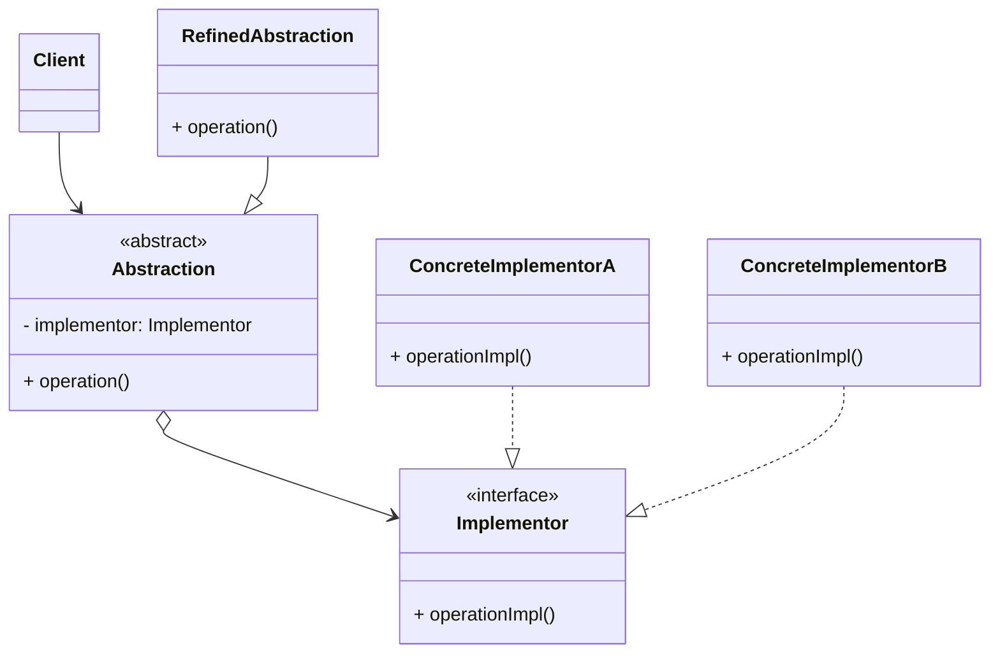

# 桥接模式 (Bridge) —— 多维度变化的解耦利器

## 前言
在深入探讨桥接模式之前，想向大家推荐一个非常棒的开源项目：[design-patterns-23](https://github.com/YeatsLiao/design-patterns-23)。这个项目用最现代的技术栈重写了 23 种设计模式，非常适合实战学习，还配套了[在线交互演示站](https://yeatsliao.github.io/design-patterns-23/)，可以边读文章边动手玩。本文的实战案例灵感也来源于此。

## 1. 模式背景：继承的噩梦

在软件开发中，我们经常遇到某个类需要在两个（或更多）维度上进行扩展的情况。

### 1.1 场景引入：跨平台视频播放器
假设我们要开发一个视频播放器，它需要支持：
1.  **操作系统**：Windows, Mac, Linux
2.  **视频格式**：MP4, AVI, RMVB

如果我们使用继承结构，可能会写出这样的类：
*   `WindowsMP4Player`
*   `WindowsAVIPlayer`
*   `WindowsRMVBPlayer`
*   `MacMP4Player`
*   ...

**问题分析**：
1.  **类爆炸 (Class Explosion)**：如果有 $N$ 个操作系统和 $M$ 种视频格式，我们需要创建 $N \times M$ 个类。
2.  **代码重复**：`MP4` 的解码逻辑在不同操作系统的子类中可能会重复。
3.  **扩展困难**：如果增加一个新的操作系统（如 Android），需要为每种视频格式添加新的子类；如果增加新的视频格式，需要在每个操作系统下添加子类。

### 1.2 桥接模式的解决方案
桥接模式的核心思想是 **"组合优于继承" (Composition over Inheritance)**。它将两个独立变化的维度拆分开来，分别定义接口，然后通过**组合**的方式将它们连接起来。

在这个例子中，我们将“操作系统（平台）”和“视频文件（格式）”分开：
*   **抽象部分 (Abstraction)**：播放器本身（依赖平台接口）。
*   **实现部分 (Implementor)**：平台接口（提供底层解码能力）。

这样，我们只需要 $N$ 个平台类 + $M$ 个格式类，总共 $N + M$ 个类。

## 2. 桥接模式定义

**桥接模式 (Bridge Pattern)**：将抽象部分与它的实现部分分离，使它们都可以独立地变化。

> "Abstraction" and "Implementation" here serves as two dimensions of variation, not just interface vs class.

### 2.1 核心角色

1.  **Abstraction (抽象化角色)**：
    *   定义抽象类的接口。
    *   维护一个指向 `Implementor` 类型对象的引用。
    *   通常包含业务逻辑的高层控制代码。
2.  **RefinedAbstraction (扩展抽象化角色)**：
    *   `Abstraction` 的子类。
    *   实现父类中的业务方法，并通过组合关系调用 `Implementor` 中的业务方法。
3.  **Implementor (实现化角色)**：
    *   定义实现化角色的接口。
    *   这个接口不一定需要与 `Abstraction` 的接口完全一致，通常提供基本操作。
4.  **ConcreteImplementor (具体实现化角色)**：
    *   实现 `Implementor` 接口。

### 2.2 UML 类图结构



## 3. 实战案例：通用支付系统

为了更直观地理解，我们设计一个支付系统。它有两个变化的维度：
1.  **支付渠道 (Channel)**：微信支付、支付宝、银行卡。
2.  **支付模式 (Mode)**：密码支付、人脸支付、指纹支付。

### 3.1 传统继承方式（反例）
如果不使用桥接模式，我们可能需要：
*   `WxPasswordPay`
*   `WxFacePay`
*   `AliPasswordPay`
*   ...
简直是维护噩梦。

### 3.2 桥接模式重构

#### Step 1: 定义实现化接口 (支付模式)
这是底层的操作，负责具体的验证逻辑。

```java
// Implementor: 支付模式接口
public interface IPayMode {
    /**
     * 安全校验
     * @param uId 用户ID
     * @return 校验是否通过
     */
    boolean security(String uId);
}

// ConcreteImplementor: 刷脸支付
public class PayFaceMode implements IPayMode {
    @Override
    public boolean security(String uId) {
        System.out.println("【人脸支付】识别面部特征成功");
        return true;
    }
}

// ConcreteImplementor: 指纹支付
public class PayFingerprintMode implements IPayMode {
    @Override
    public boolean security(String uId) {
        System.out.println("【指纹支付】指纹验证通过");
        return true;
    }
}

// ConcreteImplementor: 密码支付
public class PayCypherMode implements IPayMode {
    @Override
    public boolean security(String uId) {
        System.out.println("【密码支付】环境安全检测通过");
        return true;
    }
}
```

#### Step 2: 定义抽象化类 (支付渠道)
这是高层的抽象，它持有支付模式的引用。

```java
import java.math.BigDecimal;

// Abstraction: 支付渠道抽象类
public abstract class PayAbstract {
    protected IPayMode payMode; // 桥接点：持有实现化部分的引用

    public PayAbstract(IPayMode payMode) {
        this.payMode = payMode;
    }

    // 划账功能
    public abstract String transfer(String uId, String tradeId, BigDecimal amount);
}
```

#### Step 3: 扩展抽象化类 (具体渠道)

```java
// RefinedAbstraction: 微信支付
public class WxPay extends PayAbstract {
    public WxPay(IPayMode payMode) {
        super(payMode);
    }

    @Override
    public String transfer(String uId, String tradeId, BigDecimal amount) {
        System.out.println("--- 开始微信支付 ---");
        boolean security = payMode.security(uId); // 调用桥接接口
        if (!security) {
            return "微信支付失败: 安全校验未通过";
        }
        System.out.println(String.format("微信划账成功, 用户: %s, 金额: %s", uId, amount));
        return "200";
    }
}

// RefinedAbstraction: 支付宝支付
public class ZfbPay extends PayAbstract {
    public ZfbPay(IPayMode payMode) {
        super(payMode);
    }

    @Override
    public String transfer(String uId, String tradeId, BigDecimal amount) {
        System.out.println("--- 开始支付宝支付 ---");
        boolean security = payMode.security(uId);
        if (!security) {
            return "支付宝支付失败: 安全校验未通过";
        }
        System.out.println(String.format("支付宝划账成功, 用户: %s, 金额: %s", uId, amount));
        return "200";
    }
}
```

#### Step 4: 客户端调用

```java
public class Client {
    public static void main(String[] args) {
        System.out.println("场景1: 微信 + 人脸支付");
        PayAbstract wxFacePay = new WxPay(new PayFaceMode());
        wxFacePay.transfer("user_001", "T001", new BigDecimal("100.00"));

        System.out.println("\n场景2: 支付宝 + 指纹支付");
        PayAbstract zfbFingerPay = new ZfbPay(new PayFingerprintMode());
        zfbFingerPay.transfer("user_002", "T002", new BigDecimal("250.00"));
    }
}
```

**输出结果**：
```text
场景1: 微信 + 人脸支付
--- 开始微信支付 ---
【人脸支付】识别面部特征成功
微信划账成功, 用户: user_001, 金额: 100.00

场景2: 支付宝 + 指纹支付
--- 开始支付宝支付 ---
【指纹支付】指纹验证通过
支付宝划账成功, 用户: user_002, 金额: 250.00
```

## 4. 源码中的桥接模式

### 4.1 JDBC 驱动管理
JDBC 是桥接模式最经典的实现之一。
*   **Abstraction**: `java.sql.Connection`, `java.sql.Statement` 等接口，以及 `DriverManager`。
*   **Implementor**: 数据库驱动厂商提供的实现（如 `com.mysql.cj.jdbc.Driver`）。

在 Java 应用中，我们编写代码时只依赖 `java.sql` 包下的接口（抽象层），而具体的执行逻辑由加载的 Driver（实现层）完成。

```java
// 客户端代码（只依赖抽象）
Class.forName("com.mysql.cj.jdbc.Driver"); // 加载具体实现
Connection conn = DriverManager.getConnection("jdbc:mysql://..."); // 获取抽象连接
Statement stmt = conn.createStatement();
stmt.executeQuery("SELECT * FROM users");
```

虽然 JDBC 的实现方式与标准桥接模式略有不同（它使用了 `DriverManager` 来管理注册的驱动），但核心思想是一致的：**将数据库操作的抽象定义（JDK API）与具体数据库的实现逻辑（MySQL/Oracle Driver）分离**。

### 4.2 Spring 的 PlatformTransactionManager
Spring 的事务管理也体现了桥接思想：
*   **Abstraction**: `PlatformTransactionManager` 接口（定义了 `getTransaction`, `commit`, `rollback`）。
*   **Implementor**: 具体的事务管理器，如 `DataSourceTransactionManager` (JDBC), `HibernateTransactionManager` (Hibernate), `JtaTransactionManager` (JTA)。

Spring 用户只需面对 `PlatformTransactionManager` 接口编程（或使用 `@Transactional` 注解），而无需关心底层事务是基于 JDBC Connection 还是 Hibernate Session 实现的。

## 5. 桥接模式 vs 适配器模式

这两个模式很容易混淆，因为它们都涉及到“连接”两个不同的东西。

| 特性 | 桥接模式 (Bridge) | 适配器模式 (Adapter) |
| :--- | :--- | :--- |
| **设计时机** | **设计初期**。预先设计好两个维度的分离，让它们配合工作。 | **设计后期**。通常是因为两个已有的接口不兼容，需要“补救”。 |
| **目的** | **分离接口与实现**。为了支持多维度的独立变化。 | **接口兼容**。为了复用现有的类，使其适配新的接口。 |
| **关系** | 抽象与实现的关系。 | 包装器与被包装者的关系。 |
| **复杂度** | 较高，需要正确识别系统的变化维度。 | 较低，主要是简单的接口转换。 |

**一句话总结**：
*   适配器模式是“**事后诸葛亮**”，让两个不兼容的东西能凑合在一起。
*   桥接模式是“**先见之明**”，预先设计好分离结构，让系统能从容应对变化。

## 6. 优缺点与总结

### 优点
1.  **分离抽象和实现**：提高了系统的可扩展性，符合开闭原则。
2.  **减少子类个数**：将 $N \times M$ 的继承关系变为 $N + M$ 的组合关系。
3.  **实现细节对客户透明**：客户只需要关心抽象层的接口。

### 缺点
1.  **增加系统的理解和设计难度**：需要正确识别出系统中两个独立变化的维度。如果分错了维度，系统反而会变得复杂。
2.  **聚合关联关系建立在抽象层**：要求开发者针对抽象进行设计和编程。

### 适用场景
1.  如果一个系统需要在构件的抽象化角色和具体化角色之间增加更多的灵活性，避免在两个层次之间建立静态的继承联系。
2.  设计要求实现化角色的任何改变不应当影响客户端，或者说实现化角色的改变对客户端是透明的。
3.  一个类存在两个独立变化的维度，且这两个维度都需要进行扩展。
4.  对于那些不希望使用继承或因为多层次继承导致系统类的个数急剧增加的系统。

## 7. 最佳实践 Tips

*   **识别维度**：不要滥用桥接模式。只有当类确实存在两个独立变化的维度（如：平台+格式、支付渠道+支付方式、消息类型+紧急程度）时才使用。
*   **接口设计**：Implementor 接口应该尽量简单，只提供原子操作；Abstraction 接口可以复杂一些，通过组合原子操作完成复杂业务。
*   **依赖注入**：在 Spring 环境下，可以通过依赖注入（Dependency Injection）非常方便地将 ConcreteImplementor 注入到 RefinedAbstraction 中，完全不需要手动 `new`。

```java
@Service
public class WechatPayService extends PayAbstract {
    @Autowired
    @Qualifier("facePayMode") // 注入具体的支付模式
    private IPayMode payMode;
    
    // ...
}
```

## 8. 实验实操
在 `design-patterns-web` 项目中，体验**桥接模式**如何将“抽象部分”（遥控器）与“实现部分”（设备）分离。
左侧是通用的遥控器（抽象），右侧是具体的设备（电视、收音机）。你可以点击按钮切换控制对象（TV 或 Radio）。无论控制哪个设备，遥控器的“电源开关”、“音量调节”逻辑都是一样的，但右侧的设备会做出相应的具体反应（电视屏幕亮起或收音机播放声音）。这展示了两个维度可以独立变化，互不影响。
**截图建议**：截取遥控器控制电视处于开启状态，音量条显示的画面。
