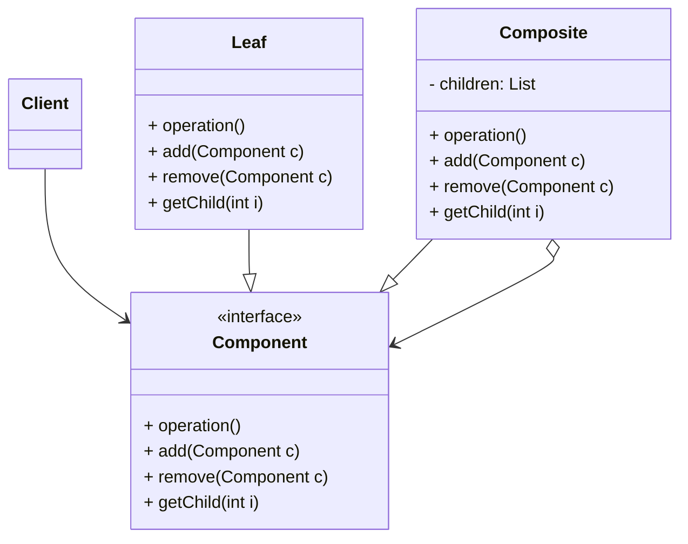

# 组合模式 (Composite) —— 统一对待整体与部分

## 前言
在深入探讨组合模式之前，想向大家推荐一个非常棒的开源项目：[design-patterns-23](https://github.com/YeatsLiao/design-patterns-23)。这个项目用最现代的技术栈重写了 23 种设计模式，非常适合实战学习，还配套了[在线交互演示站](https://yeatsliao.github.io/design-patterns-23/)，可以边读文章边动手玩。本文的实战案例灵感也来源于此。

## 1. 模式背景：树形结构的痛点

在软件开发中，我们经常需要处理**树形结构**的数据，例如：
*   **文件系统**：文件夹里既可以有文件，也可以有子文件夹。
*   **组织架构**：总公司下有部门，部门下有员工，也有子部门。
*   **GUI 容器**：Panel 里可以放 Button，也可以放另一个 Panel。

### 1.1 场景引入：杀毒软件
假设我们要开发一个杀毒软件，它可以扫描：
1.  **单个文件**：直接杀毒。
2.  **文件夹**：先扫描里面的文件，再递归扫描里面的子文件夹。

如果不使用设计模式，客户端代码可能会写成这样：

```java
public void scan(Object node) {
    if (node instanceof File) {
        ((File)node).killVirus();
    } else if (node instanceof Folder) {
        Folder folder = (Folder)node;
        for (Object child : folder.getChildren()) {
            scan(child); // 递归
        }
    }
}
```

**问题分析**：
1.  **缺乏一致性**：客户端必须区分“文件”和“文件夹”，代码逻辑复杂。
2.  **扩展性差**：如果增加一种新类型（比如“压缩包”），客户端的 `if-else` 逻辑需要修改。

### 1.2 组合模式的解决方案
组合模式通过定义一个抽象的 **Component** 接口，让“叶子节点（Leaf）”和“容器节点（Composite）”都去实现它。这样，客户端就可以**像对待单个对象一样对待组合对象**，彻底消除了区别。

---

## 2. 组合模式定义

**组合模式 (Composite Pattern)**：将对象组合成树形结构以表示“部分-整体”的层次结构。组合模式使得用户对单个对象和组合对象的使用具有一致性。

### 2.1 核心角色

1.  **Component (抽象构件)**：
    *   为组合中的对象声明接口。
    *   在适当情况下，实现所有类共有接口的缺省行为。
    *   声明管理子构件的接口（`add`, `remove`, `getChild`）。
2.  **Leaf (叶子构件)**：
    *   在组合中表示叶子节点对象，叶子节点没有子节点。
    *   实现 Component 接口中定义的行为。
3.  **Composite (容器构件)**：
    *   表示容器节点对象，容器节点包含子节点。
    *   实现 Component 接口中定义的行为（通常是遍历子节点并调用它们的对应方法）。

### 2.2 两种实现形式：透明 vs 安全

组合模式有两种主要流派，区别在于**管理子节点的方法放在哪里**。

#### A. 透明方式 (Transparent)
*   **做法**：在 `Component` 接口中声明 `add` / `remove` 方法。
*   **优点**：客户端无需区分 Leaf 和 Composite，完全一致。
*   **缺点**：Leaf 节点必须实现 `add` / `remove`，但它实际上没有子节点，只能抛出异常（Unsafe）。
*   **适用**：大多数情况下的首选，符合“一致性”原则。

#### B. 安全方式 (Safe)
*   **做法**：`Component` 接口不声明管理子节点的方法，只在 `Composite` 类中声明。
*   **优点**：Leaf 节点不需要实现无意义的方法，编译期安全。
*   **缺点**：客户端必须区分 Leaf 和 Composite，如果要把 Component 转为 Composite 需要强制类型转换，失去了透明性。

### 2.3 UML 类图结构 (透明方式)



---

## 3. 实战案例：公司组织架构

我们模拟一个公司组织架构，包括总公司、分公司、部门（行政部、IT部），它们都有统一的职责：`checkWork` (考勤)。

### 3.1 Step 1: 定义抽象构件 (透明方式)

```java
// Component
public abstract class OrgComponent {
    protected String name; // 节点名称
    protected String desc; // 描述

    public OrgComponent(String name, String desc) {
        this.name = name;
        this.desc = desc;
    }

    // 核心业务方法
    public abstract void checkWork();

    // 管理方法（默认抛异常，Leaf 不需要重写）
    public void add(OrgComponent c) {
        throw new UnsupportedOperationException("叶子节点不支持添加操作");
    }

    public void remove(OrgComponent c) {
        throw new UnsupportedOperationException("叶子节点不支持删除操作");
    }

    public OrgComponent getChild(int i) {
        throw new UnsupportedOperationException("叶子节点无子节点");
    }
}
```

### 3.2 Step 2: 定义叶子节点 (具体部门)

```java
// Leaf: 员工/具体部门
public class Department extends OrgComponent {
    public Department(String name, String desc) {
        super(name, desc);
    }

    @Override
    public void checkWork() {
        System.out.println("  " + name + " (" + desc + ")：考勤完成，全员到岗");
    }
}
```

### 3.3 Step 3: 定义容器节点 (公司)

```java
import java.util.ArrayList;
import java.util.List;

// Composite: 公司（可以包含部门或其他分公司）
public class Company extends OrgComponent {
    // 关键点：持有一个 Component 列表
    private List<OrgComponent> children = new ArrayList<>();

    public Company(String name, String desc) {
        super(name, desc);
    }

    @Override
    public void add(OrgComponent c) {
        children.add(c);
    }

    @Override
    public void remove(OrgComponent c) {
        children.remove(c);
    }

    @Override
    public OrgComponent getChild(int i) {
        return children.get(i);
    }

    @Override
    public void checkWork() {
        System.out.println(name + " (" + desc + ") 开始考勤汇总：");
        // 递归调用子节点的业务方法
        for (OrgComponent c : children) {
            c.checkWork();
        }
    }
}
```

### 3.4 Step 4: 客户端调用

```java
public class Client {
    public static void main(String[] args) {
        // 1. 组装树形结构
        Company headOffice = new Company("北京总公司", "Headquarters");
        
        Department headAdmin = new Department("总公司行政部", "负责后勤");
        Department headIT = new Department("总公司IT部", "负责技术");
        
        Company shBranch = new Company("上海分公司", "Branch Office");
        Department shSales = new Department("上海销售部", "负责华东区销售");
        Department shSupport = new Department("上海客服部", "负责客户服务");
        
        // 组装
        shBranch.add(shSales);
        shBranch.add(shSupport);
        
        headOffice.add(headAdmin);
        headOffice.add(headIT);
        headOffice.add(shBranch); // 分公司也是一个节点

        // 2. 统一操作
        System.out.println("--- 考勤系统启动 ---");
        headOffice.checkWork();
    }
}
```

**输出结果**：
```text
--- 考勤系统启动 ---
北京总公司 (Headquarters) 开始考勤汇总：
  总公司行政部 (负责后勤)：考勤完成，全员到岗
  总公司IT部 (负责技术)：考勤完成，全员到岗
上海分公司 (Branch Office) 开始考勤汇总：
  上海销售部 (负责华东区销售)：考勤完成，全员到岗
  上海客服部 (负责客户服务)：考勤完成，全员到岗
```

---

## 4. 源码中的组合模式

### 4.1 MyBatis 的 SqlNode
MyBatis 强大的动态 SQL 功能（`<if>`, `<where>`, `<foreach>`）就是基于组合模式实现的。

*   **Component**: `org.apache.ibatis.scripting.xmltags.SqlNode` 接口。
    ```java
    public interface SqlNode {
        boolean apply(DynamicContext context);
    }
    ```
*   **Leaf**: `StaticTextSqlNode` (静态文本), `TextSqlNode` (带参数文本)。
*   **Composite**: `MixedSqlNode` (持有 `List<SqlNode>`)。
*   **其他 Composite**: `IfSqlNode`, `WhereSqlNode`, `TrimSqlNode` 等，它们既是 Composite（内部包含子节点），又有特定的业务逻辑。

当 MyBatis 解析 XML 时，会将 SQL 片段组装成一个 `SqlNode` 树。执行时，只需要调用根节点的 `apply` 方法，整个 SQL 就会被递归拼装出来。

### 4.2 Java AWT/Swing
Java 的 GUI 编程是组合模式的典型应用。
*   **Component**: `java.awt.Component` (Button, TextField, Label)。
*   **Composite**: `java.awt.Container` (Frame, Panel, Dialog)。

`Container` 继承自 `Component`，同时又有一个 `add(Component c)` 方法。当我们调用 `container.paint()` 时，它会负责绘制自己，并递归调用所有子组件的 `paint()`。

### 4.3 JDK 集合
`java.util.HashMap` 的 `putAll(Map m)` 方法，虽然不是严格的组合模式结构，但体现了“将一组对象视为一个整体”的思想。更典型的例子是 `ArrayList.addAll(Collection c)`，它允许将一个集合（一组对象）一次性添加，虽然这更多是集合操作而非设计模式，但逻辑上类似。

---

## 5. 优缺点与总结

### 优点
1.  **高层模块调用简单**：客户端不需要关心对象是单个还是组合，调用逻辑统一。
2.  **节点自由增加**：很容易在树中增加新的节点类型（如新增一个“临时工”类型的 Leaf，或“项目组”类型的 Composite），符合开闭原则。
3.  **简化客户端代码**：不需要写复杂的递归逻辑和类型判断。

### 缺点
1.  **设计复杂**：如果业务逻辑不具有树形结构，强行使用组合模式会增加复杂度。
2.  **类型限制困难**：在透明模式下，无法在编译期限制 Composite 只能添加特定类型的 Leaf（必须在运行时检查）。
3.  **叶子节点的安全性**：透明模式下，叶子节点暴露了 `add/remove` 接口，调用会抛出异常，可能给调用者带来困惑。

### 适用场景
1.  需要表示对象的部分-整体层次结构（树形结构）。
2.  希望用户忽略组合对象与单个对象的不同，用户将统一地使用组合结构中的所有对象。

## 6. 最佳实践 Tips

*   **透明 vs 安全**：
    *   如果你希望客户端完全忽略差异，选**透明方式**（Leaf 抛异常）。这是最常用的。
    *   如果你非常看重类型安全，或者 Leaf 和 Composite 差异巨大，选**安全方式**。
*   **递归性能**：组合模式通常涉及递归操作。如果树结构非常深，或者操作非常复杂（如计算整个公司的复杂的奖金系数），要注意性能问题，必要时可以使用缓存（在 Composite 中缓存子节点的计算结果）。
*   **父指针**：在实际应用中，子节点通常需要访问父节点（例如删除自己时，或者向上冒泡事件）。可以在 Component 中维护一个 `parent` 引用。

## 7. 实验实操
在 `design-patterns-web` 项目中，通过**文件系统**来演示**组合模式**。
界面展示了一个树状的文件夹结构。你可以点击文件夹展开或折叠内容。当你点击某个文件夹时，系统会利用组合模式的递归特性，自动累加该文件夹下所有子文件和子文件夹的大小，并显示出来。无论是处理单个文件还是包含文件的文件夹，客户端代码都以统一的方式（`getSize()`）进行交互。
**截图建议**：截取展开了多级目录的文件树，并显示某个文件夹总大小的界面。
