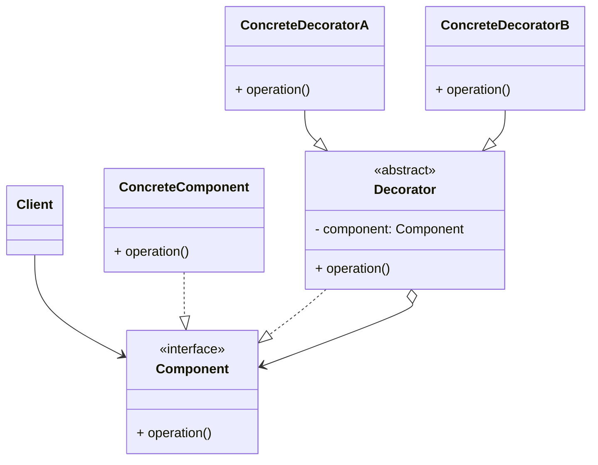

# 装饰器模式 (Decorator) —— 动态赋予对象新功能

## 前言
在深入探讨装饰器模式之前，想向大家推荐一个非常棒的开源项目：[design-patterns-23](https://github.com/YeatsLiao/design-patterns-23)。这个项目用最现代的技术栈重写了 23 种设计模式，非常适合实战学习，还配套了[在线交互演示站](https://yeatsliao.github.io/design-patterns-23/)，可以边读文章边动手玩。本文的实战案例灵感也来源于此。

## 1. 模式背景：继承的困境

在软件开发中，我们经常需要给一个现有的类添加新功能。传统的做法是**继承**。

### 1.1 场景引入：星巴克咖啡订单
假设我们要设计一个咖啡订单系统：
1.  基础饮品：`HouseBlend` (综合咖啡), `DarkRoast` (深焙咖啡)。
2.  调料：`Milk` (牛奶), `Soy` (豆浆), `Mocha` (摩卡/巧克力), `Whip` (奶泡)。

用户可以随意组合：
*   HouseBlend + Milk
*   DarkRoast + Mocha + Whip
*   HouseBlend + Soy + Mocha + Whip

如果不使用模式，用继承来实现：
*   `HouseBlendWithMilk`
*   `HouseBlendWithMochaAndWhip`
*   `DarkRoastWithSoy`
*   ...

**问题分析**：
1.  **类爆炸**：调料的组合是无穷无尽的。如果有 $N$ 种咖啡和 $M$ 种调料，子类数量会指数级增长。
2.  **僵化**：如果牛奶价格涨了，你需要去修改所有包含牛奶的子类。

### 1.2 装饰器模式的解决方案
装饰器模式的核心思想是：**像“穿衣服”一样层层包裹**。
*   咖啡是“核心对象”（人）。
*   调料是“装饰器”（衣服）。
*   你可以先穿衬衫，再穿毛衣，最后穿外套。每一层都包裹着里面的一层。
*   最重要的是，**穿上衣服的人，本质上还是一个人**（接口不变）。

---

## 2. 装饰器模式定义

**装饰器模式 (Decorator Pattern)**：动态地给一个对象添加一些额外的职责。就增加功能来说，装饰器模式相比生成子类更为灵活。

### 2.1 核心角色

1.  **Component (抽象构件)**：
    *   定义一个对象接口，可以给这些对象动态地添加职责。
    *   例如：`Coffee` 接口。
2.  **ConcreteComponent (具体构件)**：
    *   定义一个对象，可以给这个对象添加一些职责。
    *   例如：`HouseBlend` 咖啡。
3.  **Decorator (抽象装饰类)**：
    *   **关键点**：继承自 `Component`，**并且**持有一个 `Component` 对象的引用。
    *   它起到了“转发”请求的作用，并在转发前后添加附加动作。
4.  **ConcreteDecorator (具体装饰类)**：
    *   负责向组件添加新的职责。
    *   例如：`Milk`, `Mocha`。

### 2.2 UML 类图结构



---

## 3. 实战案例：网红奶茶订单系统

我们用更符合国情的“奶茶”为例。
*   基础：奶茶 (MilkTea)
*   加料：椰果 (Coco), 珍珠 (Pearl), 冰淇淋 (IceCream)

### 3.1 Step 1: 定义抽象构件 (饮品)

```java
// Component
public interface Drink {
    double cost(); // 计算价格
    String desc(); // 描述
}
```

### 3.2 Step 2: 定义具体构件 (原味奶茶)

```java
// ConcreteComponent
public class MilkTea implements Drink {
    @Override
    public double cost() {
        return 10.0; // 基础价 10 元
    }

    @Override
    public String desc() {
        return "原味奶茶";
    }
}

// ConcreteComponent: 柠檬茶
public class LemonTea implements Drink {
    @Override
    public double cost() {
        return 8.0;
    }

    @Override
    public String desc() {
        return "柠檬茶";
    }
}
```

### 3.3 Step 3: 定义抽象装饰器

**这是最关键的一步**：它既是 `Drink`（为了能被继续装饰），又包含一个 `Drink`（为了调用被装饰者）。

```java
// Decorator
public abstract class Decorator implements Drink {
    // 核心：持有被装饰者的引用
    protected Drink drink;

    public Decorator(Drink drink) {
        this.drink = drink;
    }
    
    // 默认实现：直接转发请求
    @Override
    public double cost() {
        return drink.cost();
    }
    
    @Override
    public String desc() {
        return drink.desc();
    }
}
```

### 3.4 Step 4: 定义具体装饰器 (加料)

```java
// ConcreteDecorator: 加珍珠
public class Pearl extends Decorator {
    public Pearl(Drink drink) {
        super(drink);
    }

    @Override
    public double cost() {
        return super.cost() + 2.0; // 价格 +2
    }

    @Override
    public String desc() {
        return super.desc() + " + 珍珠"; // 描述叠加
    }
}

// ConcreteDecorator: 加椰果
public class Coco extends Decorator {
    public Coco(Drink drink) {
        super(drink);
    }

    @Override
    public double cost() {
        return super.cost() + 1.5;
    }

    @Override
    public String desc() {
        return super.desc() + " + 椰果";
    }
}
```

### 3.5 Step 5: 客户端调用

```java
public class Client {
    public static void main(String[] args) {
        // 1. 点一杯原味奶茶
        Drink order = new MilkTea();
        System.out.println(String.format("订单1: %s, 价格: %.1f", order.desc(), order.cost()));

        // 2. 加珍珠
        order = new Pearl(order);
        System.out.println(String.format("订单2: %s, 价格: %.1f", order.desc(), order.cost()));

        // 3. 再加椰果（套娃）
        order = new Coco(order);
        System.out.println(String.format("订单3: %s, 价格: %.1f", order.desc(), order.cost()));
        
        System.out.println("-----------------");
        
        // 4. 一步到位的写法：柠檬茶 + 珍珠 + 珍珠 (双份珍珠)
        Drink luxury = new Pearl(new Pearl(new LemonTea()));
        System.out.println(String.format("豪横版: %s, 价格: %.1f", luxury.desc(), luxury.cost()));
    }
}
```

**输出结果**：
```text
订单1: 原味奶茶, 价格: 10.0
订单2: 原味奶茶 + 珍珠, 价格: 12.0
订单3: 原味奶茶 + 珍珠 + 椰果, 价格: 13.5
-----------------
豪横版: 柠檬茶 + 珍珠 + 珍珠, 价格: 12.0
```

---

## 4. 源码中的装饰器模式

### 4.1 Java IO 流 (经典教科书案例)
Java 的 `java.io` 包是装饰器模式的集大成者。

*   **Component**: `InputStream`
*   **ConcreteComponent**: `FileInputStream`, `ByteArrayInputStream`
*   **Decorator**: `FilterInputStream`
*   **ConcreteDecorator**: `BufferedInputStream` (增加缓冲), `DataInputStream` (增加读取基本数据类型功能), `GZIPInputStream` (增加解压功能)

```java
// 这是一个层层包裹的过程
InputStream in = new FileInputStream("test.txt"); // 基础流
in = new BufferedInputStream(in);                 // 增加缓冲功能
in = new DataInputStream(in);                     // 增加读取 int/double 的功能
```

如果不使用装饰器模式，Java IO 可能会有 `BufferedFileInputStream`, `DataFileInputStream`, `BufferedDataFileInputStream`... 简直不敢想象。

### 4.2 Servlet API 的 Wrapper
在 Java Web 开发中，我们经常使用 `HttpServletRequestWrapper` 来增强请求对象。
例如，实现 XSS 过滤：
1.  创建一个类继承 `HttpServletRequestWrapper`。
2.  重写 `getParameter()` 方法，在返回参数前进行 HTML 转义。
3.  在 Filter 中将原始 Request 替换为 Wrapper 对象传入 FilterChain。

```java
public class XssRequestWrapper extends HttpServletRequestWrapper {
    public XssRequestWrapper(HttpServletRequest request) {
        super(request);
    }
    
    @Override
    public String getParameter(String name) {
        String value = super.getParameter(name);
        return HtmlUtils.htmlEscape(value); // 增强功能：转义
    }
}
```

### 4.3 Spring 的 BeanWrapper
Spring 的 `BeanWrapperImpl` 也是一种装饰器（或者说是适配器+装饰器的结合），它包装了一个 Java Bean，并提供了设置/获取属性值的统一接口。

---

## 5. 装饰器模式 vs 代理模式 vs 适配器模式

这三个模式结构非常像，都是“包装”一个对象，但意图完全不同：

| 模式 | 意图 | 接口一致性 | 重点 |
| :--- | :--- | :--- | :--- |
| **装饰器 (Decorator)** | **增强功能** | 保持接口一致 | 动态地给对象增加职责，功能叠加（套娃）。 |
| **代理 (Proxy)** | **控制访问** | 保持接口一致 | 控制对对象的访问（权限、延迟加载、远程调用），不改变核心功能。 |
| **适配器 (Adapter)** | **转换接口** | 改变接口 | 将一个类的接口转换成客户期望的另一个接口，为了兼容。 |

**简单区分**：
*   **装饰器**：我想在这个对象做事之前/之后加点料（比如加个日志、加个缓存、加个计费），而且我可能要套好几层。
*   **代理**：我是这个对象的经纪人，想找它办事得先过我这一关（权限控制），或者它太忙了（远程调用），我来代表它。

---

## 6. 优缺点与总结

### 优点
1.  **比继承更灵活**：可以在运行时动态地增加或删除功能。
2.  **避免类爆炸**：通过组合不同的装饰器，可以实现无穷多的功能组合，而不需要创建对应的子类。
3.  **单一职责原则**：将具体功能（核心业务）和装饰功能（辅助业务）分离开来，每个类只关心自己的逻辑。

### 缺点
1.  **小对象过多**：会产生很多具体的装饰器类和层层嵌套的对象，增加系统复杂度。
2.  **调试困难**：由于多层包装，一旦出现 bug，堆栈信息会很深，很难定位是哪一层装饰器出了问题。
3.  **初始化复杂**：构建一个功能完整的对象需要写一长串 `new A(new B(new C(...)))`，这通常需要结合**建造者模式**或**工厂模式**来缓解。

### 适用场景
1.  在不影响其他对象的情况下，以动态、透明的方式给单个对象添加职责。
2.  需要动态地给一个对象增加功能，这些功能也可以动态地被撤销。
3.  当不能采用继承的方式对系统进行扩充或者采用继承不利于系统扩展和维护时。

## 7. 最佳实践 Tips

*   **保持接口简单**：Component 接口应该尽量简洁，否则 Decorator 类需要实现大量无关的方法。
*   **省略抽象 Decorator**：如果系统中只需要一个具体的装饰器，或者装饰器层次很简单，可以省略抽象的 Decorator 类，直接让 ConcreteDecorator 继承 Component（如果 Component 是类）或实现接口。
*   **配合工厂/建造者**：为了避免客户端写出 `new A(new B(new C()))` 这种地狱代码，通常会提供一个 Factory 或 Builder 来封装组装过程。

## 8. 实验实操
在 `design-patterns-web` 项目中，你可以像在咖啡店点单一样体验**装饰器模式**。
初始是一杯基础咖啡（Base Coffee）。你可以点击“Add Milk”、“Add Sugar”、“Add Whip”按钮，每点击一次，就是在原有对象外层包裹了一个装饰器。右侧的咖啡杯会实时显示添加的配料分层，同时下方的价格和描述也会动态更新（例如 "Dark Roast, Milk, Sugar"）。这展示了如何动态地给对象添加职责，而不需要修改原有类。
**截图建议**：截取一杯添加了多种配料（牛奶、糖、奶油）且价格已更新的咖啡。
