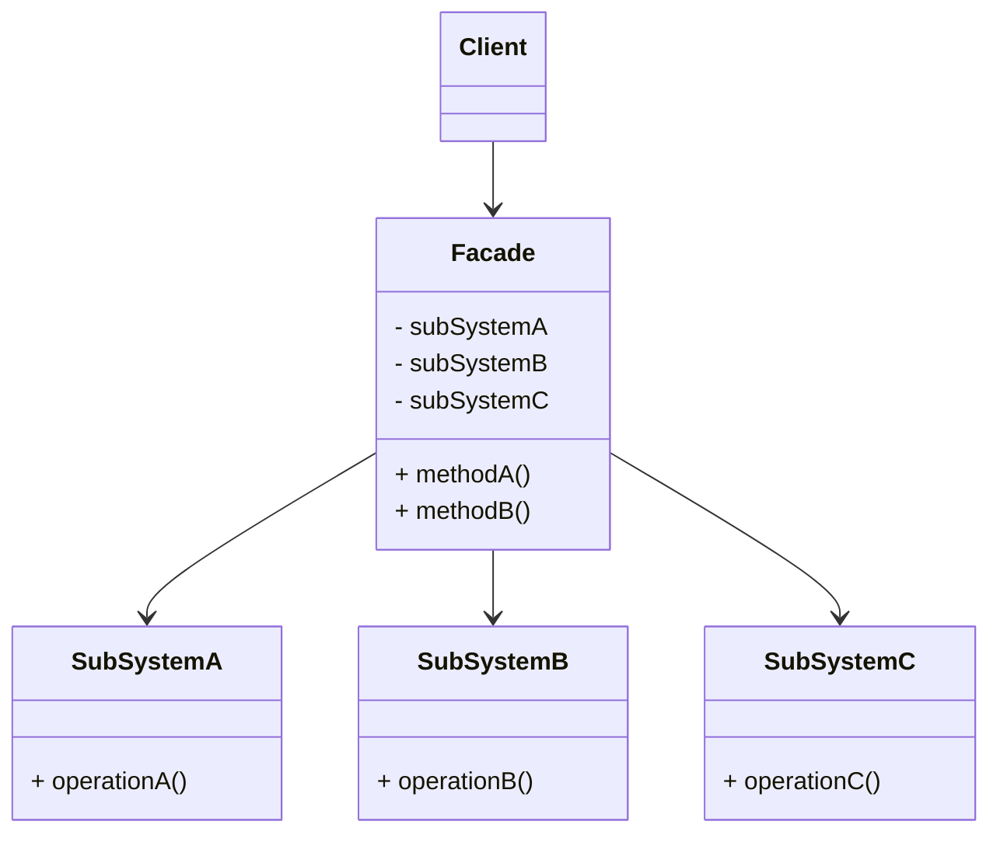

# 外观模式 (Facade) —— 系统的总服务台

## 前言
在深入探讨外观模式之前，想向大家推荐一个非常棒的开源项目：[design-patterns-23](https://github.com/YeatsLiao/design-patterns-23)。这个项目用最现代的技术栈重写了 23 种设计模式，非常适合实战学习，还配套了[在线交互演示站](https://yeatsliao.github.io/design-patterns-23/)，可以边读文章边动手玩。本文的实战案例灵感也来源于此。

## 1. 模式背景：复杂的子系统

在软件开发中，随着系统功能的增加，子系统会变得越来越复杂。客户端（Client）如果直接与子系统内部的多个模块交互，会导致高耦合和高复杂度。

### 1.1 场景引入：智能家居控制
假设你安装了一套智能家居系统，包含：
1.  **灯光 (Light)**：客厅灯、卧室灯、走廊灯。
2.  **电视 (TV)**：开关、音量、频道。
3.  **空调 (AirConditioner)**：开关、温度、模式。
4.  **音响 (Stereo)**：开关、音量。

如果你想看电影，你可能需要：
1.  关掉客厅灯。
2.  打开电视。
3.  打开音响。
4.  把空调调到 26 度。
5.  ...

**问题分析**：
1.  **操作繁琐**：用户需要分别操作 4 个设备，按很多次按钮。
2.  **耦合度高**：如果换了新款电视，操作方式变了，用户习惯（客户端代码）也得改。

### 1.2 外观模式的解决方案
外观模式提供了一个高层接口，屏蔽了子系统的复杂性。
我们可以设计一个 **SmartHomeFacade**（智能家居控制面板），提供一个 `movieMode()`（观影模式）按钮。用户只需要按这一个按钮，剩下的事情由 Facade 帮我们去协调各个设备。

---

## 2. 外观模式定义

**外观模式 (Facade Pattern)**：为子系统中的一组接口提供一个一致的界面，Facade 模式定义了一个高层接口，这个接口使得这一子系统更加容易使用。

### 2.1 核心角色

1.  **Facade (外观角色)**：
    *   客户端调用的入口。
    *   它知道所有子系统的功能和责任。
    *   将客户端的请求代理给适当的子系统对象。
2.  **Subsystem (子系统角色)**：
    *   可以有一个或多个子系统。
    *   子系统并不知道 Facade 的存在，对于子系统而言，Facade 只是另一个客户端而已。
3.  **Client (客户端)**：
    *   通过 Facade 接口与子系统交互，不直接调用子系统。

### 2.2 UML 类图结构



---

## 3. 实战案例：智能家居控制中心

### 3.1 Step 1: 定义子系统

```java
// 子系统 1: 灯光
public class Light {
    public void on() { System.out.println("灯光打开"); }
    public void off() { System.out.println("灯光关闭"); }
    public void dim() { System.out.println("灯光调暗"); }
}

// 子系统 2: 电视
public class TV {
    public void on() { System.out.println("电视打开"); }
    public void off() { System.out.println("电视关闭"); }
}

// 子系统 3: 空调
public class AirConditioner {
    public void on() { System.out.println("空调打开"); }
    public void setTemp(int temp) { System.out.println("空调温度设为 " + temp + "度"); }
}
```

### 3.2 Step 2: 定义外观类 (Facade)

这个类持有所有子系统的引用，并提供语义化的业务方法。

```java
public class SmartHomeFacade {
    private Light light;
    private TV tv;
    private AirConditioner ac;

    public SmartHomeFacade() {
        this.light = new Light();
        this.tv = new TV();
        this.ac = new AirConditioner();
    }

    // 业务方法：回家模式
    public void homeMode() {
        System.out.println(">>> 开启回家模式");
        light.on();
        ac.on();
        ac.setTemp(26);
        tv.on();
    }

    // 业务方法：离家模式
    public void leaveMode() {
        System.out.println(">>> 开启离家模式");
        light.off();
        ac.setTemp(30); // 节能
        tv.off();
    }
    
    // 业务方法：观影模式
    public void movieMode() {
        System.out.println(">>> 开启观影模式");
        light.dim(); // 灯光调暗
        tv.on();
        ac.on();
    }
}
```

### 3.3 Step 3: 客户端调用

```java
public class Client {
    public static void main(String[] args) {
        SmartHomeFacade smartHome = new SmartHomeFacade();

        // 此时，用户不需要关心具体的灯、电视怎么操作
        smartHome.homeMode();
        
        System.out.println("------------");
        
        smartHome.movieMode();
    }
}
```

**输出结果**：
```text
>>> 开启回家模式
灯光打开
空调打开
空调温度设为 26度
电视打开
------------
>>> 开启观影模式
灯光调暗
电视打开
空调打开
```

---

## 4. 源码中的外观模式

### 4.1 SLF4J (Simple Logging Facade for Java)
SLF4J 是 Java 界最著名的外观模式应用。
*   **Facade**: `org.slf4j.Logger`, `org.slf4j.LoggerFactory`。
*   **Subsystem**: Log4j, Logback, Java Util Logging (JUL)。

开发者只需要面向 SLF4J 编程：
```java
Logger logger = LoggerFactory.getLogger(MyClass.class);
logger.info("Hello World");
```
底层到底是用 Log4j 还是 Logback，完全由 classpath 下的 jar 包决定，客户端代码无需修改。

### 4.2 Tomcat 的 RequestFacade
在 Servlet 开发中，我们在 `doGet(HttpServletRequest req, ...)` 拿到的 `req` 对象，实际上是 `RequestFacade` 的实例。
*   Tomcat 内部有一个 `org.apache.catalina.connector.Request` 类，它包含了很多 Tomcat 内部的管理方法（如 `setDecodedURI`, `recycle`）。
*   如果直接把这个对象传给用户，用户可能会误调用这些核心方法破坏 Tomcat 运行。
*   所以 Tomcat 设计了一个 `RequestFacade` 类，实现了 `HttpServletRequest` 接口，内部持有 `Request` 引用，但只暴露标准 Servlet API 方法，屏蔽了内部管理方法。

### 4.3 Spring MVC 的 DispatcherServlet
虽然 `DispatcherServlet` 本身是一个 Servlet，但它充当了 Spring MVC 框架的前端控制器（Front Controller），本质上也是一个 Facade。
所有的 Web 请求都先交给它，由它去协调：
1.  **HandlerMapping** (找谁处理)
2.  **HandlerAdapter** (怎么处理)
3.  **ViewResolver** (怎么渲染)

开发者只需要配置好这些组件，剩下的流程由 `DispatcherServlet` 统一调度。

---

## 5. 外观模式 vs 适配器模式 vs 中介者模式

| 模式 | 核心意图 | 关系方向 |
| :--- | :--- | :--- |
| **外观 (Facade)** | **简化接口**。封装复杂性，提供统一入口。 | 单向。Client -> Facade -> Subsystems。 |
| **适配器 (Adapter)** | **转换接口**。解决兼容性问题。 | 单向。Client -> Adapter -> Adaptee。 |
| **中介者 (Mediator)** | **解耦多对多交互**。同事类之间不直接通信，全找中介。 | 双向/多向。Colleague <-> Mediator。 |

**简单区分**：
*   **Facade**：我是**总服务台**。你要办所有的事都把材料给我，我帮你跑腿。你不用认识里面的办事员。
*   **Mediator**：我是**调度中心**。你们这群人（同事类）不要私下吵架，有事都跟我说，我来协调。

---

## 6. 优缺点与总结

### 优点
1.  **减少依赖**：客户端与子系统解耦。客户端只需要依赖 Facade。
2.  **提高安全性**：Facade 可以只暴露必要的方法，隐藏子系统的敏感方法（如 Tomcat RequestFacade）。
3.  **遵循迪米特法则**（最少知道原则）：客户端知道得越少越好。

### 缺点
1.  **不符合开闭原则**：如果子系统功能变化很大，或者需要增加新的业务流程，通常需要修改 Facade 类的源代码。
2.  **可能演变成上帝类**：如果 Facade 管得太多，它自己会变得非常庞大且难以维护。

### 适用场景
1.  **简化复杂系统调用**：为一个复杂的子系统提供一个简单的接口。
2.  **层次化结构**：在构建多层系统时，使用 Facade 定义每层的入口（如 Controller 层调用 Service 层，Service 层就是 Domain 层的 Facade）。
3.  **处理遗留系统**：新系统需要与遗留系统交互，可以为遗留系统设计一个 Facade，屏蔽其糟糕的接口设计。

## 7. 最佳实践 Tips

*   **不要试图屏蔽所有功能**：Facade 只是提供一个“常用功能”的快捷方式。如果客户端需要用到子系统的高级功能，应该允许客户端越过 Facade 直接调用子系统（除非是为了安全目的）。
*   **多个 Facade**：如果一个 Facade 太大了，可以按照功能模块拆分成多个 Facade（如 `UserFacade`, `OrderFacade`）。
*   **接口隔离**：Facade 类最好也定义为接口，这样通过依赖注入，可以方便地切换不同的 Facade 实现。

## 8. 实验实操
在 `design-patterns-web` 项目中，通过**智能家居控制系统**展示**外观模式**。
左侧提供了“早安模式”、“观影模式”、“晚安模式”三个一键按钮（外观接口）。右侧展示了灯光、电视、空调、窗帘等具体子系统。当你点击“Movie Night”时，系统会自动关闭灯光、打开电视、打开空调、拉上窗帘。你不需要分别去操作每一个设备，外观类（Facade）帮你封装了复杂的子系统交互，提供了一个简洁的高层接口。
**截图建议**：截取点击“Movie Night”后，各个子系统状态（灯灭、电视开等）的画面。
