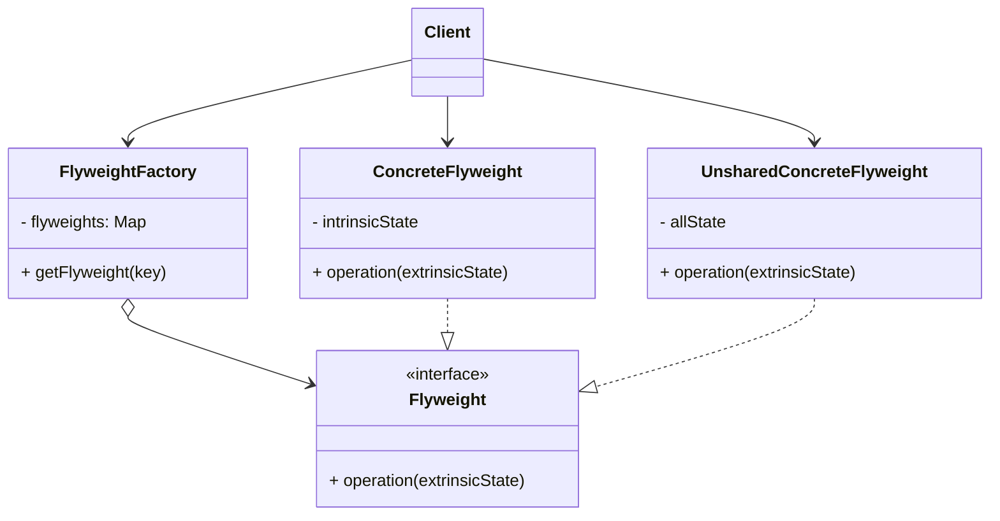

# 享元模式 (Flyweight) —— 亿万对象的瘦身秘籍

## 前言
在深入探讨享元模式之前，想向大家推荐一个非常棒的开源项目：[design-patterns-23](https://github.com/YeatsLiao/design-patterns-23)。这个项目用最现代的技术栈重写了 23 种设计模式，非常适合实战学习，还配套了[在线交互演示站](https://yeatsliao.github.io/design-patterns-23/)，可以边读文章边动手玩。本文的实战案例灵感也来源于此。

## 1. 模式背景：内存的不可承受之重

在软件开发中，我们经常会遇到需要创建大量相似对象的场景。

### 1.1 场景引入：多人在线即时战略游戏
假设我们在开发一款像《星际争霸》或《红色警戒》这样的游戏。地图上可能会有上千个“步兵”单位。
每个步兵对象都需要保存大量数据：
1.  **3D模型数据**：骨骼动画、贴图、纹理（几十 MB）。
2.  **音效数据**：移动声、开火声（几 MB）。
3.  **状态数据**：当前生命值、位置 (x, y)、朝向、剩余弹药。

如果每个步兵对象都完整地持有这所有数据：
*   1000 个步兵 $\times$ 50MB/人 = 50GB 内存。
*   游戏直接崩溃。

### 1.2 享元模式的解决方案
其实我们仔细分析，会发现大部分数据是**重复**的。
*   **不可变数据 (内部状态)**：所有“步兵”的模型、纹理、音效都是一样的。这部分可以提取出来，内存里只存一份。
*   **可变数据 (外部状态)**：每个步兵的位置、血量、朝向是不同的。这部分由各个对象自己维护。

享元模式的核心思想就是：**共享技术**。我们将那个包含了模型、纹理的“重”对象做成单例（或者有限个），让所有“轻”的步兵对象引用它。

## 2. 享元模式定义

**享元模式 (Flyweight Pattern)**：运用共享技术有效地支持大量细粒度的对象。

### 2.1 核心概念：内部状态 vs 外部状态
这是理解享元模式的关键：
1.  **内部状态 (Intrinsic State)**：
    *   存储在享元对象内部。
    *   **不随环境改变而改变**。
    *   可以被共享。
    *   例如：棋子的颜色、形状；步兵的 3D 模型。
2.  **外部状态 (Extrinsic State)**：
    *   随环境改变而改变。
    *   **不可以共享**。
    *   通常由客户端保存，在需要使用享元对象时传入。
    *   例如：棋子的坐标；步兵的位置、血量。

### 2.2 核心角色

1.  **Flyweight (抽象享元类)**：
    *   定义具体享元类的接口。
    *   通常定义一个方法 `operation(UnsharedConcreteFlyweight state)`，接受外部状态作为参数。
2.  **ConcreteFlyweight (具体享元类)**：
    *   实现 Flyweight 接口。
    *   存储内部状态。
    *   **必须是单例或在工厂中复用**。
3.  **UnsharedConcreteFlyweight (非共享具体享元类)**：
    *   并非所有 Flyweight 子类都需要被共享。Flyweight 接口只是规定了共享的可能性。
    *   通常包含外部状态。
4.  **FlyweightFactory (享元工厂类)**：
    *   负责创建和管理享元对象。
    *   维护一个享元池 (Pool)。
    *   当请求享元对象时，如果池中有，直接返回；如果没有，创建并放入池中。

### 2.3 UML 类图结构



## 3. 实战案例：共享单车管理系统

共享单车是典型的享元模式场景。
*   **内部状态**：单车的型号、颜色、车架结构（同一批次的车完全一样）。
*   **外部状态**：每辆车的编号（ID）、当前位置、使用状态。

为了简化，我们假设系统只需要管理单车的“基础信息”（内部状态）和“动态信息”（外部状态）。

### 3.1 Step 1: 定义享元接口 (BikeFlyweight)

```java
// Flyweight: 抽象单车
public abstract class BikeFlyweight {
    // 内部状态
    protected String type; // 车型（如：一代车、二代车）
    protected String color; // 颜色

    public BikeFlyweight(String type, String color) {
        this.type = type;
        this.color = color;
    }

    // 业务方法：骑行（需要传入外部状态：车牌号、位置）
    public abstract void ride(String bikeId, String location);
}
```

### 3.2 Step 2: 具体享元类 (ConcreteBike)

```java
// ConcreteFlyweight: 具体单车类型
// 这种对象在内存中只需要存一份（每种型号一份）
public class ConcreteBike extends BikeFlyweight {

    public ConcreteBike(String type, String color) {
        super(type, color);
    }

    @Override
    public void ride(String bikeId, String location) {
        System.out.println(String.format("骑行单车[型号:%s, 颜色:%s] (车牌:%s) 在位置: %s", 
                type, color, bikeId, location));
    }
}
```

### 3.3 Step 3: 享元工厂 (BikeFactory)

```java
import java.util.HashMap;
import java.util.Map;

// FlyweightFactory: 单车工厂
public class BikeFactory {
    // 缓存池
    private static Map<String, BikeFlyweight> pool = new HashMap<>();

    public static BikeFlyweight getBike(String type, String color) {
        String key = type + "-" + color;
        
        if (pool.containsKey(key)) {
            System.out.println("-> 从池中获取现有对象: " + key);
            return pool.get(key);
        } else {
            System.out.println("-> 创建新对象放入池中: " + key);
            BikeFlyweight newBike = new ConcreteBike(type, color);
            pool.put(key, newBike);
            return newBike;
        }
    }
    
    public static int getPoolSize() {
        return pool.size();
    }
}
```

### 3.4 Step 4: 客户端调用

```java
public class Client {
    public static void main(String[] args) {
        // 模拟：很多人骑车
        
        // 用户 A 骑摩拜一代
        BikeFlyweight b1 = BikeFactory.getBike("Mobike-Gen1", "Orange");
        b1.ride("No.001", "北京天安门");

        // 用户 B 骑摩拜一代（应该复用 b1）
        BikeFlyweight b2 = BikeFactory.getBike("Mobike-Gen1", "Orange");
        b2.ride("No.002", "上海东方明珠");

        // 用户 C 骑哈啰单车
        BikeFlyweight b3 = BikeFactory.getBike("Hello-Blue", "Blue");
        b3.ride("No.003", "深圳湾公园");

        System.out.println("-----------------");
        System.out.println("b1 == b2 ? " + (b1 == b2)); // true
        System.out.println("内存中实际对象数量: " + BikeFactory.getPoolSize()); // 2
    }
}
```

**输出结果**：
```text
-> 创建新对象放入池中: Mobike-Gen1-Orange
骑行单车[型号:Mobike-Gen1, 颜色:Orange] (车牌:No.001) 在位置: 北京天安门
-> 从池中获取现有对象: Mobike-Gen1-Orange
骑行单车[型号:Mobike-Gen1, 颜色:Orange] (车牌:No.002) 在位置: 上海东方明珠
-> 创建新对象放入池中: Hello-Blue-Blue
骑行单车[型号:Hello-Blue, 颜色:Blue] (车牌:No.003) 在位置: 深圳湾公园
-----------------
b1 == b2 ? true
内存中实际对象数量: 2
```

## 4. 源码中的享元模式

Java 源码中大量使用了享元模式，主要是为了节省内存和提升性能。

### 4.1 Java String 常量池
String 是 Java 中最常用的类。JVM 为了减少字符串对象的重复创建，维护了一个**字符串常量池**。
```java
String s1 = "hello";
String s2 = "hello";
System.out.println(s1 == s2); // true
```
当你创建一个字符串字面量时，JVM 首先会检查池中是否有该字符串。如果有，直接返回引用；如果没有，则创建并放入池中。这就是最典型的享元模式应用。

### 4.2 Integer.valueOf() (IntegerCache)
Java 的 `Integer` 类也利用了享元模式来缓存常用数值。
```java
Integer i1 = 127;
Integer i2 = 127;
System.out.println(i1 == i2); // true

Integer i3 = 128;
Integer i4 = 128;
System.out.println(i3 == i4); // false
```
查看 `Integer.valueOf()` 源码可以发现，Java 默认缓存了 **-128 到 127** 之间的 Integer 对象（通过 `IntegerCache` 内部类）。当数值在这个范围内时，直接返回缓存对象；超出范围才会 `new` 新对象。

### 4.3 数据库连接池 (Database Connection Pool)
虽然连接池更多被归类为**对象池 (Object Pool)** 模式，但它体现了享元模式“复用”的核心思想。
连接池中的连接对象被创建后放入池中。客户端请求连接时，从池中取出一个复用；用完后不关闭，而是放回池中供下一次使用。
**区别在于**：享元模式通常是共享“不可变”对象（多人同时用一个），而对象池是“独占”使用（一人用完还回去给下一个人用）。但二者本质都是为了减少对象创建开销。

## 5. 优缺点与适用场景

### 5.1 优点
1.  **极大减少内存消耗**：对于重复对象非常多的场景，效果立竿见影。
2.  **提高性能**：减少了对象创建和垃圾回收 (GC) 的开销。

### 5.2 缺点
1.  **系统复杂度增加**：需要分离内部状态和外部状态，如果分离不当，可能导致逻辑混乱。
2.  **线程安全问题**：如果享元对象包含非 final 的内部状态，在多线程环境下需要考虑同步。

### 5.3 适用场景
1.  系统中存在**大量**相似对象。
2.  这些对象消耗大量内存。
3.  对象的大部分状态可以外部化。
4.  需要缓冲池的场景（如字符串常量池、数据库连接池）。

## 6. 实验实操

在 `design-patterns-web` 项目中，我们通过一个“植树造林”的场景来展示享元模式的威力。
Demo 界面允许你点击“Plant 1000 Trees”按钮快速生成大量树木。左侧面板会实时计算并对比内存占用情况：
*   **Naive Memory**（红色）：假设每棵树都完整存储了所有属性（包括树的类型数据），内存消耗巨大。
*   **Flyweight Memory**（绿色）：应用享元模式后，所有树共享了 `TreeType` 对象（内部状态），每棵树只保留坐标（外部状态），内存占用显著降低。
你可以清楚地看到，随着树木数量的增加，节省的内存比例（Savings）非常可观。

**截图建议**：点击“Plant 1000 Trees”按钮几次，让屏幕上充满树木，截取左侧面板显示的内存对比数据（特别是巨大的 Savings 百分比）和右侧密集的树木渲染。
