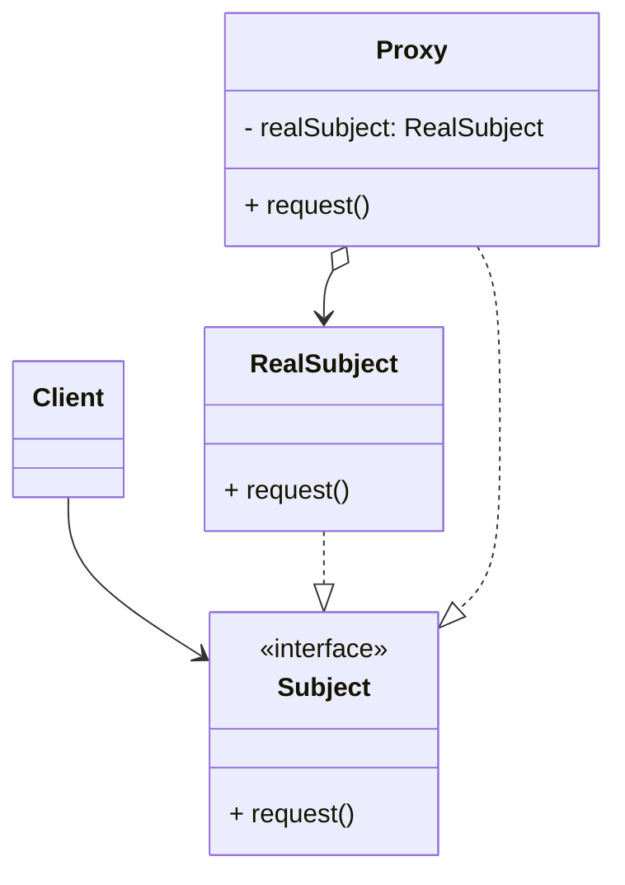

# 代理模式 (Proxy) —— 我是你的全能经纪人

## 前言
在深入探讨代理模式之前，想向大家推荐一个非常棒的开源项目：[design-patterns-23](https://github.com/YeatsLiao/design-patterns-23)。这个项目用最现代的技术栈重写了 23 种设计模式，非常适合实战学习，还配套了[在线交互演示站](https://yeatsliao.github.io/design-patterns-23/)，可以边读文章边动手玩。本文的实战案例灵感也来源于此。

## 1. 模式背景：控制与增强

在软件开发中，我们经常遇到这样的情况：客户端不能（或不便）直接访问某个对象，或者需要在访问某个对象时添加一些额外的操作（如日志、权限、事务）。

### 1.1 场景引入：访问 Google
在国内，我们无法直接访问 `google.com`。如果直接尝试连接 Google 服务器，请求往往会失败。

此时，我们可以借助一个**代理服务器 (Proxy Server)**。客户端向代理发送请求，代理再将请求转发给 Google，最后把结果返回给客户端。在这个过程中，代理服务器不仅充当了“中间人”的角色，还可以进行**缓存加速**（直接返回之前的查询结果）或**内容过滤**（拦截非法请求），从而提升访问体验和安全性。

### 1.2 代理模式的解决方案
代理模式的核心思想是**给某一个对象提供一个代理对象，并由代理对象控制对原对象的引用**。

这就像是给核心业务逻辑加上了一层“防弹衣”或“外挂”。代理对象可以在真正的业务执行之前或之后，添加额外的操作（如权限校验、日志记录、事务管理），而无需修改原有的业务代码。同时，代理还可以控制客户端对真实对象的访问权限，拒绝不合法的请求。

## 2. 代理模式定义

**代理模式 (Proxy Pattern)**：为其他对象提供一种代理以控制对这个对象的访问。

### 2.1 核心角色

1.  **Subject (抽象主题角色)**：
    *   定义了 RealSubject 和 Proxy 的共用接口，这样就在任何使用 RealSubject 的地方都可以使用 Proxy。
2.  **RealSubject (真实主题角色)**：
    *   定义了 Proxy 所代表的真实实体。
    *   它是最终真正执行业务逻辑的对象。
3.  **Proxy (代理主题角色)**：
    *   保存一个引用使得代理可以访问实体。
    *   提供一个与 Subject 的接口相同的接口，这样代理就可以用来替代实体。
    *   控制对实体的存取，并可能负责创建和删除它。
    *   **通常在将调用传递给 RealSubject 之前或之后，执行某个操作**。

### 2.2 UML 类图结构



## 3. 实战案例：明星与经纪人

### 3.1 静态代理 (Static Proxy)
静态代理是指在**编译期**就已经确定了代理类。

#### Step 1: 定义接口 (Subject)

```java
// 抽象主题：明星接口
public interface Star {
    void sing(String songName);
    void dance();
}
```

#### Step 2: 真实对象 (RealSubject)

```java
// 真实主题：刘德华
public class AndyLau implements Star {
    @Override
    public void sing(String songName) {
        System.out.println("刘德华正在唱: " + songName);
    }

    @Override
    public void dance() {
        System.out.println("刘德华正在跳舞...");
    }
}
```

#### Step 3: 代理对象 (Proxy)

```java
// 代理主题：经纪人
public class Agent implements Star {
    private Star star; // 持有真实对象的引用

    public Agent(Star star) {
        this.star = star;
    }

    @Override
    public void sing(String songName) {
        System.out.println("【经纪人】谈合同，收出场费");
        star.sing(songName); // 转发请求
        System.out.println("【经纪人】演出结束，安排车辆");
    }

    @Override
    public void dance() {
        System.out.println("【经纪人】谈合同，收出场费");
        star.dance();
        System.out.println("【经纪人】演出结束，安排车辆");
    }
}
```

#### Step 4: 客户端调用

```java
public class Client {
    public static void main(String[] args) {
        Star andy = new AndyLau();
        Star agent = new Agent(andy);
        
        agent.sing("《忘情水》");
    }
}
```

**缺点**：静态代理非常僵化。如果接口增加一个方法，代理类也要修改；如果有 100 个不同的接口需要代理，就需要写 100 个代理类。

### 3.2 动态代理 (Dynamic Proxy)

动态代理在**运行期**通过反射机制动态生成代理类。Java 中主要有两种实现方式：JDK 动态代理和 CGLIB 动态代理。

#### A. JDK 动态代理
*   **基于接口**：被代理类必须实现接口。
*   核心类：`java.lang.reflect.Proxy` 和 `InvocationHandler`。

```java
import java.lang.reflect.InvocationHandler;
import java.lang.reflect.Method;
import java.lang.reflect.Proxy;

public class JdkProxyFactory {
    
    // 获取代理对象
    public static Object getProxy(Object target) {
        return Proxy.newProxyInstance(
            target.getClass().getClassLoader(), // 类加载器
            target.getClass().getInterfaces(),  // 目标对象实现的接口
            new DebugInvocationHandler(target)  // 处理器
        );
    }

    // 处理器：定义增强逻辑
    static class DebugInvocationHandler implements InvocationHandler {
        private Object target;

        public DebugInvocationHandler(Object target) {
            this.target = target;
        }

        @Override
        public Object invoke(Object proxy, Method method, Object[] args) throws Throwable {
            System.out.println(">>> [JDK动态代理] 方法 " + method.getName() + " 开始...");
            Object result = method.invoke(target, args); // 反射调用真实对象
            System.out.println("<<< [JDK动态代理] 方法 " + method.getName() + " 结束.");
            return result;
        }
    }
}
```

**客户端调用**：

```java
public static void main(String[] args) {
    Star andy = new AndyLau();
    Star proxy = (Star) JdkProxyFactory.getProxy(andy); // 必须转成接口类型
    
    proxy.sing("《冰雨》");
    
    // 验证一下代理类的名字
    System.out.println("代理类名: " + proxy.getClass().getName()); 
    // 输出: com.sun.proxy.$Proxy0
}
```

#### B. CGLIB 动态代理
*   **基于继承**：被代理类不需要实现接口。它通过生成目标类的**子类**来拦截方法调用。
*   **限制**：无法代理 `final` 类或 `final` 方法。
*   核心类：`net.sf.cglib.proxy.Enhancer` 和 `MethodInterceptor`。

```java
// 需要引入 cglib 依赖
import net.sf.cglib.proxy.Enhancer;
import net.sf.cglib.proxy.MethodInterceptor;
import net.sf.cglib.proxy.MethodProxy;
import java.lang.reflect.Method;

public class CglibProxyFactory implements MethodInterceptor {

    public Object getProxy(Class<?> clazz) {
        Enhancer enhancer = new Enhancer();
        enhancer.setSuperclass(clazz); // 设置父类
        enhancer.setCallback(this);    // 设置回调
        return enhancer.create();
    }

    @Override
    public Object intercept(Object obj, Method method, Object[] args, MethodProxy proxy) throws Throwable {
        System.out.println(">>> [CGLIB] 前置增强");
        Object result = proxy.invokeSuper(obj, args); // 调用父类方法
        System.out.println("<<< [CGLIB] 后置增强");
        return result;
    }
}
```

## 4. 源码中的代理模式

### 4.1 Spring AOP
Spring AOP (面向切面编程) 是代理模式最著名的应用场景。Spring 会根据 Bean 的具体情况自动选择代理方式：
*   如果目标 Bean **实现了接口**，Spring 默认使用 **JDK 动态代理**。
*   如果目标 Bean **没有实现接口**，Spring 则会切换到 **CGLIB**，通过生成子类来实现代理。
*   当然，你也可以通过配置 `<aop:aspectj-autoproxy proxy-target-class="true"/>` 强制 Spring 始终使用 CGLIB 代理。

### 4.2 RPC 框架 (Dubbo / Feign)
在微服务开发中，我们经常像调用本地方法一样调用远程服务：
```java
@Reference
private UserService userService;

void doSomething() {
    userService.getUser(1); 
}
```
这里的 `userService` 并不是真正的服务端对象，而是一个**代理对象**。当你调用 `getUser(1)` 时，这个代理对象会悄悄地将方法名、参数等信息封装起来，通过网络发送给服务端。服务端执行完后，代理对象再接收返回值并交还给你。整个过程对开发者是透明的，仿佛一切都发生在本地。

### 4.3 Mybatis Mapper 接口
使用 Mybatis 时，我们只需要定义一个 `UserMapper` 接口，写好 SQL，不需要写任何实现类就能直接注入使用。这背后的魔法也是代理模式。

Mybatis 在启动时，会利用 **JDK 动态代理** 为每一个 Mapper 接口生成一个代理对象（`MapperProxy`）。当你调用接口方法时，代理对象会拦截调用，根据方法名找到对应的 SQL 语句并执行，最后将结果映射回 Java 对象。

## 5. 优缺点与适用场景

### 5.1 优点
1.  **职责分离**：真实角色只关注核心业务，非业务逻辑（日志、事务）交给代理。
2.  **保护目标对象**：控制对真实对象的访问权限。
3.  **高扩展性**：可以在不修改目标对象代码的情况下，通过代理增加功能（符合开闭原则）。

### 5.2 缺点
1.  **性能损耗**：反射调用（JDK）或 生成字节码（CGLIB）都会有一定的性能开销（虽然现在 JVM 优化得已经很快了）。
2.  **类爆炸**：静态代理会产生大量代理类。

### 5.3 适用场景
1.  **远程代理 (Remote Proxy)**：RPC 调用。
2.  **虚拟代理 (Virtual Proxy)**：延迟加载（如图片预加载）。
3.  **保护代理 (Protection Proxy)**：权限控制。
4.  **智能引用 (Smart Reference)**：AOP 切面（日志、事务、缓存）。

## 6. 实验实操

在 `design-patterns-web` 项目中，你可以体验一个带有缓存功能的视频下载代理。
Demo 模拟了视频下载请求。当你第一次点击“Download Video #1”时，请求会穿透代理，直接访问“Real Server”（红色图标），你可以看到明显的网络延迟动画。
当你再次点击同一个按钮时，请求会被“Proxy Cache”（蓝色盾牌图标）拦截，直接返回缓存的数据，速度非常快，且不会触发 Real Server 的动画。
日志面板会清晰地记录下 "Cache Miss"（首次）和 "Cache Hit"（后续）的区别，直观地展示了代理模式控制访问和增强性能的能力。

**截图建议**：先点击一次下载按钮等待完成，然后再次点击该按钮。截取第二次点击时，中间的盾牌图标发光（拦截请求）且日志显示“Cache Hit”的瞬间。
