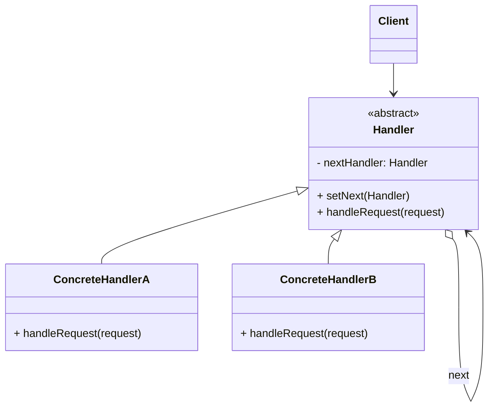

# 责任链模式 (Chain of Responsibility) —— 踢皮球的高手

## 前言
在深入探讨责任链模式之前，想向大家推荐一个非常棒的开源项目：[design-patterns-23](https://github.com/YeatsLiao/design-patterns-23)。这个项目用最现代的技术栈重写了 23 种设计模式，非常适合实战学习，还配套了[在线交互演示站](https://yeatsliao.github.io/design-patterns-23/)，可以边读文章边动手玩。本文的实战案例灵感也来源于此。

## 1. 模式背景：复杂的请求处理

在软件开发中，我们经常面临需要对一个请求进行一系列处理的场景。

### 1.1 场景引入：OA 请假审批
假设你在一家大公司工作，需要请假。公司的审批流程是这样的：
1.  **请假 < 3天**：直属组长审批。
2.  **3天 <= 请假 < 7天**：部门经理审批。
3.  **请假 >= 7天**：总经理审批。

如果我们在代码中硬编码这个逻辑：

```java
public void handleRequest(int days) {
    if (days < 3) {
        // 组长处理
    } else if (days < 7) {
        // 经理处理
    } else {
        // 总经理处理
    }
}
```

**问题**：
*   **耦合度高**：请求发送者必须知道所有的审批规则。
*   **违反开闭原则**：如果流程变了（例如新增一个“副总”审批），必须修改 `if-else` 代码块。
*   **逻辑臃肿**：如果每个角色的审批逻辑很复杂，这个方法会变得极其庞大。

### 1.2 责任链模式的解决方案
责任链模式将每个处理者（组长、经理、总经理）看作一个独立的**节点**。我们将这些节点连成一条**链**。
当请求到来时，从链头开始传递，直到有一个节点处理它为止（或者所有节点都处理一遍）。

Client -> [组长] -> [经理] -> [总经理]

客户端只需要将请求交给“组长”，剩下的事情它就不管了。

## 2. 责任链模式定义

**责任链模式 (Chain of Responsibility Pattern)**：使多个对象都有机会处理请求，从而避免请求的发送者和接收者之间的耦合关系。将这些对象连成一条链，并沿着这条链传递该请求，直到有一个对象处理它为止。

### 2.1 核心角色

1.  **Handler (抽象处理者)**：
    *   定义一个处理请求的接口。
    *   (可选) 包含一个指向下一个处理者的引用 (`nextHandler`)。
2.  **ConcreteHandler (具体处理者)**：
    *   实现处理请求的方法。
    *   判断自己能否处理该请求：
        *   如果能，则处理。
        *   如果不能，则将请求转发给下一个处理者。
3.  **Client (客户端)**：
    *   创建处理链，并向链头的处理者对象提交请求。

### 2.2 UML 类图结构



## 3. 实战案例：电商订单风控系统

在电商下单时，后台通常会进行一系列的风控检查：
1.  **非空检查**：检查订单参数是否完整。
2.  **安全检查**：检查用户账号是否有风险（黑名单）。
3.  **库存检查**：检查商品是否有货。

如果任何一个步骤失败，订单就被拦截。

### 3.1 Step 1: 定义请求对象

```java
@Data
@AllArgsConstructor
public class OrderRequest {
    private String orderId;
    private String userId;
    private String productId;
    private int amount;
}
```

### 3.2 Step 2: 定义抽象处理者

```java
public abstract class OrderHandler {
    protected OrderHandler nextHandler;

    public void setNext(OrderHandler nextHandler) {
        this.nextHandler = nextHandler;
    }

    // 核心处理方法
    public abstract boolean handle(OrderRequest request);
}
```

### 3.3 Step 3: 具体处理者

**非空检查处理器**：
```java
public class NullParamHandler extends OrderHandler {
    @Override
    public boolean handle(OrderRequest request) {
        System.out.println("-> [1] 检查参数完整性...");
        if (request.getOrderId() == null || request.getUserId() == null) {
            System.out.println("   X 参数缺失，拦截！");
            return false;
        }
        // 传递给下一个
        if (nextHandler == null) return true;
        return nextHandler.handle(request);
    }
}
```

**安全检查处理器**：
```java
public class SecurityHandler extends OrderHandler {
    @Override
    public boolean handle(OrderRequest request) {
        System.out.println("-> [2] 检查账号安全...");
        if ("black_user".equals(request.getUserId())) {
            System.out.println("   X 账号在黑名单中，拦截！");
            return false;
        }
        if (nextHandler == null) return true;
        return nextHandler.handle(request);
    }
}
```

**库存检查处理器**：
```java
public class StockHandler extends OrderHandler {
    @Override
    public boolean handle(OrderRequest request) {
        System.out.println("-> [3] 检查库存...");
        if (request.getAmount() > 100) { // 假设库存只有100
            System.out.println("   X 库存不足，拦截！");
            return false;
        }
        if (nextHandler == null) return true;
        return nextHandler.handle(request);
    }
}
```

### 3.4 Step 4: 客户端组装链条

这里可以使用“**链式编程**”的技巧来优化组装过程（Builder模式的思想），但为了演示标准模式，我们先手动组装。

```java
public class Client {
    public static void main(String[] args) {
        // 1. 创建节点
        OrderHandler h1 = new NullParamHandler();
        OrderHandler h2 = new SecurityHandler();
        OrderHandler h3 = new StockHandler();

        // 2. 组装链条: h1 -> h2 -> h3
        h1.setNext(h2);
        h2.setNext(h3);

        // 3. 发起请求
        System.out.println("--- 测试请求 1: 正常 ---");
        OrderRequest r1 = new OrderRequest("OID001", "user_001", "P100", 10);
        h1.handle(r1);

        System.out.println("\n--- 测试请求 2: 黑名单用户 ---");
        OrderRequest r2 = new OrderRequest("OID002", "black_user", "P100", 10);
        h1.handle(r2);
    }
}
```

**输出结果**：
```text
--- 测试请求 1: 正常 ---
-> [1] 检查参数完整性...
-> [2] 检查账号安全...
-> [3] 检查库存...

--- 测试请求 2: 黑名单用户 ---
-> [1] 检查参数完整性...
-> [2] 检查账号安全...
   X 账号在黑名单中，拦截！
```

可以看到，请求 2 在第二个节点被拦截，没有进入第三个节点。

## 4. 进阶：基于数组/List 的责任链（Spring 常用风格）

经典的“链表式”责任链有一个缺点：客户端需要手动处理 `setNext`，或者每个 Handler 需要维护 `next` 指针，比较麻烦。

在 Spring 和 Servlet 中，更常见的做法是引入一个 **Chain 管理者**，它内部维护一个 Handler 的 List。

### 4.1 定义接口

```java
public interface Filter {
    void doFilter(String request, FilterChain chain);
}
```

### 4.2 定义 Chain 管理者

```java
import java.util.ArrayList;
import java.util.List;

public class FilterChain {
    private List<Filter> filters = new ArrayList<>();
    private int index = 0; // 当前执行到第几个

    // 链式添加
    public FilterChain addFilter(Filter filter) {
        filters.add(filter);
        return this;
    }

    public void doFilter(String request) {
        if (index == filters.size()) {
            return; // 链条执行完了
        }
        
        // 获取当前 filter
        Filter f = filters.get(index);
        index++;
        
        // 执行 filter，并把自己（Chain）传进去，让 filter 决定何时调用下一个
        f.doFilter(request, this);
    }
}
```

### 4.3 具体 Filter

```java
public class LogFilter implements Filter {
    @Override
    public void doFilter(String request, FilterChain chain) {
        System.out.println("LogFilter: 请求来了 -> " + request);
        // 放行，调用链中的下一个
        chain.doFilter(request);
        System.out.println("LogFilter: 请求处理完了");
    }
}

public class AuthFilter implements Filter {
    @Override
    public void doFilter(String request, FilterChain chain) {
        if (request.contains("admin")) {
            System.out.println("AuthFilter: 权限校验通过");
            chain.doFilter(request);
        } else {
            System.out.println("AuthFilter: 权限不足，拦截！");
            // 不调用 chain.doFilter，链条在此终止
        }
    }
}
```

### 4.4 调用

```java
public static void main(String[] args) {
    FilterChain chain = new FilterChain();
    chain.addFilter(new LogFilter())
         .addFilter(new AuthFilter());

    chain.doFilter("user:admin, action:delete");
}
```

这种方式更加灵活，易于管理，且支持 Filter 在处理**之后**执行逻辑（回溯）。

## 5. 源码中的责任链模式

### 5.1 Servlet Filter
Java Web 开发中最经典的责任链。
`javax.servlet.Filter` 接口和 `FilterChain` 接口。
Tomcat 容器会把 web.xml 中配置的 Filter 组装成一个链，请求到来时依次经过这些 Filter。

### 5.2 Spring MVC Interceptor
`HandlerExecutionChain` 类。
Spring MVC 在处理请求时，会根据 URL 找到对应的 Handler（Controller 方法），并将该 Handler 和所有匹配的 `HandlerInterceptor` 包装成一个 `HandlerExecutionChain` 对象。
执行时，依次调用 Interceptor 的 `preHandle` 方法。

### 5.3 Netty ChannelPipeline
Netty 的核心处理模型。`ChannelPipeline` 维护了一个 `ChannelHandler` 的双向链表。
入站事件（Inbound）从链头流向链尾，出站事件（Outbound）从链尾流向链头。

### 5.4 Mybatis Plugin
Mybatis 的插件机制也是责任链。
`InterceptorChain` 类维护了所有的插件。在创建 Executor、StatementHandler 等核心对象时，会通过 `pluginAll` 方法，使用动态代理层层包装目标对象。

## 6. 优缺点与总结

### 优点
1.  **降低耦合度**：请求发送者无需知道请求被谁处理，处理者也无需知道请求的全貌。
2.  **增强扩展性**：可以方便地增加新的处理类，或者调整链的顺序，符合开闭原则。
3.  **灵活指派**：可以根据业务逻辑动态构建链条。

### 缺点
1.  **性能损耗**：如果链条很长，每个请求都要遍历链条，会有一定的性能开销。
2.  **调试困难**：逻辑分散在各个类中，运行时的调用栈可能会很深，排查问题比较麻烦。
3.  **循环调用风险**：如果链条配置不当（A->B->A），可能导致死循环。
4.  **不能保证被处理**：如果链尾都没有处理者处理该请求，请求可能会被丢弃（需要兜底机制）。

### 适用场景
1.  **多级审批**：请假、报销、贷款审批。
2.  **拦截器/过滤器**：权限校验、日志记录、参数签名验签、防刷限流。
3.  **异常处理**：多个异常处理器依次尝试处理异常。

## 7. 最佳实践 Tips

*   **控制链的长度**：避免链条过长导致性能问题（StackOverflowError）。
*   **统一上下文**：在链中传递数据时，建议定义一个统一的 Context 对象（如 `OrderRequest` 或 `Map<String, Object>`），而不是传递散乱的参数。
*   **配置化**：最好将链的组装逻辑放到配置文件或数据库中，结合 Spring 的依赖注入，实现真正的动态可配置。

## 8. 实验实操

在 `design-patterns-web` 项目中，我们模拟了一个多级客户支持系统来演示责任链。
界面上有三个按钮代表不同级别的请求：“Simple Query”（简单咨询）、“Complex Issue”（复杂问题）和“Critical Failure”（严重故障）。
*   点击“Simple Query”，只有 **Bot**（机器人）会响应。
*   点击“Complex Issue”，Bot 无法处理，请求会传递给 **Support Agent**（人工客服）处理。
*   点击“Critical Failure”，前两者都无法处理，最终由 **Manager**（经理）介入。
右侧的日志面板会以瀑布流的形式展示请求在链条中的传递过程，直到被某个处理者捕获。

**截图建议**：依次点击三个不同级别的按钮，截取右侧日志面板中显示的不同处理路径（例如 Critical Failure 经过 Bot -> Agent -> Manager 的完整链条）。
