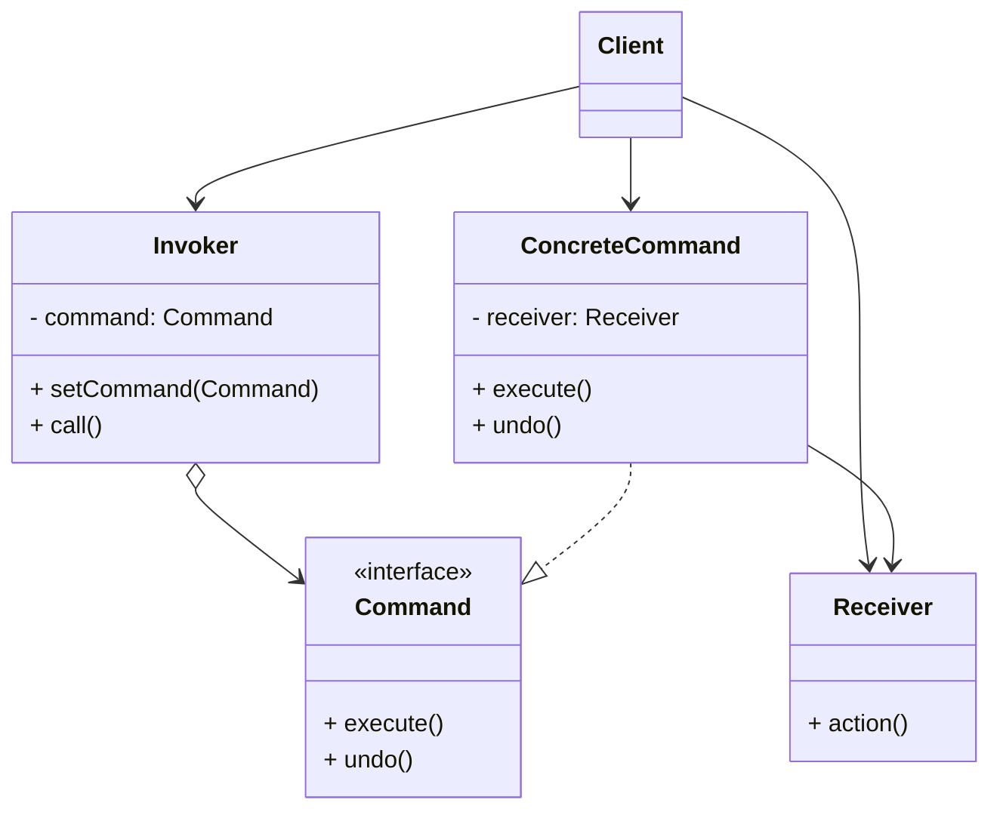

# 命令模式 (Command) —— 运筹帷幄的将军

## 前言
在深入探讨命令模式之前，想向大家推荐一个非常棒的开源项目：[design-patterns-23](https://github.com/YeatsLiao/design-patterns-23)。这个项目用最现代的技术栈重写了 23 种设计模式，非常适合实战学习，还配套了[在线交互演示站](https://yeatsliao.github.io/design-patterns-23/)，可以边读文章边动手玩。本文的实战案例灵感也来源于此。

## 1. 模式背景：请求的封装与解耦

在软件设计中，我们经常需要向某些对象发送请求，但是并不知道请求的接收者是谁，也不知道被请求的操作具体是怎么执行的。

### 1.1 场景引入：智能家居控制系统
假设我们要设计一个智能家居的通用遥控器。
*   这个遥控器有多个按钮。
*   我们希望某个按钮可以开灯，另一个按钮可以开电视，甚至未来可以控制扫地机器人。

如果不使用设计模式，我们可能会在遥控器类（Invoker）里写一堆 `if-else` 或者直接依赖具体的电器类（Receiver）：

```java
public class RemoteControl {
    private Light light;
    private TV tv;

    public void pressButton1() {
        light.on(); // 强依赖 Light
    }
    
    public void pressButton2() {
        tv.open(); // 强依赖 TV
    }
}
```

**问题**：
1.  **高耦合**：遥控器必须知道家里有什么电器。
2.  **扩展性差**：买了个新电器，得拆开遥控器改代码。
3.  **功能受限**：很难实现“撤销”、“定时执行”、“一键开启所有电器（宏命令）”等高级功能。

### 1.2 命令模式的解决方案
命令模式的核心是将**请求**封装成一个**对象**。
*   遥控器只管调用 `command.execute()`。
*   具体 `execute()` 里是开灯还是开电视，由具体的 Command 对象决定。
*   Command 对象内部持有真正的执行者（Light 或 TV）。

这样，遥控器（Invoker）和电器（Receiver）就完全解耦了。

---

## 2. 命令模式定义

**命令模式 (Command Pattern)**：将一个请求封装为一个对象，从而使你可用不同的请求对客户进行参数化；对请求排队或记录请求日志，以及支持可撤销的操作。

### 2.1 核心角色

1.  **Command (抽象命令)**：
    *   声明执行操作的接口（通常是 `execute()`）。
2.  **ConcreteCommand (具体命令)**：
    *   将一个接收者对象绑定于一个动作。
    *   调用接收者相应的操作，以实现 `execute()`。
3.  **Receiver (接收者)**：
    *   知道如何实施与执行一个请求相关的操作。任何类都可能作为一个接收者。
4.  **Invoker (调用者/请求者)**：
    *   要求该命令执行这个请求。通常持有 Command 对象。
5.  **Client (客户端)**：
    *   创建一个具体命令对象并设定它的接收者。

### 2.2 UML 类图结构



---

## 3. 实战案例：多功能遥控器与宏命令

我们来实现一个支持“撤销”和“宏命令”（一键组合操作）的遥控器。

### 3.1 Step 1: 接收者 (Receiver)

家里的电器，真正的干活人。

```java
// 电灯
public class Light {
    private String name;

    public Light(String name) { this.name = name; }

    public void on() { System.out.println(name + " 亮了"); }
    public void off() { System.out.println(name + " 灭了"); }
}

// 音响
public class Stereo {
    public void on() { System.out.println("音响打开"); }
    public void off() { System.out.println("音响关闭"); }
    public void setCD() { System.out.println("音响设置为 CD 模式"); }
    public void setVolume(int vol) { System.out.println("音响音量设置为 " + vol); }
}
```

### 3.2 Step 2: 命令接口 (Command)

```java
public interface Command {
    void execute(); // 执行
    void undo();    // 撤销
}
```

### 3.3 Step 3: 具体命令 (ConcreteCommand)

**开灯命令**：
```java
public class LightOnCommand implements Command {
    private Light light;

    public LightOnCommand(Light light) {
        this.light = light;
    }

    @Override
    public void execute() {
        light.on();
    }

    @Override
    public void undo() {
        light.off(); // 开灯的撤销是关灯
    }
}
```

**关灯命令**：
```java
public class LightOffCommand implements Command {
    private Light light;

    public LightOffCommand(Light light) {
        this.light = light;
    }

    @Override
    public void execute() {
        light.off();
    }

    @Override
    public void undo() {
        light.on();
    }
}
```

**音响开启宏命令 (MacroCommand)**：
比如“回家模式”，我们要开灯、开音响、调大音量。
```java
public class MacroCommand implements Command {
    private Command[] commands; // 命令数组

    public MacroCommand(Command[] commands) {
        this.commands = commands;
    }

    @Override
    public void execute() {
        for (Command cmd : commands) {
            cmd.execute();
        }
    }

    @Override
    public void undo() {
        // 撤销时，需要反向遍历
        for (int i = commands.length - 1; i >= 0; i--) {
            commands[i].undo();
        }
    }
}
```

### 3.4 Step 4: 调用者 (Invoker)

遥控器。

```java
public class RemoteControl {
    private Command slot; // 假设只有一个按钮

    public void setCommand(Command command) {
        this.slot = command;
    }

    public void buttonWasPressed() {
        slot.execute();
    }

    public void undoButtonWasPressed() {
        slot.undo();
    }
}
```

### 3.5 Step 5: 客户端测试

```java
public class Client {
    public static void main(String[] args) {
        // 1. 创建接收者
        Light livingRoomLight = new Light("客厅灯");
        Stereo stereo = new Stereo();

        // 2. 创建具体命令
        LightOnCommand lightOn = new LightOnCommand(livingRoomLight);
        LightOffCommand lightOff = new LightOffCommand(livingRoomLight);
        
        // 复杂的音响命令（这里简化，应该封装成 StereoOnWithCDCommand）
        // 这里演示宏命令：一键开启“派对模式”
        Command[] partyList = { lightOn, lightOff, lightOn }; // 闪烁一下？
        MacroCommand partyMode = new MacroCommand(partyList);

        // 3. 创建调用者
        RemoteControl remote = new RemoteControl();

        // 测试 1: 开灯
        System.out.println("--- 按下开灯 ---");
        remote.setCommand(lightOn);
        remote.buttonWasPressed();
        System.out.println("--- 按下撤销 ---");
        remote.undoButtonWasPressed();

        // 测试 2: 宏命令
        System.out.println("\n--- 开启派对模式 ---");
        remote.setCommand(partyMode);
        remote.buttonWasPressed();
        System.out.println("--- 撤销派对模式 ---");
        remote.undoButtonWasPressed();
    }
}
```

**输出结果**：
```text
--- 按下开灯 ---
客厅灯 亮了
--- 按下撤销 ---
客厅灯 灭了

--- 开启派对模式 ---
客厅灯 亮了
客厅灯 灭了
客厅灯 亮了
--- 撤销派对模式 ---
客厅灯 灭了
客厅灯 亮了
客厅灯 灭了
```

---

## 4. 源码中的命令模式

### 4.1 JDK Runnable
`java.lang.Runnable` 接口就是一个典型的命令接口。
```java
public interface Runnable {
    public abstract void run();
}
```
线程池 `ThreadPoolExecutor` 就是 Invoker，它负责调度和执行这些 Command（Runnable 任务）。

### 4.2 Spring JdbcTemplate
在 `JdbcTemplate` 中，`StatementCallback` 接口充当了命令的角色。
`execute(StatementCallback<T> action)` 方法接收一个命令对象，然后在内部创建 `Statement`（Receiver），并调用命令的 `doInStatement` 方法。

### 4.3 Hystrix 熔断器
Netflix 的 Hystrix 框架大量使用了命令模式。所有的外部调用都必须继承 `HystrixCommand` 或 `HystrixObservableCommand`。
这使得 Hystrix 可以统一控制这些请求的执行（同步/异步）、超时、熔断、降级等。

---

## 5. 命令模式 vs 策略模式

这两个模式的类图看起来非常像，都是把一个逻辑封装成对象。

| 模式 | 关注点 | 语义 |
| :--- | :--- | :--- |
| **命令模式 (Command)** | **What (做什么)** | 发送者和接收者解耦。关注的是**动作**本身，以及动作的生命周期（排队、撤销）。 |
| **策略模式 (Strategy)** | **How (怎么做)** | 算法的替换。关注的是**同一个目标的不同实现方式**（如：排序算法、计税策略）。 |

*   如果你的意图是**记录、撤销、重做、事务**，用命令模式。
*   如果你的意图是**灵活切换算法**，用策略模式。

---

## 6. 优缺点与总结

### 优点
1.  **解耦**：调用者无需关心命令具体怎么执行，也不用知道接收者是谁。
2.  **扩展性强**：新增命令很简单，不需要修改现有代码。
3.  **支持组合命令**：可以将多个命令组装成一个宏命令。
4.  **支持撤销/重做**：通过保存命令的历史记录，可以方便地实现 Undo/Redo。

### 缺点
1.  **类爆炸**：对于每一个操作，都需要定义一个具体的 Command 类。如果系统中有 100 个操作，就会有 100 个类，这可能导致项目变得臃肿。
    *   *优化*：可以使用 Java 8 Lambda 表达式或方法引用来减少类的定义（如果是简单的命令）。

### 适用场景
1.  **GUI 按钮/菜单**：点击按钮触发什么操作，可以在运行时配置。
2.  **任务队列**：将任务封装成对象，放入队列中异步执行。
3.  **事务系统**：支持回滚操作（Undo）。
4.  **宏命令**：录制和回放一系列操作。

## 7. 最佳实践 Tips

*   **智能命令 (Smart Command)**：标准的命令模式通过 `Receiver` 去执行逻辑。但如果逻辑很简单，也可以直接在 `Command` 内部实现，不再依赖 Receiver。这叫“智能命令”或“退化的命令模式”。
*   **结合 Memento 模式**：如果要实现复杂的撤销功能（比如恢复对象状态），命令模式通常需要结合**备忘录模式 (Memento)** 来保存执行前的状态。
*   **Lambda 简化**：在 Java 8+ 中，如果 Command 接口只有一个方法（Functional Interface），可以直接传 Lambda，避免写大量的匿名内部类或具体类。
    ```java
    remote.setCommand(() -> System.out.println("开灯"));
    ```

## 8. 实验实操

在 `design-patterns-web` 项目中，你可以通过智能灯控系统体验命令模式的魅力。
界面提供了“Turn On”、“Turn Off”、“Set Red”、“Set Blue”等按钮。每次点击操作，实际上都是生成了一个具体的 `Command` 对象并被执行。
更有趣的是“Undo”按钮。你可以随意操作几次灯光（改变颜色、开关），然后点击 Undo。你会发现灯光的状态会严格按照你操作的相反顺序一步步回退。这展示了命令模式如何将操作封装为对象，从而轻松实现撤销/重做栈。

**截图建议**：进行一系列颜色和开关操作后，截取灯泡显示某种颜色，且 Undo 按钮上显示可撤销步数（例如 "Undo (3)"）的画面。
