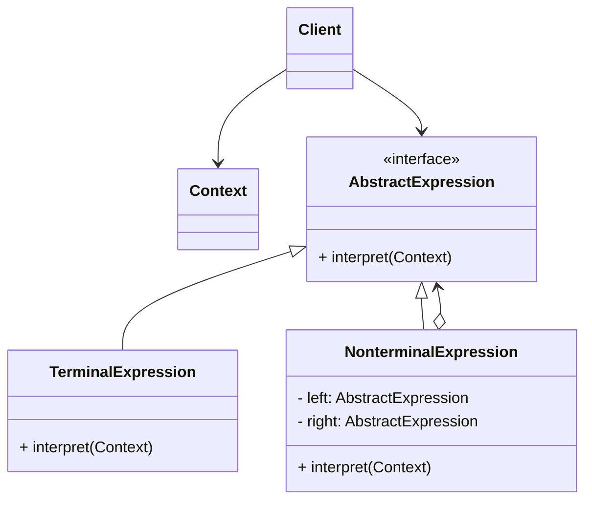

# 解释器模式 (Interpreter) —— 语言的魔法师

## 前言
在深入探讨解释器模式之前，想向大家推荐一个非常棒的开源项目：[design-patterns-23](https://github.com/YeatsLiao/design-patterns-23)。这个项目用最现代的技术栈重写了 23 种设计模式，非常适合实战学习，还配套了[在线交互演示站](https://yeatsliao.github.io/design-patterns-23/)，可以边读文章边动手玩。本文的实战案例灵感也来源于此。

## 1. 模式背景：领域特定语言 (DSL)

在软件开发中，我们有时会遇到一些特定的问题，这些问题无法直接用通用的编程语言（如 Java）简洁地表达，或者我们需要允许用户自定义一些规则。

### 1.1 场景引入：机器人指令控制
假设你开发了一款机器人，你想让用户可以通过简单的文本指令控制它。
指令格式：`DOWN RUN 10 LEFT MOVE 20`
意思是：向下跑 10 步，然后向左移动 20 步。

如果用 `if-else` 或字符串切割来硬写：
```java
String[] commands = text.split(" ");
for (int i = 0; i < commands.length; i++) {
    if ("DOWN".equals(commands[i])) { ... }
    else if ("RUN".equals(commands[i])) { ... }
    // 逻辑非常脆弱，难以处理嵌套或复杂语法
}
```

我们需要一种更优雅的方式来**定义文法**，并**解析**这些句子。这就是解释器模式的用武之地。它通常用于构建 **DSL (Domain Specific Language)**。

---

## 2. 解释器模式定义

**解释器模式 (Interpreter Pattern)**：给定一个语言，定义它的文法的一种表示，并定义一个解释器，这个解释器使用该表示来解释语言中的句子。

### 2.1 核心角色

1.  **AbstractExpression (抽象表达式)**：
    *   声明一个抽象的解释操作，这个接口为抽象语法树中所有的节点所共享。
    *   通常包含 `interpret(Context context)` 方法。
2.  **TerminalExpression (终结符表达式)**：
    *   实现与文法中的终结符相关联的解释操作。
    *   文法中每一个终结符都有一个具体终结表达式与之相对应（如：变量、数字、关键字）。
    *   它是树的叶子节点，不再包含子节点。
3.  **NonterminalExpression (非终结符表达式)**：
    *   为文法中的非终结符实现解释操作。
    *   通常包含其他表达式（Terminal 或 Nonterminal）作为子节点（如：加法、循环）。
4.  **Context (环境/上下文)**：
    *   包含解释器之外的一些全局信息（如：变量的值 `a=10, b=20`）。
5.  **Client (客户端)**：
    *   构建（或通过解析器构建）抽象语法树。
    *   调用解释操作。

### 2.2 UML 类图结构

解释器模式的结构其实就是**组合模式 (Composite Pattern)** 的一种特例。



---

## 3. 实战案例：自定义四则运算解释器

我们要实现一个能解析 `a + b - c` 这种表达式的解释器。

### 3.1 Step 1: 环境类 (Context)
用于存储变量的值（比如 `a=10`）。

```java
import java.util.HashMap;
import java.util.Map;

public class Context {
    private Map<String, Integer> variableMap = new HashMap<>();

    public void assign(String var, int value) {
        variableMap.put(var, value);
    }

    public int getValue(String var) {
        return variableMap.getOrDefault(var, 0);
    }
}
```

### 3.2 Step 2: 抽象表达式

```java
public interface Expression {
    int interpret(Context context);
}
```

### 3.3 Step 3: 终结符表达式 (变量)

```java
public class Variable implements Expression {
    private String name;

    public Variable(String name) {
        this.name = name;
    }

    @Override
    public int interpret(Context context) {
        // 从上下文中获取变量的值
        return context.getValue(name);
    }
}
```

### 3.4 Step 4: 非终结符表达式 (加减法)

```java
public class Add implements Expression {
    private Expression left, right;

    public Add(Expression left, Expression right) {
        this.left = left;
        this.right = right;
    }

    @Override
    public int interpret(Context context) {
        return left.interpret(context) + right.interpret(context);
    }
}

public class Minus implements Expression {
    private Expression left, right;

    public Minus(Expression left, Expression right) {
        this.left = left;
        this.right = right;
    }

    @Override
    public int interpret(Context context) {
        return left.interpret(context) - right.interpret(context);
    }
}
```

### 3.5 Step 5: 简单的解析器 (Parser)
解释器模式只负责“解释”，通常还需要一个“解析器”把字符串变成语法树。这里我们用**栈**来实现一个简单的后缀表达式（逆波兰）解析，或者为了演示方便，直接手动组装。

为了更贴近真实场景，我们写一个能解析 `a + b - c` 的解析逻辑（假设输入已经是处理好的顺序，或者简化处理）：

```java
import java.util.Stack;

public class Calculator {
    private Expression expression;

    // 解析逻辑：这里简化假设输入是 "a b + c -" (后缀表达式) 或者我们简单处理
    // 为了演示方便，我们直接手动组装树，或者写个简单的从左到右解析
    // 真实场景通常需要用 Stack 处理 "a + b - c"
    public Calculator(String expressionStr) {
        Stack<Expression> stack = new Stack<>();
        
        // 假设 expressionStr 是 "a + b - c"
        // 这种中缀表达式解析比较复杂，通常转后缀再算。
        // 这里我们简化：假设总是 从左到右，没有括号
        
        String[] charArray = expressionStr.split(" ");
        Expression left = null;
        Expression right = null;

        for (int i = 0; i < charArray.length; i++) {
            switch (charArray[i]) {
                case "+":
                    left = stack.pop();
                    right = new Variable(charArray[++i]); // 取下一个作为右操作数
                    stack.push(new Add(left, right));
                    break;
                case "-":
                    left = stack.pop();
                    right = new Variable(charArray[++i]);
                    stack.push(new Minus(left, right));
                    break;
                default:
                    stack.push(new Variable(charArray[i]));
                    break;
            }
        }
        this.expression = stack.pop();
    }

    public int calculate(Context context) {
        return this.expression.interpret(context);
    }
}
```
*注：上面的解析逻辑非常简陋，仅为了演示如何构建树。真正的解析器（Compiler）要复杂得多。*

### 3.6 Step 6: 客户端调用

```java
public class Client {
    public static void main(String[] args) {
        // 1. 定义上下文
        Context context = new Context();
        context.assign("a", 10);
        context.assign("b", 20);
        context.assign("c", 5);

        // 2. 解析表达式: "a + b - c"
        // 对应的语法树结构：Minus( Add(a, b), c )
        Calculator calculator = new Calculator("a + b - c");

        // 3. 计算
        int result = calculator.calculate(context);
        System.out.println("Result: " + result); // (10 + 20) - 5 = 25
    }
}
```

---

## 4. 源码中的解释器模式

### 4.1 Spring SpEL (Spring Expression Language)
Spring 中强大的表达式语言 `#{...}`。
`ExpressionParser` 解析字符串，生成 `Expression` 对象，然后调用 `getValue()`。
虽然内部实现非常复杂（使用了 AST 抽象语法树），但思想是解释器模式。

### 4.2 Hibernate HQL
Hibernate 将 HQL (`FROM User WHERE age > 18`) 解析为 SQL。这也是一种解释器/编译器实现。

### 4.3 java.util.regex.Pattern
正则表达式是典型的解释器模式应用。
`Pattern` 类编译正则表达式字符串，生成一个状态机（内部由多个节点组成），`Matcher` 负责执行匹配。

### 4.4 Cron 表达式
Quartz 等调度框架解析 Cron 表达式 (`0 0 12 * * ?`) 来计算下次执行时间。

---

## 5. 解释器模式 vs 组合模式

| 模式 | 关注点 | 结构 |
| :--- | :--- | :--- |
| **解释器模式** | **语言解析** | 专门用于表示抽象语法树（AST）。节点代表文法规则（终结符/非终结符）。 |
| **组合模式** | **部分-整体** | 用于表示树形结构（如文件系统、菜单）。节点代表对象集合。 |

解释器模式的**静态结构**（类图）就是组合模式。
区别在于**行为**：解释器模式的节点包含 `interpret` 方法，目的是执行某种逻辑计算；而组合模式的节点通常是管理子节点或执行统一操作。

---

## 6. 优缺点与总结

### 优点
1.  **易于扩展文法**：如果需要增加新的运算符（如乘法），只需要增加一个新的非终结符类 (`MultiplyExpression`)，不需要修改现有代码。
2.  **实现简单文法容易**：对于规则简单、层级不深的语法，解释器模式实现起来很直观。

### 缺点
1.  **性能问题**：解释器模式通常使用递归调用。如果表达式非常复杂、层级很深，会导致运行慢，甚至栈溢出。
2.  **类膨胀**：每一条文法规则都需要至少一个类。如果语法很复杂，类会多得可怕。
3.  **解析复杂**：解释器模式只解决了“解释”执行的问题，但如何把字符串变成语法树（Parse 过程）通常非常复杂，需要具备编译原理知识。

### 适用场景
1.  **特定领域语言 (DSL)**：如 SQL 解析、正则解析、数学公式计算。
2.  **规则引擎**：需要频繁修改规则，且规则可以用简单的语言表达。
3.  **编译器开发**：作为编译器前端的一部分。

## 7. 最佳实践 Tips

*   **不要滥用**：如果你需要解析像 Java 或 C++ 这样复杂的语言，**千万不要**手写解释器模式。请使用成熟的工具，如 **ANTLR**, **JavaCC**, **Lex & Yacc**。
*   **结合其他模式**：
    *   **享元模式 (Flyweight)**：终结符（如字母、数字）可以共享，减少对象创建。
    *   **访问者模式 (Visitor)**：如果要在语法树上执行多种不同的操作（不仅仅是 interpret，还有 format, check 等），可以使用访问者模式将操作与语法树分离。

## 8. 实验实操

在 `design-patterns-web` 项目中，提供了一个简单的数学表达式解释器。
你可以在输入框中输入类似 `5 + 10 - 3` 的加减法表达式。点击“Interpret”后，系统内部会使用解释器模式将字符串解析为表达式树（Expression Tree），并递归调用 `interpret()` 方法计算结果。
界面会显示最终的计算结果（如 12），验证了解释器模式如何定义文法并解释执行句子。

**截图建议**：在输入框输入一个较长的表达式（如 `100 + 50 - 20`），并点击计算，截取显示正确大号绿色结果数字的画面。
