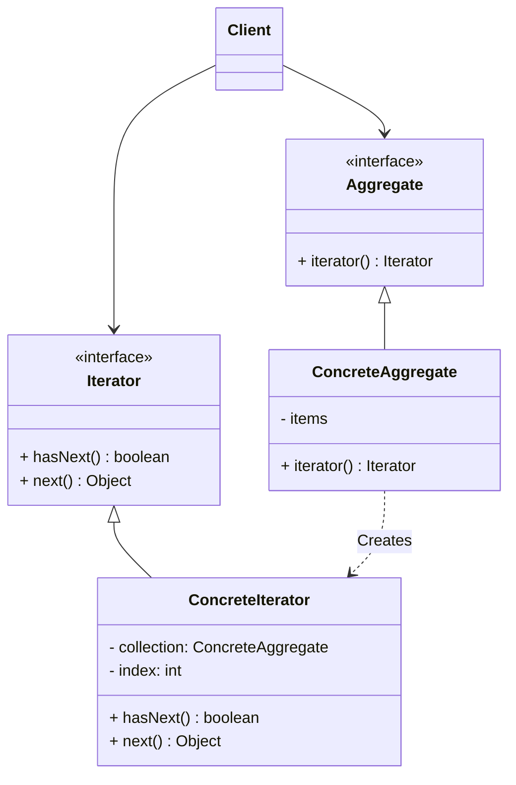

# 迭代器模式 (Iterator) —— 遍历元素的通用钥匙

## 前言
在深入探讨迭代器模式之前，想向大家推荐一个非常棒的开源项目：[design-patterns-23](https://github.com/YeatsLiao/design-patterns-23)。这个项目用最现代的技术栈重写了 23 种设计模式，非常适合实战学习，还配套了[在线交互演示站](https://yeatsliao.github.io/design-patterns-23/)，可以边读文章边动手玩。本文的实战案例灵感也来源于此。

## 1. 模式背景：统一遍历接口

在软件开发中，我们经常需要存储和遍历一组对象。我们有各种各样的数据结构：
*   **数组 (Array)**：使用下标 `books[i]` 访问。
*   **链表 (LinkedList)**：使用 `node.next` 访问。
*   **哈希表 (HashMap)**：使用 `entry.key` 访问。
*   **树 (Tree)**：使用前序/中序/后序遍历。

如果客户端（Client）想要遍历这些不同的容器，就必须知道它们内部的具体实现细节。
```java
// 遍历数组
for (int i = 0; i < array.length; i++) { ... }

// 遍历链表
while (node != null) { ... }
```
这导致客户端与容器的实现**紧密耦合**。如果我想把底层存储从数组换成链表，客户端的遍历代码就得重写。

我们希望能有一种**统一**的方式来遍历所有类型的容器，而不管它底层是怎么存的。

## 2. 迭代器模式定义

**迭代器模式 (Iterator Pattern)**：提供一种方法顺序访问一个聚合对象中的各个元素，而又不暴露该对象的内部表示。

### 2.1 核心角色

1.  **Iterator (抽象迭代器)**：
    *   定义访问和遍历元素的接口。
    *   通常包含 `hasNext()` (是否有下一个) 和 `next()` (获取下一个) 方法。
2.  **ConcreteIterator (具体迭代器)**：
    *   实现迭代器接口。
    *   记录遍历的当前位置。
3.  **Aggregate (抽象聚合类)**：
    *   定义创建相应迭代器对象的接口（通常是 `iterator()` 方法）。
4.  **ConcreteAggregate (具体聚合类)**：
    *   实现创建迭代器的接口，返回一个具体的迭代器实例。

### 2.2 UML 类图结构



## 3. 实战案例：书架与书籍遍历

我们模拟一个书架（Aggregate），它内部可能用数组存书，也可能用 ArrayList 存书。我们要实现一个迭代器来遍历它。

### 3.1 Step 1: 定义接口

Java 已经提供了标准的 `java.util.Iterator` 和 `java.lang.Iterable` 接口，我们直接使用它们，或者为了演示模式原理，定义简化版。这里为了贴近原生，我们模拟 JDK 的命名。

```java
// 对应 Aggregate
public interface MyIterable<T> {
    MyIterator<T> iterator();
}

// 对应 Iterator
public interface MyIterator<T> {
    boolean hasNext();
    T next();
}
```

### 3.2 Step 2: 具体聚合类 (BookShelf)

```java
public class BookShelf implements MyIterable<String> {
    private String[] books;
    private int last = 0;

    public BookShelf(int maxsize) {
        this.books = new String[maxsize];
    }

    public String getBookAt(int index) {
        return books[index];
    }

    public void appendBook(String book) {
        this.books[last] = book;
        last++;
    }

    public int getLength() {
        return last;
    }

    @Override
    public MyIterator<String> iterator() {
        return new BookShelfIterator(this);
    }
}
```

### 3.3 Step 3: 具体迭代器 (BookShelfIterator)

这个类通常作为聚合类的**内部类**实现，因为它需要直接访问聚合类的私有成员（如数组）。为了演示清晰，我们先作为外部类，通过公开方法访问。

```java
public class BookShelfIterator implements MyIterator<String> {
    private BookShelf bookShelf;
    private int index;

    public BookShelfIterator(BookShelf bookShelf) {
        this.bookShelf = bookShelf;
        this.index = 0;
    }

    @Override
    public boolean hasNext() {
        if (index < bookShelf.getLength()) {
            return true;
        } else {
            return false;
        }
    }

    @Override
    public String next() {
        String book = bookShelf.getBookAt(index);
        index++;
        return book;
    }
}
```

### 3.4 Step 4: 客户端调用

```java
public class Client {
    public static void main(String[] args) {
        BookShelf bookShelf = new BookShelf(4);
        bookShelf.appendBook("Effective Java");
        bookShelf.appendBook("Clean Code");
        bookShelf.appendBook("Design Patterns");

        // 客户端不知道 bookShelf 内部是用数组还是 List
        // 只管拿迭代器遍历
        MyIterator<String> it = bookShelf.iterator();
        while (it.hasNext()) {
            String book = it.next();
            System.out.println(book);
        }
    }
}
```

**输出结果**：
```text
Effective Java
Clean Code
Design Patterns
```

## 4. 源码中的迭代器模式

### 4.1 Java Collections Framework
Java 所有的集合类（List, Set, Map）都广泛使用了迭代器模式。
*   `Collection` 接口继承了 `Iterable` 接口。
*   `ArrayList` 内部有一个 `Itr` 内部类实现了 `Iterator` 接口。
*   `HashMap` 有 `KeyIterator`, `ValueIterator`, `EntryIterator`。

### 4.2 增强 for 循环 (foreach)
Java 5 引入的增强 for 循环：
```java
for (String s : list) {
    System.out.println(s);
}
```
这只是语法糖。编译后，它会被编译器自动转译成迭代器的调用：
```java
Iterator var2 = list.iterator();
while(var2.hasNext()) {
    String s = (String)var2.next();
    System.out.println(s);
}
```
所以，任何实现了 `Iterable` 接口的类，都可以使用增强 for 循环。

### 4.3 Fail-Fast 机制 (快速失败)
在 Java 集合的迭代器实现中，通常有一个 `modCount` 变量。
*   每次调用 `add/remove` 修改集合结构时，`modCount++`。
*   迭代器在创建时会记录当前的 `expectedModCount = modCount`。
*   在迭代过程中（调用 `next()`），如果发现 `expectedModCount != modCount`，说明集合在遍历过程中被其他人（或别的线程）修改了。
*   此时抛出 `ConcurrentModificationException`，防止出现未知的错误。

## 5. 内部迭代器 vs 外部迭代器

### 5.1 外部迭代器 (External Iterator)
上面演示的就是外部迭代器。
*   **控制权**：在客户端手中。客户端显式调用 `hasNext()` 和 `next()`。
*   **优点**：灵活。客户端可以控制遍历速度，甚至可以在遍历过程中停止。

### 5.2 内部迭代器 (Internal Iterator)
Java 8 的 `forEach` 就是内部迭代器。
*   **控制权**：在聚合对象（或迭代器）手中。客户端只需要提供“对每个元素做什么（Consumer）”。
*   **优点**：代码简洁。更容易并行化（如 Java 8 Stream parallel）。

```java
// 内部迭代器示例
list.forEach(item -> System.out.println(item));
```

## 6. 优缺点与总结

### 优点
1.  **解耦**：封装了遍历算法，客户端不需要知道聚合对象的内部结构（数组、链表、树）。
2.  **单一职责**：聚合类只负责存储数据，迭代器类只负责遍历数据。
3.  **多态遍历**：可以为同一个聚合对象提供不同的迭代器（如：正序遍历、倒序遍历）。

### 缺点
1.  **类爆炸**：对于每一个聚合类，都需要配对一个迭代器类。
2.  **性能微损**：对于简单的数组遍历，迭代器（方法调用）比直接的 `for(i)` 循环稍微慢一点点（通常可忽略）。

### 适用场景
1.  访问一个聚合对象的内容而无须暴露它的内部表示。
2.  需要为聚合对象提供多种遍历方式。
3.  为遍历不同的聚合结构提供一个统一的接口。

## 7. 最佳实践 Tips

*   **优先使用增强 for 循环**：在 Java 中，除非你需要用到 `Iterator.remove()` 方法在遍历时删除元素，否则尽量使用 `for (T item : collection)`，代码更简洁。
*   **不要在遍历时修改集合**：除非使用 `Iterator.remove()`，否则在遍历过程中调用 `list.remove()` 会触发 Fail-Fast 异常。
*   **Stream API**：在 Java 8+ 中，`Stream` API 提供了更强大的遍历和处理能力（filter, map, reduce），通常比手写迭代器更优。

## 8. 实验实操
在 `design-patterns-web` 项目中，我们通过一个**音乐播放列表**的 Demo 来演示迭代器模式的应用。
这个 Demo 展示了如何使用迭代器遍历播放列表，而无需暴露列表的底层存储结构。
*   **播放列表控制**：点击 "Next" 或 "Prev" 按钮时，播放器使用迭代器 (`OrderIterator`) 获取下一首或上一首歌曲，播放器本身并不直接操作数组索引。
*   **乱序播放**：虽然 Demo 中默认展示了顺序播放，但迭代器模式的优势在于可以轻松替换为 `RandomIterator` 实现随机播放，而无需修改播放器的主体逻辑。
**截图建议**：截取播放器界面，重点展示当前的歌曲信息（如 "Playing: Song B"）以及底部的控制按钮，体现出通过统一的控制接口遍历歌曲集合的过程。
