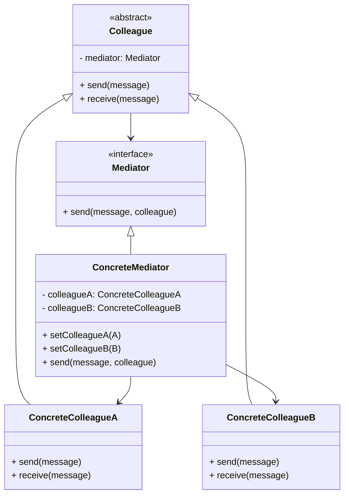

# 中介者模式 (Mediator) —— 拒绝乱连线的调度中心

## 前言
在深入探讨中介者模式之前，想向大家推荐一个非常棒的开源项目：[design-patterns-23](https://github.com/YeatsLiao/design-patterns-23)。这个项目用最现代的技术栈重写了 23 种设计模式，非常适合实战学习，还配套了[在线交互演示站](https://yeatsliao.github.io/design-patterns-23/)，可以边读文章边动手玩。本文的实战案例灵感也来源于此。

## 1. 模式背景：网状结构 vs 星形结构

在软件开发中，我们经常遇到多个对象之间需要相互通信的情况。

### 1.1 场景引入：联合国
世界上有 200 多个国家。如果每个国家都和其他国家直接建交、通信：
*   中国 -> 美国
*   中国 -> 日本
*   中国 -> 英国
*   ...
这是一个巨大的**网状结构**（Full Mesh），连接数是 $N \times (N-1) / 2$。关系极其复杂，牵一发而动全身。

为了解决这个问题，成立了**联合国**（United Nations）。
*   各国只需要派代表常驻联合国。
*   如果中国要传话给美国，可以通过联合国协调。
*   结构变成了**星形结构**（Star Topology），连接数降为 $N$。

### 1.2 中介者模式的解决方案
中介者模式引入了一个**中介者对象**，用来封装一系列对象之间的交互。中介者使各对象不需要显式地相互引用，从而使其耦合松散，而且可以独立地改变它们之间的交互。

---

## 2. 中介者模式定义

**中介者模式 (Mediator Pattern)**：用一个中介对象来封装一系列的对象交互。中介者使各对象不需要显式地相互引用，从而使其耦合松散，而且可以独立地改变它们之间的交互。

### 2.1 核心角色

1.  **Mediator (抽象中介者)**：
    *   定义了同事对象到中介者对象的接口。
2.  **ConcreteMediator (具体中介者)**：
    *   实现抽象中介者的方法。
    *   它需要知道所有具体的同事类，并从具体同事接收消息，向其他同事发出命令。
3.  **Colleague (抽象同事类)**：
    *   保存中介者的引用。
    *   只知道中介者，不知道其他同事。
4.  **ConcreteColleague (具体同事类)**：
    *   每个人只知道自己的行为，不知道其他人的情况。
    *   当需要和其他人通信时，就找中介者。

### 2.2 UML 类图结构



---

## 3. 实战案例：智能家居控制中心

在智能家居系统中，各个设备之间往往有复杂的联动关系：
*   闹钟响了 -> 咖啡机开始工作 -> 窗帘拉开。
*   电视打开了 -> 窗帘拉上 -> 灯光调暗。

如果让闹钟直接调用咖啡机，咖啡机直接调用窗帘，耦合度就太高了。我们需要一个**智能中枢 (Mediator)**。

### 3.1 Step 1: 抽象中介者

```java
public abstract class Mediator {
    public abstract void send(String message, Colleague colleague);
}
```

### 3.2 Step 2: 抽象同事类 (智能设备)

```java
public abstract class Colleague {
    protected Mediator mediator;

    public Colleague(Mediator mediator) {
        this.mediator = mediator;
    }
    
    // 核心方法：发送指令给中介
    public void send(String message) {
        mediator.send(message, this);
    }

    // 核心方法：接收指令
    public abstract void receive(String message);
}
```

### 3.3 Step 3: 具体同事类

**闹钟**：
```java
public class Alarm extends Colleague {
    public Alarm(Mediator mediator) { super(mediator); }

    @Override
    public void receive(String message) {
        System.out.println("闹钟收到消息: " + message);
    }

    public void ring() {
        System.out.println("闹钟响了！滴滴滴！");
        // 通知中介者，我响了
        super.send("alarm_ring");
    }
}
```

**咖啡机**：
```java
public class CoffeeMachine extends Colleague {
    public CoffeeMachine(Mediator mediator) { super(mediator); }

    @Override
    public void receive(String message) {
        if ("alarm_ring".equals(message)) {
            startCoffee();
        }
    }

    public void startCoffee() {
        System.out.println("咖啡机开始煮咖啡...");
    }
}
```

**窗帘**：
```java
public class Curtains extends Colleague {
    public Curtains(Mediator mediator) { super(mediator); }

    @Override
    public void receive(String message) {
        if ("alarm_ring".equals(message)) {
            System.out.println("窗帘自动打开，迎接阳光！");
        } else if ("tv_on".equals(message)) {
            System.out.println("窗帘自动关闭，防止反光！");
        }
    }
}
```

**电视**：
```java
public class TV extends Colleague {
    public TV(Mediator mediator) { super(mediator); }

    @Override
    public void receive(String message) {
        // TV 暂时不关心别人的消息
    }

    public void turnOn() {
        System.out.println("电视打开了");
        super.send("tv_on");
    }
}
```

### 3.4 Step 4: 具体中介者 (智能中枢)

```java
public class SmartHomeMediator extends Mediator {
    private Alarm alarm;
    private CoffeeMachine coffeeMachine;
    private Curtains curtains;
    private TV tv;

    // 注入各个设备
    public void setAlarm(Alarm alarm) { this.alarm = alarm; }
    public void setCoffeeMachine(CoffeeMachine coffeeMachine) { this.coffeeMachine = coffeeMachine; }
    public void setCurtains(Curtains curtains) { this.curtains = curtains; }
    public void setTv(TV tv) { this.tv = tv; }

    @Override
    public void send(String message, Colleague colleague) {
        // 收到消息后，协调其他设备
        if (colleague == alarm) {
            // 闹钟响了 -> 煮咖啡、开窗帘
            coffeeMachine.receive(message);
            curtains.receive(message);
        } else if (colleague == tv) {
            // 电视开了 -> 关窗帘
            curtains.receive(message);
        }
    }
}
```

### 3.5 Step 5: 客户端调用

```java
public class Client {
    public static void main(String[] args) {
        // 1. 创建中介者
        SmartHomeMediator mediator = new SmartHomeMediator();

        // 2. 创建同事（设备），并认识中介者
        Alarm alarm = new Alarm(mediator);
        CoffeeMachine coffeeMachine = new CoffeeMachine(mediator);
        Curtains curtains = new Curtains(mediator);
        TV tv = new TV(mediator);

        // 3. 中介者认识大家
        mediator.setAlarm(alarm);
        mediator.setCoffeeMachine(coffeeMachine);
        mediator.setCurtains(curtains);
        mediator.setTv(tv);

        // --- 场景 1：早晨闹钟响了 ---
        System.out.println("=== 早晨 ===");
        alarm.ring();

        // --- 场景 2：晚上看电视 ---
        System.out.println("\n=== 晚上 ===");
        tv.turnOn();
    }
}
```

**输出结果**：
```text
=== 早晨 ===
闹钟响了！滴滴滴！
咖啡机开始煮咖啡...
窗帘自动打开，迎接阳光！

=== 晚上 ===
电视打开了
窗帘自动关闭，防止反光！
```

---

## 4. 源码中的中介者模式

### 4.1 JDK Timer
`java.util.Timer` 充当了中介者。
*   `TimerTask` 是同事类。
*   `Timer` 协调各个 Task 的执行时间，Task 之间互不关心。

### 4.2 Spring MVC DispatcherServlet
MVC 框架中的 Controller (C) 其实就是 Model (M) 和 View (V) 的中介者。
但在 Spring MVC 内部，`DispatcherServlet` 是更顶层的中介者：
1.  它接收 HTTP 请求。
2.  调用 `HandlerMapping` 找处理器。
3.  调用 `HandlerAdapter` 执行逻辑。
4.  调用 `ViewResolver` 解析视图。
5.  返回响应。
各个组件互不认识，全靠 `DispatcherServlet` 调度。

---

## 5. 中介者模式 vs 外观模式 vs 观察者模式

| 模式 | 结构 | 方向 | 目的 |
| :--- | :--- | :--- | :--- |
| **中介者模式 (Mediator)** | 星形结构 | **双向** | 协调多个对象之间的交互（同事之间互不通信，全靠中介）。 |
| **外观模式 (Facade)** | 树形/层级 | **单向** | 为子系统提供统一入口（上层调用下层，下层不知道上层）。 |
| **观察者模式 (Observer)** | 1 对 N | **单向** | 当一个对象变化时，通知所有依赖者（通常是单向通知）。 |

**辨析**：
*   中介者模式的中介者通常比较“重”，包含很多业务逻辑。
*   观察者模式通常用于状态同步。
*   有时候中介者模式会结合观察者模式来实现（中介者作为 Observer 监听 Colleagues 的事件）。

---

## 6. 优缺点与总结

### 优点
1.  **减少耦合**：将多对多的网状关系简化为一对多的星形关系。
2.  **集中控制**：交互逻辑被集中在同一个地方（中介者），便于管理和修改。
3.  **复用性**：同事类（Colleague）变得很简单，没有任何依赖，非常容易复用。

### 缺点
1.  **上帝类 (God Class)**：中介者类承担了太多的责任。如果系统很复杂，中介者会变得非常臃肿，难以维护。一旦中介者挂了，整个系统就瘫痪了。

### 适用场景
1.  系统中对象之间存在复杂的引用关系，产生的依赖关系结构混乱且难以复用。
2.  想通过一个中间类来封装多个类中的行为，而又不想生成太多的子类。
3.  **MVC 架构**：View 和 Model 通常不直接交互，而是通过 Controller 协调。

## 7. 最佳实践 Tips

*   **慎用**：不要一看到两个对象交互就用中介者。只有当对象关系复杂成“网状”时才考虑。如果是简单的 A 调用 B，直接调用就好。
*   **拆分中介者**：如果中介者太大，可以按照业务模块拆分成多个小的中介者。

## 8. 实验实操
在 `design-patterns-web` 项目中，我们提供了一个**多人聊天室**的 Demo 来展示中介者模式。
在这个场景中，聊天室（ChatRoom）充当了中介者，而各个用户（User）则是同事类。
*   **消息路由**：当你在 User A 的输入框发送消息时，消息并不是直接发给 User B 的，而是发送给 ChatRoom。ChatRoom 接收到消息后，负责将其分发给所有其他用户（如 User B, User C）。
*   **解耦效果**：用户之间不需要互相持有引用，新加入一个用户只需在 ChatRoom 注册即可，完全符合中介者模式“网状变星形”的设计初衷。
**截图建议**：打开两个或多个用户窗口（Demo 界面中模拟的），在一个窗口发送消息，截取该消息同时出现在所有用户聊天记录面板的画面，直观展示中介者的广播协调能力。
