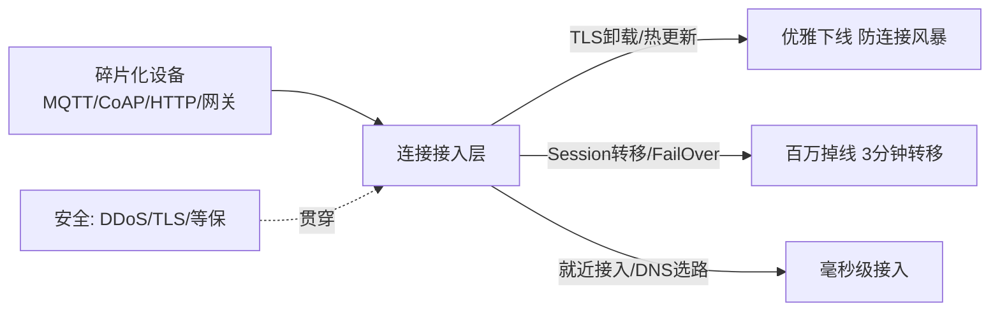

# 阿里云 · 稳定连接

> 技术栈：阿里云物联网平台连接层（MQTT / CoAP / HTTP、TLS、网关与边缘代理）作为具体案例
> 适用场景：理解大规模设备接入时，连接层面临的碎片化、连接风暴、广域安全挑战，以及平台怎么扛

## 0. “连得上”和“连得稳”是两回事

"连得上"和"连得稳"，是两回事。

几台设备的时候，随便起个 TCP 服务就能收数据。可一旦设备上了规模——几十万、上百万台，而且分散在地下车库、高空铁塔、甚至动物身上——连接就不再是"建个长连接"那么简单：设备型号千奇百怪、网络随时抖、还老有人想打你。

这一篇就讲连接层这个最底层、却最容易被忽视的环节：**怎么把碎片化的设备，稳稳地接进来。**


*（以下为阿里云官方原图，作对照参考）*

## 1. 问题背景：物联网难在终端太特殊

传统互联网面对的是整齐的手机、PC，协议、系统都相对统一。物联网终端的"特殊"，带来三个典型挑战：

### 1.1 碎片化

物联网设备的模组、芯片、操作系统、网络、资源消耗情况差异极大。一台智能水表、一个工业 PLC、一盏路灯，背后的芯片和协议可能完全不一样。碎片化严重程度远超移动互联网。

### 1.2 远程实时在线 → 连接风暴

设备一旦上云，往往要支持远程控制与监控，所以大多采用**低功耗长连接**。但长连接的隐患是：一旦网络抖动、云平台发布、或设备批量故障，可能造成大规模设备集体上线 / 下线，触发整个雪崩——这就是连接风暴。

### 1.3 地域分布广 + 安全要求高

设备可能在地下、高空、动物身上，分布在地球每个角落，规模是移动互联网的几个量级。同时安全风险极高：DDoS、数据泄露都要防。

## 2. 设计理念：连接层的三组对策

### 2.1 用多协议 + 边缘代理消化碎片化

平台不要求设备统一协议，而是自己把差异吃下：

- 支持 **CoAP、HTTP、MQTT** 等多种协议，MQTT 是标准的低功耗连接协议；
- 针对局域网场景，支持**各种网关和边缘代理模型**，由边缘做协议转换；
- 对客户已有的标准 MQTT 存量设备，支持**一键迁移**上云。

```text
碎片化的设备侧               平台连接层怎么兜底
  MQTT 设备        ─────→  原生接入
  CoAP / HTTP 设备 ─────→  协议适配接入
  LoRa / 串口设备   ─────→  经网关 / 边缘代理接入
  存量 MQTT 设备    ─────→  一键迁移，不改设备端
```

### 2.2 用优雅上下线 + FailOver 防连接风暴

在连接风暴上，阿里云在网络代理层做了一组能力：

- **TLS 卸载、热更新、Session 转移**：平台发布或网络抖动时，支持连接优雅下线，避免瞬间大规模重连；
- **FailOver（故障转移）**：连接故障时，能做到百万设备掉线 **3 分钟故障转移**。

这背后是一套"不让连接瞬间崩塌"的工程能力，而不是简单的长连接保活。

### 2.3 用就近接入 + 安全通道扛广域与攻击

- **就近接入**：全球 8 大数据中心，按 IP 地址就近选址，配合 DNS 智能选路和网络加速，达到**毫秒级接入**；
- **安全通道**：支持 **600Gbps DDoS 防御**、通道采用 **TLS 加密**、满足**等保 2.0 三级**认证。

把三组对策串成一张能力图：



## 3. 实际应用：选连接方案时盯住什么

落到你做接入规划时，几个判断：

- **设备用什么协议，就接什么协议**，别强行让所有设备都改 MQTT；哑设备走网关代理即可；
- **存量设备优先用平台的一键迁移**，避免改造设备端；
- **连接稳定性看 FailOver 指标**，别只看"支持长连接"，要看故障转移时长。

## 4. 注意事项

**（1）别小看连接风暴。** 长连接 + 网络抖动是物联网的常态，发布变更、断电恢复都可能引发批量重连。没有优雅下线和 FailOver，一次抖动就能拖垮接入层。

**（2）安全通道要默认开。** DDoS、TLS 加密、等保不是可选项，设备规模一大，攻击面就大，安全通道必须前置。

**（3）就近接入影响体验。** 全球分布的设备，接入时延和 Region 选址、DNS 选路强相关，跨国有业务要提前规划 Region。

## 5. 小结

连接层解决的不只是"设备连上来"，而是**在碎片化、易抖动、广分布、高威胁的现实里，连得稳**。它的核心工程能力是：多协议兜底碎片化、优雅上下线 + FailOver 防风暴、就近接入 + 安全通道扛广域。

下一篇（三），设备连上来之后就要发消息了。我们讲**消息与规则引擎**——百亿级消息怎么可靠流转、实时优先，又怎么通过规则引擎"自己流"到该去的地方。

## 参考链接

- [阿里云物联网平台技术解读与实践（原始分享）](https://zhuanlan.zhihu.com/p/595865566)
- [阿里云物联网平台产品页](https://www.aliyun.com/product/iot)
