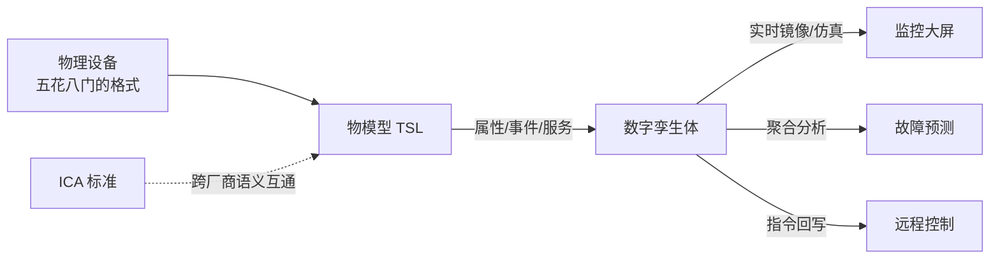

# 阿里云 · 物模型与数字孪生：TSL 定义设备，孪生映射物理世界

> 技术栈：阿里云物联网平台物模型（TSL）与数字孪生作为具体案例
> 适用场景：理解平台怎么把五花八门的设备的"能力"结构化、标准化，并进一步建出可计算的数字孪生体


消息到了平台，平台拿到的是什么？大概率是一串设备自定义的 JSON，甚至是一段二进制。平台知道"有个设备发了数据"，但不知道"这串数里哪个是温度、温度单位是什么、这台设备现在能不能远程重启"。

换句话说：**连接解决了"在不在"，消息解决了"到没到"，但"平台能不能看懂这台设备"是另一回事。**

这一篇讲物模型与数字孪生：**怎么把物理设备描述成平台能计算、能复用、能互通的标准数据。**


*（以下为阿里云官方原图，作对照参考）*

## 1.问题背景：设备千姿百态，数据没有标准

### 1.1 同一个含义，一百种写法

A 厂温度叫 `temp`，B 厂叫 `temperature`，C 厂发的是 `{"t":26.5,"u":"C"}`。平台如果为每台设备写一套解析逻辑，设备一多就崩。更糟的是，**每接一个新设备，业务系统都要重新适配一遍**。

### 1.2 应用重复造轮子

没有统一模型，监控大屏、告警服务、预测算法各自去理解设备数据，同一份"温度"在三个系统里有三种解释。复用为零，维护成本翻倍。

## 2.设计理念：用物模型把设备"数字化"

### 2.1 TSL：用结构化三件套描述设备

阿里云用 **TSL（Thing Specification Language，物模型）** 把设备的"能力"抽象成三类：

- **属性 property**：设备持续的状态量，可读、可写。比如温度、开关、电压；
- **事件 event**：设备主动上报的瞬时动作。比如"告警触发""故障发生"，带时间戳和上下文；
- **服务 service**：平台下发给设备的指令。比如"远程重启""下发配置"，有入参、有回调。

一份 TSL 长这样（精简示意）：

```json
{
  "properties": [
    {"identifier": "temperature", "name": "温度", "dataType": "double", "unit": "°C"},
    {"identifier": "powerSwitch", "name": "开关", "dataType": "bool"}
  ],
  "events": [
    {"identifier": "overTempAlarm", "name": "过温告警", "type": "alert", "outputData": ["temperature"]}
  ],
  "services": [
    {"identifier": "reboot", "name": "远程重启", "callType": "async", "inputData": []}
  ]
}
```

有了 TSL，平台和所有业务系统都按**同一套语义**理解设备：温度就是 `temperature`，单位就是 `°C`。设备侧字段叫 `temp` 还是 `t`，由平台在接入时映射掉，业务侧无感。

### 2.2 数字孪生：从"能看懂"到"能计算"

物模型解决了"看懂单个设备"。更进一步，平台建出**数字孪生体**——物理设备在云端的实时镜像：

- 它持续同步设备的属性、事件、服务状态；
- 它可以被仿真、可以被聚合（一台逆变器 → 一个电站 → 一片区域）；
- 监控大屏、故障预测、远程控制都建立在它之上，而不是反复去"扒"设备原始数据。

### 2.3 ICA 标准：让不同厂商说同一种话

光一个平台内部统一还不够。阿里云推动 **ICA（IoT Connectivity Alliance）物模型标准**，让不同厂商、不同品类的设备，在"属性 / 事件 / 服务"这套语义上互通。你换一家设备供应商，只要它遵循 ICA，上层应用基本不用改。

把这条链路画出来：



## 3.实际应用：建模时盯什么

- **先定模型，再接设备**。别等设备铺完了才发现字段乱。产品建模（TSL）是接入前的一步，做在前面最省事；
- **属性和事件别混用**。持续状态用属性，瞬时动作（告警、故障）用事件，否则下游统计和告警逻辑会乱；
- **能复用 ICA 标准物模型就复用**。标准品类（电表、水表、门锁）直接用现成模型，少造轮子。

## 4.注意事项

**（1）物模型不是越细越好。** 把设备所有寄存器都建模，反而拖慢同步、增加存储。只建模业务真正用到的能力。

**（2）设备侧语义要靠模型约定。** 上篇（三）说协议解耦能消化格式差异，但"temp 是不是温度"这种语义，必须由物模型兜底——两者配合，才叫完整。

**（3）数字孪生是"镜像"不是"替代"。** 它同步设备状态，但下发指令仍走真实设备。别把孪生体当成控制闭环的唯一真相源。

## 5.小结

物模型与数字孪生，回答的是"平台怎么看懂设备"：TSL 用**属性 / 事件 / 服务**三件套把设备能力结构化，数字孪生把单台设备变成可计算、可聚合的云端镜像，ICA 标准让跨厂商互通成为可能。

它的价值一句话：**让"设备数据"从各说各话，变成平台和业务都能复用的标准资产。** 下一篇（五），我们讲**海量设备管理**——设备多了之后，检索、升级、分发这些"运维动作"怎么规模化。

## 参考链接

- [阿里云物联网平台技术解读与实践（原始分享）](https://zhuanlan.zhihu.com/p/595865566)
- [阿里云物联网平台产品页](https://www.aliyun.com/product/iot)
