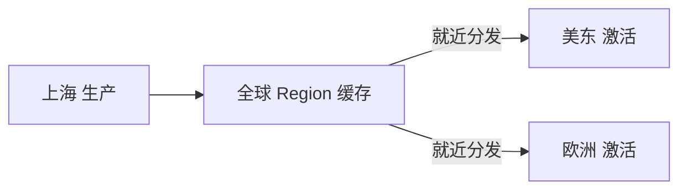

# 阿里云 · 海量设备管理：批量注册、OTA 灰度与全球就近接入

> 技术栈：阿里云物联网平台设备管理（异构检索 / OTA / 全球分发）作为具体案例
> 适用场景：理解设备规模上去之后，检索、升级、分发这些"运维动作"怎么规模化、可控化


设备接进来、消息能跑、模型也建了。但设备一多，问题从"能不能连"变成"怎么管"：百万台设备里怎么快速找到那台报错的？固件有漏洞怎么给百万台一起打补丁？设备在中国生产、在美国激活，固件怎么送过去？

这一篇讲设备管理：**连接解决"进来"，管理解决"管得住、改得了、发得走"。**


*（以下为阿里云官方原图，作对照参考）*

## 1.问题背景：规模带来的三类麻烦

### 1.1 异构设备检索难

设备型号、厂商、固件版本、地理分布全不一样。业务问一句"华东区 firmware 1.0 且离线超过 24 小时的逆变器有哪些"，如果只能一台台翻，根本没法运维。

### 1.2 OTA 升级规模化

发现一批设备有 bug，要升级固件。直接全量推送？百万台同时下载，带宽打爆、设备重启雪崩。必须分批、灰度、可回滚。

### 1.3 全球分发

设备常在生产地（如上海）出厂，却在海外（美东、欧洲）激活。固件和配置如果只存在国内 Region，海外设备拉取又慢又贵。

## 2.设计理念：管、改、发都要规模化

### 2.1 异构检索：统一索引 + 标签

平台给设备建统一索引，支持按产品、标签、状态、地域多维检索。检索从"翻设备"变成"查索引"——这和（四）物模型的标准化是一脉相承的：模型统一了，检索才能规模化。

### 2.2 OTA：分批灰度 + 可回滚

升级任务配置目标版本、灰度策略、批次大小、速率：

```json
{
  "productKey": "a1b2c3",
  "targetVersion": "1.2.0",
  "strategy": "grayscale",
  "batchSize": 1000,
  "rolloutSpeed": "500/h",
  "rollbackOnFailure": true
}
```

先小批验证，再逐步放量，失败自动回滚。升级从"赌一把"变成"可控发布"。

### 2.3 全球分发：生产地与激活地分离

固件在出厂地（上海）生产，平台把它分发到全球 Region 缓存，设备在哪激活就从哪就近拉取——生产地和激活地解耦。



## 3.实际应用：做设备管理时盯什么

- **设备一进场就打标签、入索引**，别等出事了才补检索能力；
- **OTA 永远先灰度后全量**，留好回滚开关；
- **跨国设备提前规划固件分发 Region**，别让海外激活走到国内拉取。

## 4.注意事项

**（1）检索能力前置。** 没有标签和索引，百万设备在故障面前就是黑盒。这是（四）物模型之后的自然延伸。

**（2）OTA 是高风险操作。** 全量推送等于事故温床，灰度 + 回滚是底线，不是可选项。

**（3）全球分发注意合规与成本。** 固件/数据跨境要留意合规要求，就近分发既快又省流量钱。

## 5.小结

设备管理解决的是规模化的"管、改、发"：统一索引让百万设备可检索，灰度 OTA 让升级可控，全球分发让固件的生产地与激活地解耦。

下一篇（六）收尾：设备和平台都建好了，怎么保证它自己别挂、出问题能查、规模能扛——我们讲**智能运维与高可用**。

## 参考链接

- [阿里云物联网平台技术解读与实践（原始分享）](https://zhuanlan.zhihu.com/p/595865566)
- [阿里云物联网平台产品页](https://www.aliyun.com/product/iot)
