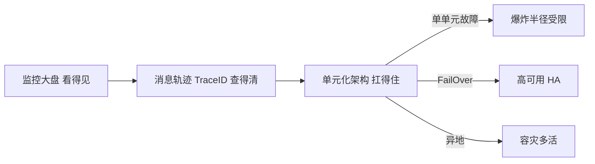

# 阿里云 · 智能运维与高可用

> 技术栈：阿里云物联网平台运维（监控大盘 / 消息轨迹 / 单元化架构）作为具体案例
> 适用场景：理解平台怎么保证自己"看得见、查得清、扛得住"，并用两个典型案例收尾整个系列

## 0. 平台自己也会出故障

前面五篇在讲"把平台建好"：连接、消息、物模型、设备管理。但平台自己也是软件，也会出故障。规模越大，一次故障的波及面越广。

这一篇讲运维与高可用，回答三个问题：**状态看得见吗？出问题查得清吗？挂了能扛住吗？** 最后用两个典型案例收尾整个系列。

*（以下为阿里云官方原图，作对照参考）*

## 1. 问题背景：平台自己也会出事

### 1.1 大规模下排查难

一条告警说"设备数据没上来"。是设备断了？网络抖了？消息丢了？规则引擎没转发？没有全链路视野，排查像盲人摸象。

### 1.2 高可用与容灾

单点故障不可避免。连接节点、消息节点任何一处挂了，不能让百万设备全掉线。这是（一）里说的"自建难点在规模化下的稳定"的延续。

## 2. 设计理念：看得见、查得清、扛得住

### 2.1 自定义监控大盘：状态看得见

平台提供可自定义的监控大盘——业务自己选指标（在线数、消息速率、错误率）、设阈值、配告警。把"凭感觉"变成"看面板"。

### 2.2 消息轨迹 + TraceID：查得清

每条消息带 TraceID，从设备上报 → 接入 → 规则引擎 → 下游，全链路可追踪。哪一段丢了，一查便知。这正好补上了（三）消息层"可靠可达"的最后一公里可观测性。

### 2.3 单元化架构与故障转移：扛得住

核心是高可用设计：

- **单元化**：把系统拆成多个独立单元，单单元故障的爆炸半径被关在该单元内；
- **FailOver / HA**：单元间互为备份，故障自动转移；
- **Region 多活 / 异地容灾**：跨地域部署，一地故障另一地接管。

把三层串起来：

## 3. 实际应用：两个典型案例

- **共享充电宝**：海量低功耗设备，靠稳定连接和远程控制（借还、锁定）；连接层的 FailOver 保证设备随时可控——对应（二）稳定连接。
- **电动车充电桩**：实时计费消息要求高可靠、低延迟；消息层的可达率 + 规则引擎把计费数据实时流转到结算系统——对应（三）消息与规则引擎。

这两个案例，正好把本系列前几篇的能力落到了具体业务上：平台能力不是陈列品，而是业务跑通的底座。

## 4. 注意事项

**（1）监控要"业务化"。** 别只盯 CPU，要盯业务指标（在线率、消息成功率），否则告警响了业务早挂了。

**（2）TraceID 要全链路。** 半路断掉的轨迹，比没有更害人——你以为没问题，其实断在看不见的地方。

**（3）高可用是架构级的。** 单元化 + FailOver + 多活，缺一不可，别靠单机冗余硬扛规模。

## 5. 小结（系列收尾）

走到这里，整个阿里云物联网平台的设计理念串成一条线：

- （一）为什么需要平台：它是业务上云的基础设施；
- （二）稳定连接：在碎片化、抖动、广域里连得稳；
- （三）消息与规则引擎：百亿级消息可靠、实时、自己流转；
- （四）物模型与数字孪生：把设备数字化成标准资产；
- （五）海量设备管理：检索、升级、分发规模化；
- （六）智能运维与高可用：看得见、查得清、扛得住。

一句话收束：**物联网平台的价值，是把"设备又多又杂又时断时续"这个现实，收敛成平台一侧干净、业务一侧简单的结构。** 希望这个系列，帮你建立起一套可迁移到任何物联网平台的思考框架。

## 参考链接

- [阿里云物联网平台技术解读与实践（原始分享）](https://zhuanlan.zhihu.com/p/595865566)
- [阿里云物联网平台产品页](https://www.aliyun.com/product/iot)
