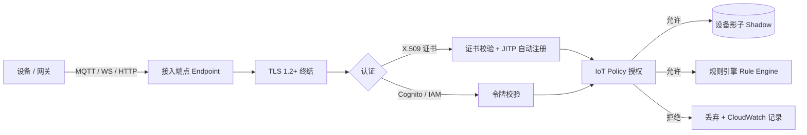

# AWS · 稳定连接

连接是物联网平台的第一道门。设备能不能连上来、连上来安不安全、断了能不能稳稳重连，决定了后面所有事情有没有意义。（一）里我们说平台要"把又多又杂又时断时续收敛掉"，这一篇就讲 AWS 是怎么在连接这一层把它收敛掉的。

## 1 问题背景：连接的碎片化

真实世界的设备连接，远比"设备连 Broker"复杂：

- **协议不统一**：受限设备用 MQTT 省流量；浏览器/车机用 MQTT over WebSocket 穿透防火墙；老系统只认 HTTP。
- **身份各异**：有的是单台设备要独立证书，有的是同一型号共用凭证，还有的是手机 App 代表用户操作设备。
- **网络会抖**：隧道切换、信号弱、设备休眠，连接必然断；断线后消息丢弃还是补发、状态要不要回填，平台得定义清楚。
- **安全是硬要求**：设备凭证泄露、伪造设备接入、越权发布控制指令，任何一条都是生产事故。

连接层要同时解决"通、认、稳、安"四件事，而不是只管"通"。

## 2 设计理念：连接层该扛住什么

AWS IoT Core 在连接层的设计，可以拆成四条主线：

1. **协议归一**：在接入侧终结 MQTT / MQTT over WebSocket / HTTP，统一成平台内部消息，业务侧不必关心设备用哪种协议。
2. **身份与认证解耦**：支持 X.509 客户端证书、IAM 角色、Amazon Cognito（终端用户）、以及自定义授权者（你自己的鉴权服务），把"谁在连"和"怎么连"分开。
3. **策略即授权**：每个设备/主体绑定一份 IoT Policy（类 IAM 的 JSON 策略），精确控制它能连哪个 ClientID、能收/发哪些 Topic。
4. **规模与韧性**：托管的消息代理按连接数和消息量弹性扩展，TLS 终结、会话保持、遗嘱消息（LWT）等都内建。

其中 **JITP（Just-in-Time Provisioning，即时预置）** 是个巧妙的设计：设备首次带着合法 CA 签发的证书连上来时，平台自动按模板创建"事物(Thing)"并绑定策略，免去了"先批量注册再发货"的繁琐。

## 3 实际应用：AWS IoT Core 的连接能力


连接层的数据流向如下——设备经协议接入后，先过 TLS 终结与认证，再经策略授权，最后才触达影子或规则引擎：



一个最小化的设备连接策略（允许连接指定 ClientID、对自家 Topic 收发布尔）：

```json
{
  "Version": "2012-10-17",
  "Statement": [
    {
      "Effect": "Allow",
      "Action": ["iot:Connect"],
      "Resource": "arn:aws:iot:us-east-1:123456789012:client/${iot:Connection.Thing.ThingName}"
    },
    {
      "Effect": "Allow",
      "Action": ["iot:Publish", "iot:Subscribe", "iot:Receive"],
      "Resource": [
        "arn:aws:iot:us-east-1:123456789012:topic/device/${iot:Connection.Thing.ThingName}/*"
      ]
    }
  ]
}
```

设备侧用 AWS IoT Device SDK 建立 MQTT 连接（伪代码示意）：

```javascript
// Node.js AWS IoT Device SDK v2 示意
import { awsiot, mqtt } from "aws-iot-device-sdk-v2";

const config = awsiot.iotcore.createConnectionProperties({
  region: "us-east-1",
  credentialsProvider: awsiot.AwsCredentialsProvider.newDefault(),
});
const client = new mqtt.MqttClient(config);
const connection = client.newConnection({
  clientId: "sensor-001",
  endpoint: "xxxx-ats.iot.us-east-1.amazonaws.com",
});
await connection.connect();
await connection.publish("device/sensor-001/telemetry", payload, mqtt.QoS.AtLeastOnce);
```

## 4 注意事项

- **证书生命周期要规划**：X.509 有有效期，得有轮换机制（IoT Core 支持证书轮换 API），别等到过期才慌。
- **策略别写太宽**：`iot:*` + `*` Resource 是新手常犯的"图省事"错误，生产环境务必按 Thing/ClientID/Topic 收敛。
- **遗嘱消息(LWT)要用起来**：设备异常掉线时，平台靠 LWT 把影子标记为离线，业务侧才知道设备"失联"而非"静默"。
- **区域端点不是全球**：每个 Region 一个端点，跨国部署要在各 Region 分别接入（见（五）全球分发）。

## 5 小结

连接层做的事，是把" fragmented、不可信、会断的"设备流量，变成"归一、可信、可恢复"的平台内部消息。AWS 用多协议终结 + 解耦的身份认证 + 细粒度 Policy + JITP 自动预置，把"通、认、稳、安"一次性兜住——这层稳了，后面的消息与物模型才有的谈。

## 参考链接

- AWS IoT Core 设备连接：https://docs.aws.amazon.com/iot/latest/developerguide/protocols.html
- 设备认证方式：https://docs.aws.amazon.com/iot/latest/developerguide/client-authentication.html
- JITP 即时预置：https://docs.aws.amazon.com/iot/latest/developerguide/jit-provisioning.html
- IoT Policy 详解：https://docs.aws.amazon.com/iot/latest/developerguide/iot-policies.html
