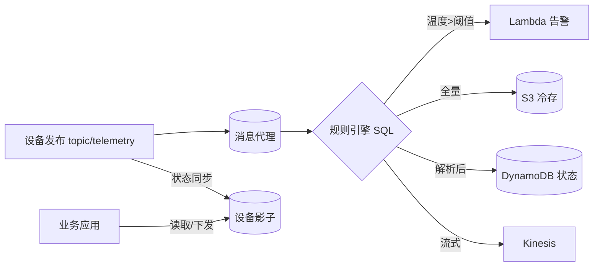

# AWS · 消息与规则引擎

设备连上来了，下一步是"消息去哪"。一条温度读数，可能既要实时告警、又要落库做历史曲线、还要喂给机器学习——如果让每个消费者都去订阅设备主题，系统会迅速变成一团乱麻。这一篇讲 AWS 怎么用"消息代理 + 规则引擎 + 设备影子"把消息这件事解耦掉。

## 1 问题背景：消息既要实时又要分流

设备消息的典型诉求：

- **一对多分发**：同一份遥测，实时看板、历史存储、流式计算都要。
- **格式转换**：原始 JSON 可能要裁剪字段、做单位换算再入库。
- **异步解耦**：下游消费者挂了，不能拖垮设备上行。
- **状态可查**：设备离线时，业务侧仍要能读到"最后一次上报的状态"。

如果让设备直连多个后端，设备端逻辑会被下游绑架；如果只发到一个地方，又得自己写分发服务。平台的价值，就是替你做这个"中转站"。

## 2 设计理念：消息解耦的三件套

AWS IoT Core 在消息层的设计靠三件套：

1. **消息代理（Message Broker）**：托管、可扩展的 MQTT/HTTP 代理，承载设备发布订阅，按区域弹性。
2. **规则引擎（Rules Engine）**：用 **SQL 式语法**订阅 Topic、过滤/转换消息，再转发到一个或多个"动作"（Action）——S3、DynamoDB、Lambda、Kinesis、SQS、SNS、Elasticsearch 等。这是"一对多分流"的核心。
3. **设备影子（Device Shadow）**：一份 JSON 文档，缓存设备"期望状态"与"实际状态"，即使设备离线也能被读取/下发，是连接抖动下的状态缓冲层。

这三件套把"设备只管发"和"业务各取所需"彻底分开——设备永远只和 Topic / 影子打交道。

## 3 实际应用：规则引擎与影子


规则引擎的工作流是"订阅 → SQL 过滤 → 动作转发"：



一条把"高温设备写入 DynamoDB + 触发 Lambda"的规则示例：

```sql
SELECT
  deviceId,
  temperature,
  timestamp() AS ts
FROM
  'device/+/telemetry'
WHERE
  temperature > 60
```

对应的规则动作（JSON 配置示意）把上面 SQL 的结果同时送到 DynamoDB 和 Lambda：

```json
{
  "sql": "SELECT deviceId, temperature, timestamp() AS ts FROM 'device/+/telemetry' WHERE temperature > 60",
  "actions": [
    { "dynamoDB": { "tableName": "HotDevices", "hashKeyField": "deviceId", "rangeKeyField": "ts" } },
    { "lambda": { "functionArn": "arn:aws:lambda:us-east-1:123456789012:function:alert" } }
  ]
}
```

设备影子则解决"离线可读"问题——影子文档长这样：

```json
{
  "state": {
    "reported": { "temperature": 62, "connected": true },
    "desired":   { "temperature": 25 }
  },
  "metadata": { "reported": { "temperature": { "timestamp": 1718000000 } } },
  "version": 12
}
```

设备上报写 `reported`，应用下发写 `desired`，两者不一致时平台可驱动"向目标收敛"——这正是"期望/实际双值"模型的精髓（与阿里云、火山引擎的物模型同源）。

## 4 注意事项

- **规则 SQL 是性能分水岭**：在 SQL 里做重计算不如交给 Lambda；规则里尽量只做过滤/投影，复杂转换下沉到下游。
- **注意计费维度**：按消息数、规则触发次数、动作次数分别计费，一对多转发会让动作次数放大，架构要算账。
- **影子不是数据库**：它只存"最新状态"，历史要靠规则引擎转存 S3/DynamoDB/Timestream。
- **Topic 规划要早定**：`device/{thingName}/telemetry` 这种带变量的命名，直接决定了规则的灵活度（见（五）的批量管理）。

## 5 小结

消息层的核心词是"解耦"：消息代理承接设备流量，规则引擎用 SQL 把消息按需分流到各处，设备影子兜住状态、抹平连接抖动。设备永远只和 Topic/影子说话，下游怎么变都不用改设备——这就是平台把复杂度收敛掉的典型体现。

## 参考链接

- 规则引擎 SQL 参考：https://docs.aws.amazon.com/iot/latest/developerguide/iot-sql-reference.html
- 规则动作（Actions）：https://docs.aws.amazon.com/iot/latest/developerguide/iot-rule-actions.html
- 设备影子概念：https://docs.aws.amazon.com/iot/latest/developerguide/iot-device-shadows.html
- MQTT 主题与通配符：https://docs.aws.amazon.com/iot/latest/developerguide/topics.html
