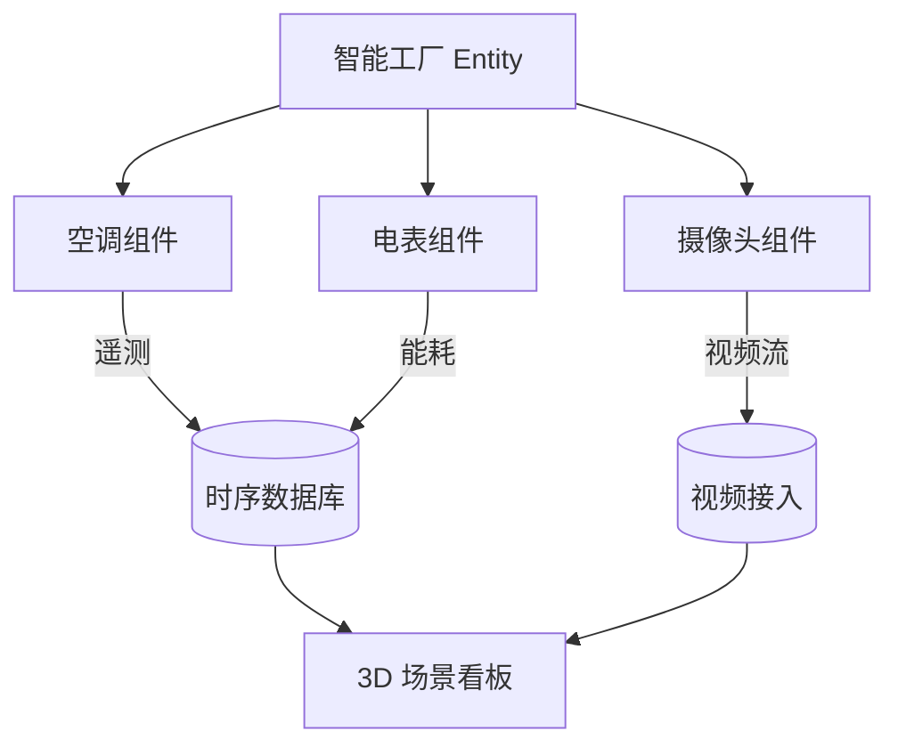
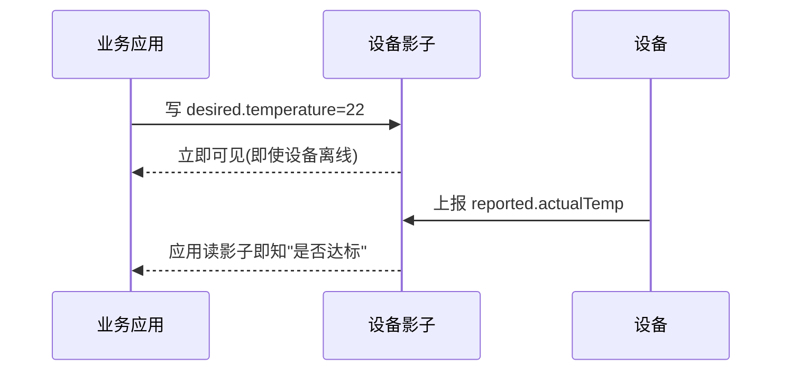

# AWS · 物模型与数字孪生

前面三篇解决了"连得上来、消息分得出去"。但还有一个根本问题：每台设备长得都不一样——空调有温度设定，水表只有流量，车机有上百个信号。业务系统如果每接一种设备就写一套解析逻辑，迟早崩溃。这一篇讲 AWS 怎么用"影子 + 模型 + 数字孪生"把异构设备数字化、标准化。

## 1.问题背景：设备的"形状"千奇百怪

- 同一类设备，不同厂商字段命名不同（`temp` vs `temperature` vs `T`）。
- 有的设备上报 JSON，有的上报二进制，有的走 Modbus 寄存器。
- 业务想问"这台设备现在多少度"，不想关心它底层是 MQTT 还是串口。

所以需要一个**统一抽象层**：把"设备是什么、能报什么、能控什么"描述成模型，业务只跟模型对话，跟物理细节解耦。

## 2.设计理念：从影子到数字孪生

AWS 在这条线上提供了三层能力，抽象度由低到高：

1. **Device Shadow（设备影子）**：最轻量的"状态抽象"，就是一份 JSON 文档（`reported` 实际 / `desired` 期望）。它不关心你设备内部怎么实现，只约定"状态长这样"。
2. **Thing Model / 设备模板**：把"一类设备有哪些属性/事件/命令"固化成可复用的模型（类似阿里云 TSL、火山引擎物模型），新建同类设备时套模板即可，避免重复定义。
3. **AWS IoT TwinMaker**：真正的**数字孪生**——把物理实体（如一座工厂、一台风机）建模为"实体(Entity) + 组件(Component) + 关系(Relation)"的图，并接入时序数据、视频、告警，形成可查询、可可视化的虚拟镜像。

抽象越往上，越接近"用数据描述世界"，业务价值越高。

## 3.实际应用：影子、模型与孪生


设备影子文档（状态抽象的基础）长这样——它把"设备此刻是什么样"标准化成 JSON：

```json
{
  "state": {
    "reported": { "power": "ON", "temperature": 24.5, "fanSpeed": 2 },
    "desired":  { "power": "ON", "temperature": 22.0 }
  },
  "version": 7
}
```

用 Thing Model 把"空调"这类设备固化成可复用模型（示意）：

```json
{
  "schemaName": "AirConditioner",
  "version": "1.0",
  "properties": [
    { "name": "temperature", "type": "number", "unit": "celsius" },
    { "name": "power", "type": "boolean" }
  ],
  "commands": [
    { "name": "setTarget", "inputs": [{ "name": "value", "type": "number" }] }
  ]
}
```

数字孪生层（TwinMaker）则把多个设备 + 环境组合成"系统级镜像"：



TwinMaker 用"实体-组件-关系"描述物理世界，组件可复用到不同实体；数据接入后，既能在 3D 场景里钻取，也能写查询"哪层楼空调能耗超阈值"。

### 3.4 影子双向同步：离线也不慌



设备离线时，desired 先落影子；设备上线后自动拉取并执行，再回报 reported——业务查询因此永远有"最新已知状态"。这把"连接抖动"对业务的影响抹平了。

### 3.5 组件化建模：一套模型多处复用

真实设备常由多个"子部件"组成（空调 = 温控器 + 湿度计 + 风扇）。AWS 用 **Thing Model / 设备模板** 把"一类设备"固化成可复用模型，新建同类设备直接套模板，避免重复定义：

```json
{
  "schemaName": "SmartAC",
  "version": "2.0",
  "properties": [
    { "name": "temperature", "type": "number", "unit": "celsius" },
    { "name": "humidity", "type": "number", "unit": "percent" }
  ],
  "commands": [
    { "name": "setMode", "inputs": [{ "name": "mode", "type": "string" }] }
  ]
}
```

模板的价值在于"设备与模型解耦"——换型号、换厂商，只要模型兼容，上层应用与规则引擎都不用改。

## 4.注意事项

- **影子只是"状态"，不是"行为"**：设备能干嘛（命令/服务）要靠模型/SDK 约定，影子本身不执行控制。
- **模型要"早定少改"**：物模型一旦被大量设备引用，改字段是破坏性操作，前期规划比后期重构便宜得多。
- **数字孪生不是炫技**：TwinMaker 的价值在于"跨系统的统一视图"，如果只有单设备，影子 + 规则引擎就够，别过度设计。
- **与（三）衔接**：影子状态来自设备上报，而上报格式由规则引擎/SDK 约定——建模和消息是同一件事的两面。
- **模型演进要向后兼容**：新增字段用可选/默认值，删除字段走版本升级，避免老设备/老应用崩。
- **模型与业务解耦**：把"设备能力"和"业务规则"分开，规则引擎/应用读影子与模型而非直连设备，改动互不影响。

## 5.小结

物模型这条线，本质是"给杂乱的设备一个统一的说法"：设备影子给出最小可用的状态抽象，Thing Model 把一类设备固化成可复用模板，TwinMaker 再把实体织成可查询的数字孪生。抽象度每升一级，业务离物理细节就更远一步——这正是"把异构设备收敛成干净结构"的最后一环。

一句收尾：物模型与数字孪生的本质，是给物理世界造一份"软件可读的说明书"——设备千差万别，但在云侧它们都是影子文档与可复用模型描述的标准对象，应用因此能统一对待。

## 参考链接

- 设备影子：https://docs.aws.amazon.com/iot/latest/developerguide/iot-device-shadows.html
- AWS IoT Things（事物/模型）：https://docs.aws.amazon.com/iot/latest/developerguide/iot-thing-management.html
- AWS IoT TwinMaker：https://docs.aws.amazon.com/twinmaker/latest/ug/what-is-twinmaker.html
- TwinMaker 数据接入：https://docs.aws.amazon.com/twinmaker/latest/ug/data-ingestion.html
