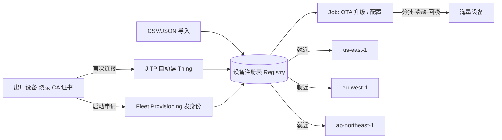
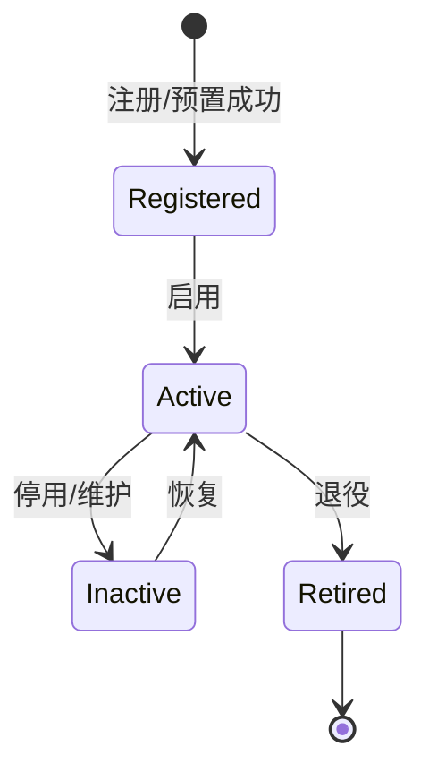

# AWS · 海量设备管理

连接、消息、物模型解决了"单台设备怎么用"。但当你有十万台设备散在各地，问题就变成"怎么把它们当资产批量管"：怎么一次性注册？出厂即连怎么实现？固件怎么灰度升级？跨国设备怎么就近接入？这一篇讲 AWS 的设备管理能力。

## 1.问题背景：Fleet Provisioning——设备出厂就能自动归队

规模化后必然出现的管理动作：

- **批量注册**：十万台设备不可能手工建，要有"出厂即注册"的自动化。
- **凭证分发**：证书怎么安全地烧录到设备、又不泄露 CA 私钥。
- **OTA 升级**：分批、可回滚、可观测进度的固件更新，出错能止损。
- **全球分布**：设备在美国、欧洲、中国，要就近接入、数据合规驻留。
- **状态可查**：哪台在线、哪台固件版本旧、哪台在告警，要一眼可见。

这些是"设备"作为资产天然带有的运维属性，平台必须内建。

## 2.设计理念：注册表 + 预置 + 任务

AWS 的设备管理靠三层：

1. **设备注册表（Registry）**：每台设备对应一个"事物(Thing)"，含属性、证书、影子、分组。注册表是管理的"主数据"。
2. **预置（Provisioning）**：
   - **JITP**（已见（二））：首连自动注册；
   - **Fleet Provisioning**：设备启动后向预置服务申请自己的身份，适合"同一固件、出厂不知归属"的场景；
   - **批量注册**：用 CSV/JSON 一次性导入大批量设备。
3. **Job（任务）**：OTA 固件升级、配置下发都抽象成"Job"，支持分批、滚动、暂停、回滚，并汇报每台设备的执行状态。

跨区域则靠**多 Region 各起 IoT Core + 全局路由/账号体系**实现"就近接入 + 数据驻留"，而非单一全球端点。

## 3.实际应用：预置、Job 与全球分发


设备从出厂到运维的数据流：



一个 OTA 升级 Job 的配置示意（分批 10% → 滚动）：

```json
{
  "jobId": "ota-2026-07",
  "targetSelection": "SNAPSHOT",
  "targets": ["arn:aws:iot:us-east-1:123456789012:thinggroup/firmware-v2"],
  "document": { "operation": "ota", "firmwareUrl": "https://s3-.../fw.bin", "version": 3 },
  "rolloverOnFailure": true,
  "abortConfig": { "criteriaList": [{ "failureType": "FAILED", "thresholdPercentage": 10 }] },
  "presignedUrlConfig": { "roleArn": "arn:aws:iam::123456789012:role/ota" }
}
```

全球分发上，常见做法是各 Region 独立部署 IoT Core，设备根据地理位置连接最近端点；若需统一身份，可共享同一账号体系或用 Account-level 路由。数据合规上，欧洲设备的数据留在 `eu-west-1`，不跨境。

### 3.3 设备生命周期状态

设备不是"永远在线"，它有明确的被管理状态，平台要能反映并驱动流转：



`Active` 才可通信；`Inactive` 保留身份但拒绝连接（如异常设备先隔离）；`Retired` 彻底下线但记录不删，便于追溯。

### 3.4 设备检索：Fleet Indexing

几万台设备，光"注册"不够，还得"找得到"。AWS 的 **Fleet Indexing** 给注册表与影子建索引，让你用类 SQL 查询"哪些设备满足条件"——按连接状态、影子字段、设备属性任意组合：

```sql
-- 找出"离线且固件版本低于 2.0"的设备（概念示意）
SELECT thingName, firmwareVersion
FROM "AWS_Things"
WHERE connectivity.connected = false
  AND shadow.reported.firmwareVersion < '2.0'
```

这把"运维时大海捞针"变成一条查询——配合（六）的监控与批量 Job，定位异常设备群的效率大幅提升。

## 4.注意事项

- **预置方式选错会返工**：JITP 适合"设备身份出厂即定"；Fleet Provisioning 适合"同固件多客户"；批量导入适合已有机密清单。先想清拓扑再选。
- **Job 一定要设 abort/rollback**：OTA 出问题的代价是" brick 一片设备"，阈值（如失败率 10%）和回滚是保命设置。
- **Thing Group 是管理单元**：分组（按型号/地区/客户）后，策略、Job、查询都能按组批量操作，比逐台方便得多。
- **全球不是自动的**：IoT Core 区域级，跨国要靠多 Region + 路由自己搭，成本与合规都要算（见（六）高可用也涉及 Region）。
- **OTA 验签要落地**：固件包应带签名，设备端验签后才刷，防篡改固件注入整批设备。
- **影子不是数据库**：设备最新状态用影子，高频时序历史落 Timestream/S3，别把影子当时序库。
- **thingName 全局稳定**：它是身份主键，改名等于换设备，命名规范要在预置阶段定好。

## 5.小结

设备管理把"单台设备"提升为"可规模化的资产"：注册表是主数据，预置让海量设备自动上线，Job 让升级/配置可分批可控，多 Region 让全球设备就近合规接入。到这一层，平台已经不只是"收数据"，而是"运营一支设备舰队"。

一句收尾：设备管理的功夫，是让"几万台会掉线、会升固件、会退役"的资产，变成可检索、可灰度、可回滚、可就近接入的有机整体——规模再大，也管得住。

## 参考链接

- 设备注册表：https://docs.aws.amazon.com/iot/latest/developerguide/thing-registry.html
- Fleet Provisioning：https://docs.aws.amazon.com/iot/latest/developerguide/provision-wo-cert.html
- 批量注册：https://docs.aws.amazon.com/iot/latest/developerguide/bulk-registration.html
- OTA Job：https://docs.aws.amazon.com/iot/latest/developerguide/iot-jobs.html
