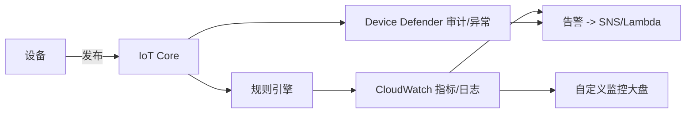
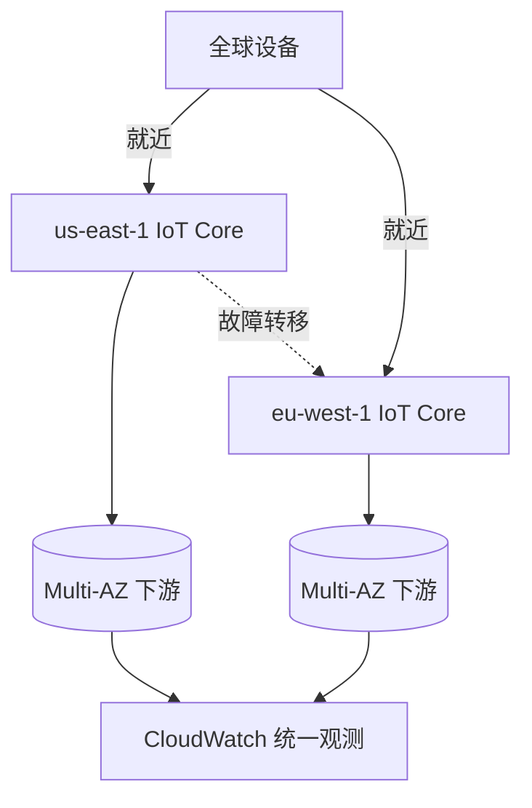
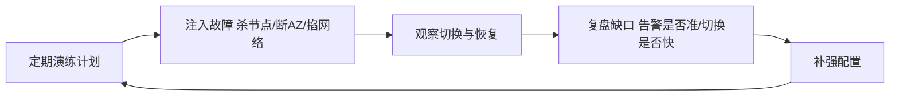

# AWS · 智能运维与高可用

前面五篇把"平台怎么接、怎么传、怎么管"讲完了。但生产系统真正的考验在运行期：设备突然掉线你知不知道？固件升级有没有异常？某个设备是不是在被劫持疯狂发消息？Region 挂了业务怎么办？这一篇讲 AWS 的运维与高可用能力，并用两个场景把全系列收个尾。

## 1.问题背景：Device Defender——用审计守住设备安全边界

- **看不见**：十万台设备，哪台在线、哪台在告警，没有大盘就是瞎子。
- **追不到**：一条错消息从哪台设备来、走了哪条规则、触发了什么，没有轨迹就无法定位。
- **防不住**：伪造设备、凭证泄露、异常流量，缺乏持续审计就会成漏洞。
- **扛不住**：Region 级故障、网络分区，系统要能降级或转移，不能整体躺平。
- **告警风暴**：故障瞬间成千上万设备同时告警，若不加收敛，运维会被"告警海"淹没，反而看不见真问题。
- **容量拐点**：连接数、消息 TPS 临近规格上限时性能会陡降，要能提前预警、提前扩容，而不是等宕机。

运维与高可用，决定了平台是"演示级"还是"生产级"。

## 2.设计理念：可观测 + 可防御 + 可容错

AWS 在运行期靠三条线：

1. **可观测（CloudWatch）**：指标(Metrics)、日志(Logs)、告警(Alarms)统一接入，可拼出自定义监控大盘——设备在线数、消息速率、规则错误率、连接失败数，一眼可见。
2. **可防御（Device Defender）**：持续审计设备配置与行为——检测"消息突增""未授权 Topic 发布""证书弱配置"等异常，并联动告警。它相当于 IoT 的"入侵检测"。
3. **可容错（高可用架构）**：IoT Core 本身跨可用区(AZ)部署；Region 级故障靠多 Region 部署 + 流量切换；关键下游（S3/DynamoDB/Lambda）本身具备 Multi-AZ/跨区域冗余。
4. **混沌与演练**：高可用不是"配了多 AZ"就完事，要定期做故障注入演练（杀节点、断 AZ），验证真的能切换、真的能恢复。

注意一个区分：**互联网应用的高可用**关注的是请求延迟与可用性；**物联网的高可用**还要额外关心"设备侧"——设备可能离线很久、可能批量同时重连造成"连接风暴"、可能固件 bug 集体异常。这也是为什么（二）的 LWT、（三）的影子、（五）的 Job 回滚，都是高可用的有机组成。

## 3.实际应用：大盘、轨迹与容错


设备消息的"轨迹"可以这样被观测（上行与下行都可追溯）：



用 CloudWatch 把"设备在线数"做成大盘的指标查询示意：

```sql
-- CloudWatch Metrics 查询（概念示意）
SELECT SUM(Connections.Connected)
FROM "AWS/IoT" 
WHERE ThingGroup = 'factory-floor'
GROUP BY ThingGroup
```

高可用的 Region 容错结构（active-active 或多 Region 主备）：



### 3.1 演练常态化：从"配了"到"验证过"

多 AZ、跨 Region、告警收敛，控制台里点几下就能"配好"。但配置不等于能力——真正决定出事时扛不扛得住的，是**有没有真的演练过**。



落地节奏：

- **频率固定**：把故障注入排进月度/季度运维日历，和版本发布一样成为固定动作。
- **范围递进**：先单节点、单 AZ 杀起，再逐步加码到网络分区、依赖服务中断，逼出真实最坏情况。
- **复盘留痕**：每次演练都要有"是否按预期恢复、告警是否及时、恢复耗时多少"的结论，缺口转成下个迭代整改项。
- **低谷演练**：选真实流量低谷做，并明确告知相关方"这是演练"，避免一次"验证"演成真故障误判。

## 4.注意事项

- **告警要分级别**：指标越界（warning）和 Defender 检测到入侵（critical）要进不同通道，避免告警风暴淹没真问题。
- **轨迹有成本**：全量消息留痕会产生存储/费用，按需采样，关键链路（控制指令、安全相关）务必全留。
- **多 Region 是运维负担**：只有真正跨国/高合规要求才上；单 Region 内 Multi-AZ 已能挡住大部分故障。
- **回看全系列**：运维能力不是孤立的——LWT 让离线可见（二）、影子让状态可查（三）、Job 回滚让升级可控（五），它们共同构成"生产级"。
- **告警要收敛抑制**：同类告警聚合、依赖抑制（下游挂了别让上游每台设备都叫），否则告警海会掩盖真问题。
- **容量要设水位线**：连接数/TPS 设 70%/90% 预警，给扩容留反应时间，别等打满才动手。
- **演练要常态化**：高可用配置会随架构漂移，半年不演练就约等于没有，建议纳入定期运维动作。

## 5.小结与全系列收尾

到这里，我们沿"连接 → 消息 → 物模型 → 设备管理 → 运维高可用"走完了一条完整的物联网数据生命周期。AWS 用一组分层服务（Core / Greengrass / Device Management / Defender / TwinMaker + 下游分析）把这套复杂度接住。

**三个典型落地场景**，帮你看清这些能力怎么组合：

- **共享充电宝 / 电动车充电桩（消费+运营）**：设备经（二）稳定连接上云，遥测经（三）规则引擎分流到 DynamoDB 做计费、Lambda 做告警；运营方在（六）CloudWatch 看在线率与异常；（五）Job 批量推送固件修复充电协议 bug。
- **工业设备预测性维护**：边缘 Greengrass 在（二）断网时本地自治，恢复后补传；（四）TwinMaker 把整条产线建成数字孪生，叠加（六）CloudWatch 的振动/温度趋势，提前预警停机。
- **智慧零售 / 冷链监测**：门店传感器经（二）稳定连接上云，Greengrass 在断网时本地聚合；（四）TwinMaker 把门店环境建成孪生；（六）Device Defender 监测异常接入、CloudWatch 告警联动自动化 Runbook——连接 + 物模型 + 运维综合体现，也展现 AWS 的企业级生态衔接。

对照「阿里云 IoT 设计解读」「火山引擎 IoT 设计解读」，你会发现：**平台名字不同，骨架几乎一样**——这正是"解读式"想传递的核心：理解了一套，就能举一反三看懂所有。

一句收尾：平台的价值，最终落在"平时看得见、出事追得到、故障扛得住"。把这三句做到，物联网才真正可运营。

## 参考链接

- CloudWatch 监控 IoT：https://docs.aws.amazon.com/iot/latest/developerguide/monitoring-iot.html
- Device Defender：https://docs.aws.amazon.com/iot/latest/developerguide/iot-security-defender.html
- IoT Core 可用性（Multi-AZ）：https://aws.amazon.com/iot-core/
- AWS IoT 合规性/区域：https://aws.amazon.com/about-aws/global-infrastructure/regions_az/
