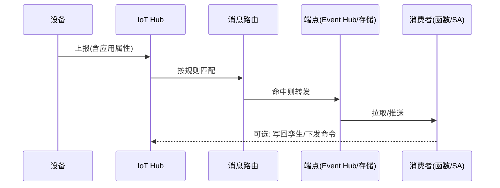

# Azure · 为什么需要物联网平台

如果你只接几十台设备，写个 MQTT Broker + 一张设备表就能跑。但当设备数爬到十万、百万，跨地域、固件要批量升级、出了故障要追溯"这条消息是谁发的"，纯粹的"收数管道"就会迅速崩塌。

这一篇先不急着讲 Azure 的某个具体服务，而是把"为什么需要物联网平台"说清楚——再看 Microsoft Azure 是怎么用一组产品把这套复杂度接住的。

## 1.问题背景：IoT Hub 替企业挡掉了哪些复杂度

抛开术语，设备接入要解决的现实问题无非这几条：

- **协议杂**：老设备只会 HTTP，新设备爱用 MQTT，企业集成偏好 AMQP，工控现场还有 OPC UA。你不能要求每台设备都改协议。
- **身份认证乱**：一机一密还是一型一密？证书怎么发？海量设备出厂时怎么"零接触"自动注册到正确租户？
- **连接不稳定**：基站切换、隧道丢包、设备休眠，连接会断，断了自己要不要重连、状态要不要补报，平台得兜住。
- **数据既要用又要存**：实时告警要秒级，历史分析要落库，机器学习要喂流——一条设备消息往往要同时流向多个地方。
- **设备要被"管理"**：固件升级、配置下发、批量注册、远程诊断，这些是"设备"作为资产必然产生的运维动作。
- **数据会乱序、会迟到**：设备弱网重连后补发旧数据、网关批量上报错峰，平台要能识别"这条消息此刻还有没有意义"。
- **固件碎片化**：同型号设备跑着五六个固件版本，升级要能分组、灰度、回滚，不能"一升级全变砖"。
- **厂商黑盒**：设备来自不同供应商，字段命名、单位、精度各一套，上层应用若逐个适配会崩溃。
- **运维黑盒**：设备在线率多少、消息堆积多少、哪台设备在刷异常，靠人盯不可能，必须可观测。

这些事单做一件都不难，**难的是把它们整成一个统一、可扩展、还得高可用的系统**。这恰恰是物联网平台存在的理由。

## 2.设计理念：为什么用托管平台，而不是自己搭

自建一套"能跑"的物联网后端，初期成本看似低；但要做到"可靠、安全、可扩展"，隐性成本极高：

| 维度 | 自建（朴素版） | 托管平台（如 Azure IoT） |
|------|----------------|--------------------------|
| 连接规模 | 单机 Broker 几千~几万，再往上要自己分片 | IoT Hub 托管的消息代理，按设备数弹性 |
| 安全 | 自己实现认证/加密/轮换，易留坑 | X.509、SAS、DPS 开箱即用 |
| 高可用 | 得自己做主备、容灾 | 多 AZ 内建，SLA 保障 |
| 设备管理 | 自己写注册/OTA/监控 | 设备注册表、DPS、IoT Edge 内建 |
| 生态衔接 | 自己接企业系统 | 与 AD、Power BI、数据栈无缝 |

所以"平台化"的本质是：**把"设备又多又杂又时断时续"这个现实，收敛成平台一侧干净、业务一侧简单的结构**。你付出的代价是"学习它的模型"，换回的是"不用自己扛那一整套基础设施"。

## 3.实际应用：Azure IoT 的产品矩阵

Azure 没有把 IoT 做成一个单体产品，而是一组"各管一段"的服务，拼起来覆盖端到云：

- **Azure IoT Hub**：设备接入与消息中枢，负责协议终结、身份认证、消息路由和设备孪生（Twin）。
- **Device Provisioning Service（DPS）**：零接触、自动化地把设备预配到正确的 IoT Hub，解决"海量设备出厂即注册"难题。
- **Azure IoT Edge**：边缘运行时，把云侧逻辑、AI 推断下沉到设备/网关，断网也能本地自治。
- **Azure Digital Twins（ADT）**：数字孪生，用 DTDL 建模语言把物理世界建成可查询、可仿真的实体-关系图。
- **Azure IoT Central**：低代码 SaaS 形态的物联网应用平台，开箱即用的模板。
- **下游**：消息路由到 Event Hub（流）、Stream Analytics（实时计算）、Data Lake（存储）、Power BI（可视化）等。

这套分层的意义在于：**每一层都可以独立替换或跳过**。比如你只想要"设备连上来 + 转发到 Event Hub"，用 IoT Hub 就够；想要边缘智能，再加 IoT Edge。

### 3.4 一条消息的完整生命周期

设备消息从产生到被消费，要跨好几道关，任何一道漏了都会"数据对不上账"：

注意每一步都可能"至少一次"重复投递，消费侧（函数、数据库）要自己处理幂等——这也是（三）要展开的可靠性前提。

### 3.5 本系列要拆的"五件事"

记住一条主线，后面五篇都围绕它：**连接 → 消息 → 物模型 → 设备管理 → 运维高可用**。

- （二）稳定连接：设备怎么连、怎么认、怎么扛抖动；
- （三）消息与规则引擎：连上来之后数据怎么流、怎么分发；
- （四）物模型与数字孪生：软件怎么"理解"设备；
- （五）海量设备管理：几万台设备怎么注册、升级、就近接入；
- （六）智能运维与高可用：平台怎么"稳得住、追得到"。

Azure 的每个服务，都能映射回这五件事上的某一环——读懂这张图，再读任何一家的 IoT 文档都不会慌。

## 4.注意事项

- **别神话平台**：平台解决的是"基础设施复杂度"，不解决"你的业务模型怎么设计"。物模型、路由规划、数据流向仍要你自己想清楚。
- **成本是按量计费的**：设备数、消息数、路由操作都计费，架构设计直接影响账单，详见（三）（五）。
- **多 Region 不是自动全球分发**：IoT Hub 是区域级服务，全球部署需要 DPS + 多 Hub 各起一套并用路由打通，留在（五）展开。
- **数据驻留与合规**：Hub 数据落在所选 Region，跨国部署要评估数据出境与合规（如欧盟 GDPR），别等上线才补。
- **团队技能曲线**：分层产品意味着团队要懂"哪层归谁"，前期学习成本不低，但换来长期可演进、可替换。

## 5.小结

物联网平台的价值，不在于"能收设备数据"，而在于把连接、认证、消息、设备管理、运维这些**横切关注点**统一接住，让你只关心业务数据本身。Azure 用一组分层服务（Hub / DPS / Edge / Digital Twins / Central + 下游分析）把这条数据生命周期覆盖完整——这正是后面五篇要逐层拆解的主线。

一句收尾：平台的价值，不是替你写业务，而是把"设备又多又杂又时断时续"这件脏活揽过去，让你只管业务数据本身。

## 参考链接

- Azure IoT 文档中心：https://learn.microsoft.com/azure/iot-hub/
- Azure IoT Hub 是什么：https://learn.microsoft.com/azure/iot-hub/iot-concepts-and-iot-azure
- Azure IoT 产品全景：https://azure.microsoft.com/products/iot-hub
