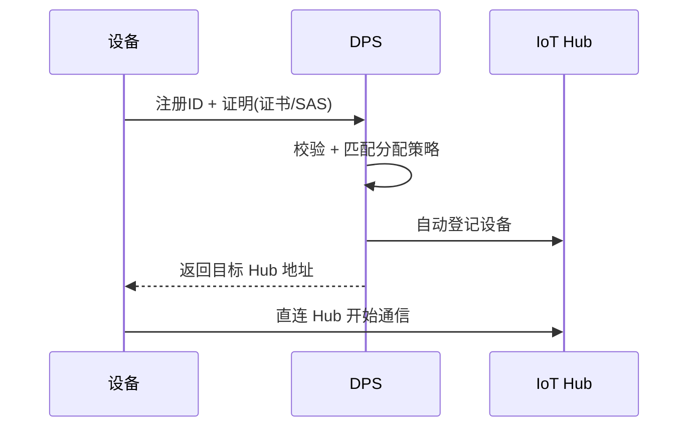
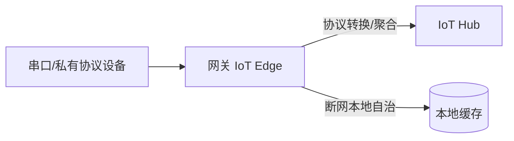

# Azure · 稳定连接

连接是物联网平台的第一道关。设备不是浏览器——它可能在地下车库的弱网里、在跨省货车上、在工控现场。平台要做的，是让"连得上、认得清、扛得住抖"。

这一篇讲 Azure IoT Hub 如何把"碎片化协议 + 不可信设备 + 不稳定网络"这三件事接住，并重点讲 Azure 独有的 **DPS 零接触预配**。

## 1.问题背景：设备身份怎么管——从芯片到云的信任链

- **协议碎片化**：MQTT（设备常用）、AMQP（企业集成偏好）、HTTPS（调试/受限网络）各有场景。
- **设备身份不可信**：设备被克隆、密钥泄露、伪造设备冒充上报，是物联网最典型的安全威胁。
- **海量设备出厂即注册**：几万设备不可能人工逐个配，要"出厂即自动连对 Hub、归对租户"。
- **网络时断时续**：连接会反复断；断线期间的状态补报、去重、保序都要平台兜底。

## 2.设计理念：多协议终结 + 双认证 + DPS 零接触预配

Azure 的核心思路是：**接入层把协议差异吞掉，身份用 X.509 证书或 SAS 令牌，再用 DPS 把"海量设备自动归属"变成声明式配置**。

- **多协议接入**：原生支持 MQTT、AMQP、HTTPS，协议差异在 Hub 侧终结。
- **设备认证**：X.509 证书（最强，适合生产）或 SAS 令牌（灵活，适合调试）；证书可吊销、可轮换。
- **DPS 零接触预配**：设备用"注册 ID + 证明"向 DPS 发起请求，DPS 根据分配策略自动把设备分配到正确的 IoT Hub——无需人工干预。
- **连接保活与离线**：长连接保活、断线重连、设备孪生状态由平台维护。

## 3.实际应用


### 3.1 设备认证示例（X.509）

```json
{
  "deviceId": "factory-sensor-0001",
  "authentication": {
    "type": "x509",
    "thumbprint": "A1B2C3...",
    "caRef": "tenant-a-root-ca"
  }
}
```

### 3.2 DPS 零接触预配流程



设备只需"知道 DPS 全局端点 + 自己的证明"，无需硬编码具体 Hub——这正是全球规模部署的关键。

> **延伸：Azure IoT Edge 运行时架构**
>
> 边缘运行时是连接层的自然延伸——当设备/网关具备本地计算能力时，Edge 让消息路由、AI 推断、协议转换可以在离线时本地完成，恢复后再同步云端。

### 3.3 重连退避与保活（客户端视角）

弱网下"断线即狂连"会把自己和 Hub 都打爆。正确做法是**带抖动的指数退避 + 合理保活**：

```python
import random, time

def connect_with_backoff(max_retry=8):
    wait = 1
    for i in range(max_retry):
        try:
            return mqtt_connect()          # 成功即返回
        except ConnectionError:
            sleep = wait * (2 ** i) + random.uniform(0, wait)
            time.sleep(min(sleep, 60))      # 上限 60s，避免无限拉长
    raise RuntimeError("连不上，转入离线缓存/本地自治")
```

保活间隔也别乱设：太长会被中间网络回收连接，太短则电池设备耗电——要和 §3.4 的网关省电策略配合看。

### 3.4 网关模式：当设备自己不会说话

不是所有设备都能直连云。老旧串口设备、无 IP 的传感器，需要一台"会说话"的网关替它们连：

- **透明网关**：网关建立 TLS 到 Hub，下游设备复用网关连接与证书，Hub 侧仍看到每台独立设备。
- **身份转换网关**：网关用自己的身份连 Hub，再"翻译"下游设备的消息（典型用于大量同构廉价设备，省证书成本）。
- **现场/协议网关**：在网关上跑 IoT Edge，把协议转换、聚合、AI 推断下沉到本地。



## 4.注意事项

- **X.509 vs SAS 的取舍**：X.509 安全性高、适合生产，但证书生命周期管理有工程量；SAS 易用但密钥泄露风险高，建议设短有效期。
- **DPS 分配策略要设计**：可基于注册列表、自定义分配（Azure Function）做分组，决定设备落到哪个 Hub/租户。
- **AMQP 的连接开销**：AMQP 比 MQTT 重，海量小设备用 MQTT 更省资源；AMQP 适合网关/企业集成。
- **NAT 超时与连接表压力**：运营商 NAT 会回收长时间空闲的映射，保活间隔要小于 NAT 超时；海量长连接也吃接入层连接表，尽量做连接复用。
- **弱网功耗权衡**：电池设备不宜频繁保活，应在"上报即顺带刷新"与"定时保活"间取舍；用 IoT Edge 网关替终端省电是更优解。

## 5.小结

Azure 连接层的设计，本质是"**协议终结在 Hub + 身份强认证 + DPS 把海量设备自动归属**"。它把"设备又杂又不可信又爱掉线、且要出厂即注册"的现实，收敛成上层看到的一张干净、可信、有状态的连接网——这正是消息、物模型、设备管理能放心建立在之上的前提。

一句收尾：连接层的功夫，全在"把不可信、不稳定、不会说话的设备，变成云侧一张干净可信的连接表"——这活做好了，后面的消息、孪生、管理才立得稳。

## 参考链接

- Azure IoT Hub 安全概念：https://learn.microsoft.com/azure/iot-hub/iot-hub-dev-guide-security
- Azure DPS 设备预配：https://learn.microsoft.com/azure/iot-dps/
