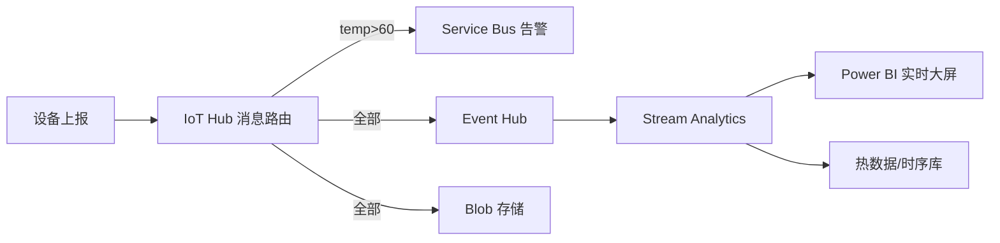
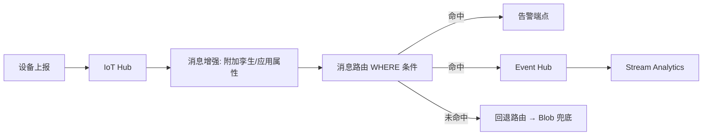

# Azure · 消息与规则引擎

设备连上来之后，真正的价值在于"数据流得动"。一条温度消息可能要同时喂给实时告警、历史库和机器学习——平台不能只把消息存下来，而要让它能**按需流向不同目的地**。

这一篇讲 Azure IoT Hub 的**消息路由**与下游流式处理（Event Hub + Stream Analytics）。

## 1.问题背景：消息层的典型诉求

- **一对多分发**：同一条消息，告警要秒级、存储要落库、分析要喂流。
- **协议与存储解耦**：业务系统不想直接连 MQTT，希望消息进 Event Hub、进函数、进 Data Lake。
- **过滤与加工**：不是所有消息都有用，想在平台侧按条件路由、字段投影。
- **规模与可达**：海量设备、海量 Topic，要保证不丢、不重、低时延。
- **消息会乱序、会迟到**：设备弱网重连后补发旧数据，平台要能识别"此刻还有没有意义"。
- **峰值洪流**：固件升级完成或定时上报，成千设备同时炸消息，端点要能扛住突增。
- **重复消息**：重传、重试、至少一次投递都会产生重复，消费侧必须幂等。

## 2.设计理念：消息路由 + 声明式端点

Azure 的思路是：**Hub 把消息按"路由规则"分发到多个端点**，规则用类 SQL 条件声明，业务消费下游即可，无需自己写 consumer。

- **消息路由（Routing）**：基于消息属性/正文写 `WHERE` 条件，把消息导向不同端点（Event Hub / Service Bus / Blob Storage / 自定义端点）。
- **消息增强**：可在路由前做 enrich（附加设备孪生信息、应用属性）。
- **下游流式处理**：Event Hub 接 Stream Analytics 做实时窗口计算，结果进 Power BI / 数据库。

## 3.实际应用


### 3.1 路由规则示例（温度超阈值导向告警端点）

```sql
-- 路由条件（伪 SQL）
SELECT * FROM messages WHERE temperature > 60
-- 目标端点: iot-hub-route-alert → Service Bus 队列
```

### 3.2 一条消息的多目标流转



### 3.3 设备孪生与消息

设备端状态通过消息更新孪生（Desired/Reported 双向），应用侧读孪生即可拿到"设备最新已知状态"——这与（二）的会话状态保活一脉相承。

### 3.4 可靠性、有序性与去重

- **至少一次投递**：Hub 保证消息"至少到达"端点，网络抖动可能重复，消费侧要幂等。
- **分区内有序**：同一设备（同一分区键）的消息按到达顺序投递；跨设备不做全局有序。
- **路由条件能引用什么**：可基于应用属性、系统属性（`connectionDeviceId` 等）、孪生/设备生命周期事件；正文 JSON 字段要先映射成应用属性才能参与路由，复杂变换交给 Stream Analytics。

消费侧幂等示例（用消息 ID 去重）：

```python
seen = set()
for msg in consume():
    mid = msg.get("message-id") or msg["enqueuedTime"]
    if mid in seen:
        continue
    seen.add(mid)
    handle(msg)   # 重复消息直接跳过
```

### 3.5 端到端消息路径（含回退路由）

把"一对多分发 + 不丢消息"串起来看：



关键点：务必配一条**回退路由**接住所有未被匹配的消息到存储，否则漏匹配就意味着消息静默丢失——这也是（四）物模型能稳定消费的前提。

## 4.注意事项

- **回退路由（Fallback）**：配置一条"兜底"路由接所有未被匹配的消息到存储，避免消息丢失。
- **端点配额与成本**：每个路由端点有吞吐与计费，海量路由要做合并，别一条设备一条路由。
- **至少一次投递**：下游（函数/数据库）应自己处理重复消息，Hub 保证"至少一次"而非"恰好一次"。
- **分区键决定有序性**：路由/下游的有序只在同一设备维度成立，跨设备别假设全局顺序，业务上需自行排序。
- **敏感数据脱敏**：设备上报含位置/身份时，在路由前或 Stream Analytics 中做脱敏，避免明文落存储。
- **路由条件有边界**：只能引用属性与孪生事件，正文变换交给 Stream Analytics，别在路由里堆复杂逻辑。

## 5.小结

Azure 消息层的设计，是"**Hub 消息路由 + 下游流式处理**"把"一对多分发、协议解耦、实时加工"三件事一次性解决。业务侧消费 Event Hub / Stream Analytics 即可，不必关心设备怎么连——这正是让数据"流得动"的关键。

一句收尾：消息层的功夫，是让同一条数据"一次产生、多路各取所需"，而平台负责不丢、不重、不乱序——剩下的业务逻辑，交给下游去写。

## 参考链接

- Azure IoT Hub 消息路由：https://learn.microsoft.com/azure/iot-hub/iot-hub-devguide-messages-d2c
- Azure Stream Analytics 文档：https://learn.microsoft.com/azure/stream-analytics/
