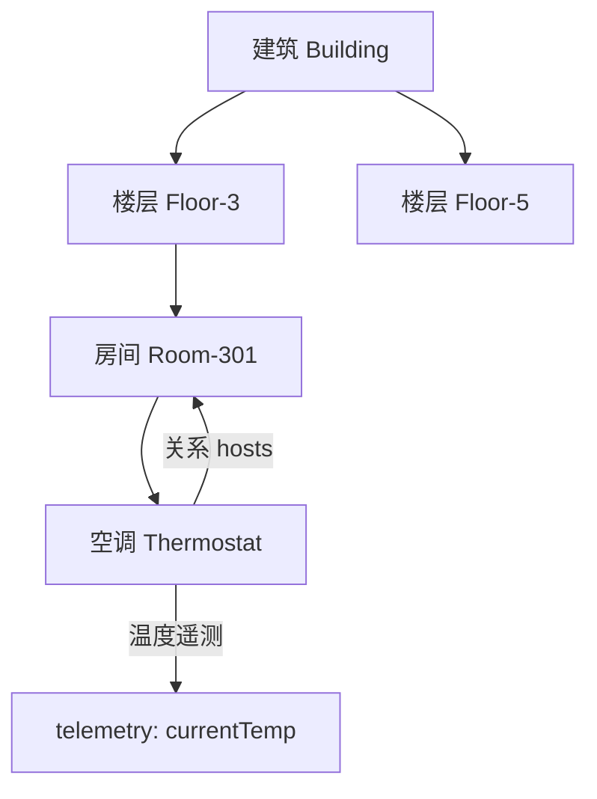
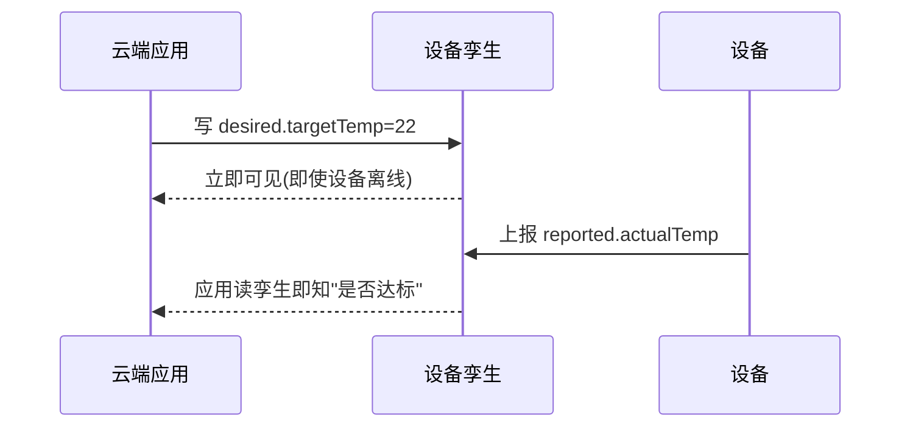

# Azure · 物模型与数字孪生

设备连上来了、消息流起来了，但平台和应用看到的还是一串"key=value"。要让"软件能理解设备"，需要一个**统一的设备描述语言**——在 Azure 里，这是**设备孪生 Twin**与**DTDL 建模语言**；再进一步把物理场景建成可查询、可仿真的数字世界，就是 **Azure Digital Twins**。

这一篇讲 Azure 的物模型与数字孪生。

## 1.问题背景：DTDL——用一套语言描述任意设备的能力

- **异构设备无统一语义**：同是"温度"，A 设备叫 `temp`、B 叫 `temperature`——应用每接一个设备就要写一套适配。
- **命令/状态难标准化**：开灯、调速、上报，各自有参数与格式。
- **场景要被建模**：一个智慧建筑不止"一台空调"，还有楼层、房间、能耗系统的关联。

## 2.设计理念：设备孪生 + DTDL 标准化建模

Azure 用两层解决：

- **设备孪生（Device Twin）**：云端维护的 JSON 文档，含 `Desired`（云端期望）与 `Reported`（设备上报）状态，实现双向同步与离线补偿。
- **DTDL（Digital Twin Definition Language）**：基于 JSON-LD 的开放建模语言，用 `Property / Telemetry / Command / Component / Relationship` 描述物模型，且与 Azure Digital Twins 复用同一套语义。

## 3.实际应用


### 3.1 设备孪生 JSON（温度调节）

```json
{
  "properties": {
    "desired": { "targetTemp": 22 },
    "reported": { "firmwareVersion": "1.4.2" }
  },
  "telemetry": { "currentTemp": 24.5 },
  "tags": { "building": "A", "floor": "3" }
}
```

云端设 `desired.targetTemp=22`，设备同步后上报 `reported`，应用读孪生即知"何时达标"——离线也不影响业务查询。

### 3.2 DTDL 模型示例

```json
{
  "@id": "dtmi:com:example:Thermostat;1",
  "@type": "Interface",
  "contents": [
    { "@type": "Telemetry", "name": "currentTemp", "schema": "double" },
    { "@type": "Property", "name": "targetTemp", "writable": true, "schema": "double" },
    { "@type": "Command", "name": "reboot", "commandType": "synchronous" }
  ]
}
```

### 3.3 Azure Digital Twins（场景级孪生）



ADT 用 `实体—属性—关系`图把"建筑—楼层—房间—设备"建模，支持层级查询、影响分析与联动控制。

### 3.4 组件化建模与 IoT Plug and Play

真实设备常由多个"子部件"组成（空调 = 温控器 + 湿度计 + 风扇）。DTDL 用 **Component** 把子部件拆开，再靠 **IoT Plug and Play（PnP）** 让设备"自报模型"——应用读到 DTDL 就能自动理解能力，无需为每台设备写适配代码。

```json
{
  "@id": "dtmi:com:example:AC;1",
  "@type": "Interface",
  "contents": [
    { "@type": "Component", "name": "thermostat", "schema": "dtmi:com:example:Thermostat;1" },
    { "@type": "Component", "name": "humidity", "schema": "dtmi:com:example:Humidity;1" },
    { "@type": "Telemetry", "name": "power", "schema": "double" }
  ]
}
```

PnP 的意义在于：设备与云应用基于**同一份 DTDL 契约**解耦——换厂商、换型号，只要模型兼容，上层应用不动。

### 3.5 孪生双向同步：离线也不慌



设备离线时，desired 先落孪生；设备上线后自动拉取并执行，再回报 reported——业务查询因此永远有"最新已知状态"。

## 4.注意事项

- **Twin 不是数据库**：它存"设备最新状态"，高频时序历史请用下游存储。
- **DTDL 要版本化**：改模型会牵动设备端与应用，建议语义版本管理。
- **孪生不是越大越好**：只建模真正要查询/联动的对象，过度建模变成维护负担。
- **模型演进要向后兼容**：新增字段用可选/默认值，删除字段走版本升级，避免老设备/老应用崩。
- **孪生与业务解耦**：把"设备能力"和"业务规则"分开，规则引擎/应用读孪生而非直连设备，改动互不影响。

## 5.小结

Azure 用"**设备孪生双向同步 + DTDL 标准化建模 + ADT 场景孪生**"把"异构设备"变成"软件可理解的对象"，且 DTDL 在 Hub 与 ADT 间复用，是它区别于其他云的一大特色。这让上层应用、路由、分析都建立在统一语义之上。

一句收尾：物模型与数字孪生的本质，是给物理世界造一份"软件可读的说明书"——设备千差万别，但在云侧它们都是 DTDL 描述的标准对象，应用因此能统一对待。

## 参考链接

- Azure 设备孪生概念：https://learn.microsoft.com/azure/iot-hub/iot-hub-devguide-device-twins
- DTDL 建模语言：https://learn.microsoft.com/azure/digital-twins/concepts-models
- Azure Digital Twins：https://learn.microsoft.com/azure/digital-twins/
