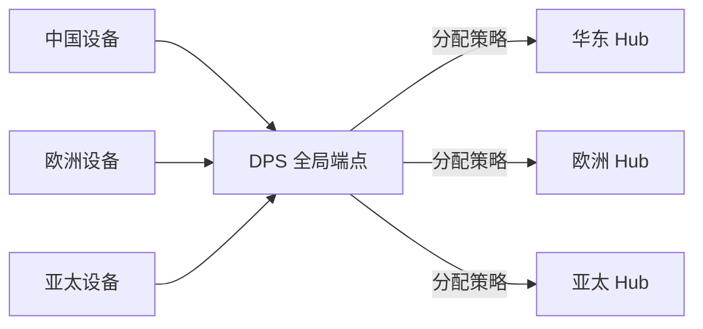
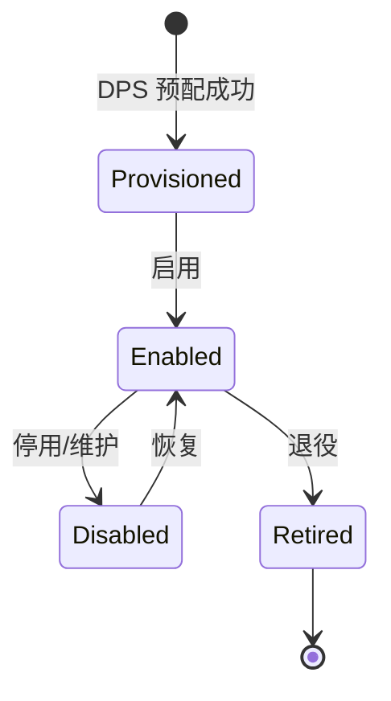

# Azure · 海量设备管理

当设备从几台变成几万台，"管理"就从"顺手配一下"变成"必须有工程化的手段"：怎么高效注册？怎么批量升级固件？怎么在全球不同 Region 就近接入？

这一篇讲 Azure 的设备注册表、DPS、IoT Edge 部署与全球接入。

## 1.问题背景：设备管理的规模难题

- **注册与鉴权海量**：几万设备逐个配密钥不现实，要批量、可审计。
- **固件要可控升级**：升级要能分组、灰度、回滚，不能"一升级全变砖"。
- **跨地域接入**：全球部署的设备，应该就近接入、低时延，而不是全连到一个 Region。
- **边缘要可运维**：IoT Edge 模块（容器）要能远程部署、监控、回滚。

## 2.设计理念：身份注册表 + DPS 自动归属 + 任务制运维

Azure 的思路是：**用注册表统一管理身份，用 DPS 把"海量设备自动归属"变成声明式配置，用自动部署管理边缘模块**。

- **设备注册表**：每个设备有唯一 `deviceId` 与身份，批量导入/导出。
- **DPS**：零接触预配，按分配策略把设备自动落到正确 Hub（见（二））。
- **自动部署（Edge）**：以"部署清单"为单位，把模块（容器）批量下发到一组边缘设备，支持分层/指标健康度。
- **全球接入**：多 Region 各起 Hub，配合 DPS 让设备就近连。

## 3.实际应用


### 3.1 DPS 全球就近接入



设备只认 DPS 全局端点，由 DPS 决定落到哪个 Hub——全球扩展无需改设备固件。

### 3.2 IoT Edge 自动部署（清单片段）

```json
{
  "content": {
    "modulesContent": {
      "$edgeAgent": {
        "properties.desired": {
          "modules": {
            "infer": { "type": "docker", "settings": { "image": "acr/infer:2.0" } }
          }
        }
      }
    }
  },
  "targetCondition": "tags.region = 'east'",
  "priority": 10
}
```

满足 `targetCondition` 的边缘设备自动拉取模块并运行，部署失败有健康度指标可观测、可回滚。

### 3.3 设备生命周期状态

设备不是"永远在线"，它有明确的被管理状态，平台要能反映并驱动流转：



`Enabled` 才可通信；`Disabled` 保留身份但拒绝连接（如异常设备先隔离）；`Retired` 彻底下线但记录不删，便于追溯。

### 3.4 固件升级：Device Update for IoT Hub

Azure 用 **Device Update（ADU）** 做标准化 OTA：把固件包 + 部署策略（分组、灰度比例、回滚阈值）下发给设备，全程可观测。

- **分组部署**：按标记（tag）把设备分成批次，先小流量灰度，再全量。
- **健康度门控**：设"成功率低于 X% 自动暂停"，避免"一升级全变砖"。
- **签名校验**：固件包带签名，设备端验签后才刷，防篡改固件注入。

这把"几万台设备怎么安全升级"从手工活变成可编排、可回滚的工程流程——与（二）的认证、（四）的孪生状态天然衔接。

## 4.注意事项

- **deviceId 全局唯一且慎改**：它是身份主键，改名等于换设备。
- **DPS 分配策略要设计**：注册列表 / 自定义分配函数决定设备归属，错配会导致设备落到错误 Hub。
- **Edge 部署优先级**：多个部署可能匹配同一设备，用 `priority` 解决冲突，最高者生效。
- **OTA 签名校验**：固件包必须验签再刷，否则伪造固件可能拿下整批设备；回滚阈值要结合健康度门控。
- **孪生不是数据库**：设备最新状态用孪生，高频时序历史落下游存储，别把孪生当时序库用。

## 5.小结

Azure 设备管理的设计，是"**注册表统一身份 + DPS 自动归属 + 任务制边缘运维**"，把"几万台设备怎么管"变成可编排、可灰度、可回滚的工程问题，并借助 DPS 天然支持全球就近接入。这让"海量设备"从负担变成可运营的资产。

一句收尾：设备管理的功夫，是让"几万台会掉线、会升固件、会退役"的资产，变成可编排、可灰度、可回滚、可就近接入的有机整体——规模再大，也管得住。

## 参考链接

- Azure IoT Hub 设备管理：https://learn.microsoft.com/azure/iot-hub/iot-hub-device-management-overview
- Azure IoT Edge 自动部署：https://learn.microsoft.com/azure/iot-edge/module-deployment-monitor
