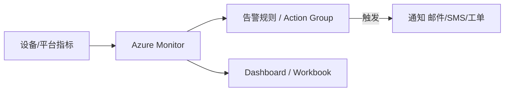
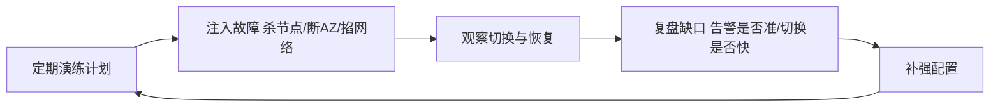

# Azure · 智能运维与高可用

平台"能跑"和"稳得住"是两回事。设备亿级、7×24 不停机、出事要能追溯——这是物联网平台的"运维与高可用"主题，也是 Azure 企业级落地的底层保障。

这一篇讲 Azure Monitor、Defender for IoT、SLA 高可用，并用两个典型案例收尾整个系列。

## 1.问题背景：运维与高可用的真实压力

- **看不见**：海量设备里谁在异常、消息是否堆积，靠人盯不可能。
- **追不到**：一条异常告警，要能回溯"哪台设备、什么时间、发了什么"。
- **扛不住**：单点故障、Region 级中断，不能让全量设备失联。
- **被攻击**：伪造设备、DDoS、异常消息突增，要能识别与隔离。
- **告警风暴**：故障瞬间成千上万设备同时告警，若不加收敛，运维会被"告警海"淹没，反而看不见真问题。
- **容量拐点**：连接数、消息 TPS 临近规格上限时性能会陡降，要能提前预警、提前扩容，而不是等宕机。

## 2.设计理念：可观测 + 安全 + 多 AZ 高可用

Azure 把"稳"建立在三层：

- **可观测（Azure Monitor）**：指标（连接数/消息数/路由延迟）、日志、告警统一，对接 Action Group 通知。
- **安全（Defender for IoT）**：资产发现、漏洞管理、异常行为检测（如消息突增、未授权接入），覆盖 OT/IT。
- **高可用**：IoT Hub 多 AZ 部署（SLA 99.9%+），关键路径无单点；跨 Region 可用 DPS + 多 Hub 做容灾。
- **混沌与演练**：高可用不是"配了多 AZ"就完事，要定期做故障注入演练（杀节点、断 AZ），验证真的能切换、真的能恢复。

## 3.实际应用

### 3.1 监控与告警数据流

### 3.2 高可用架构要点

- **多 AZ 内建**：IoT Hub 接入与路由跨可用区部署，单 AZ 故障自动切换。
- **无状态接入**：会话状态托管、可迁移，避免单点状态丢失。
- **跨 Region 容灾**：关键行业可在多 Region 各起 Hub，由 DPS 路由，见（五）。

### 3.3 典型案例收尾

**案例一 · 智慧建筑 / 能源**：楼层空调通过 Twin + DTDL 建模，Stream Analytics 实时算能耗，Power BI 出大屏；规则异常自动调温——物模型（四）+ 消息（三）+ 运维（六）综合体现。

**案例二 · 工业 OT 安全**：工厂设备经 Defender for IoT 做资产发现与异常检测，边缘 IoT Edge 本地自治，异常上报 Monitor 告警——连接（二）+ 设备管理（五）+ 安全运维（六）综合体现。

这两个案例正好对应本系列主线：连接（二）→ 消息（三）→ 物模型（四）→ 设备管理（五）→ 运维高可用（六），串起来就是一条完整的物联网数据生命周期。

**案例三 · 智慧零售 / 车联网**：门店传感器经 IoT Edge 本地聚合，Defender 监测异常接入，Monitor 告警联动自动化 Runbook 处置；跨 Region 用 DPS 就近接入——连接 + 设备管理 + 运维综合体现，也展现出 Azure 的"企业级生态"（与 AD、自动化运维衔接）优势。

这三个案例正好对应本系列主线：连接（二）→ 消息（三）→ 物模型（四）→ 设备管理（五）→ 运维高可用（六），串起来就是一条完整的物联网数据生命周期。

### 3.5 演练常态化：从"配了"到"验证过"

多 AZ、跨 Region、告警收敛，控制台里点几下就能"配好"。但配置不等于能力——真正决定出事时扛不扛得住的，是**有没有真的演练过**。

落地节奏：

- **频率固定**：把故障注入排进月度/季度运维日历，和版本发布一样成为固定动作。
- **范围递进**：先单节点、单 AZ 杀起，再逐步加码到网络分区、依赖服务中断，逼出真实最坏情况。
- **复盘留痕**：每次演练都要有"是否按预期恢复、告警是否及时、恢复耗时多少"的结论，缺口转成下个迭代整改项。
- **低谷演练**：选真实流量低谷做，并明确告知相关方"这是演练"，避免一次"验证"演成真故障误判。

## 4.注意事项

- **告警要分级**：别所有异常都叫"紧急"，否则告警疲劳；建议 Severity 0-4 分级。
- **Defender 覆盖 OT**：OT 环境有特殊性（协议/时延），启用前评估对生产的影响。
- **SLA 不等于"零中断"**：多 AZ 解决"机房级"故障，Region 级要单独规划，且要真做故障演练。
- **告警要收敛抑制**：同类告警聚合、依赖抑制（下游挂了别让上游每台设备都叫），否则告警海会掩盖真问题。
- **容量要设水位线**：连接数/TPS 设 70%/90% 预警，给扩容留反应时间，别等打满才动手。
- **演练要常态化**：高可用配置会随架构漂移，半年不演练就约等于没有，建议纳入定期运维动作。
- **边缘也要演练**：IoT Edge 的断网自治能力要在演练里真验证，别只盯云端多 AZ——边缘挂了，本地自治是否成立同样关键。
- **日志要留存**：合规与追溯都依赖它，配置合理的保留期，别让关键审计日志悄悄过期。

## 5.小结

Azure 物联网平台的"稳"，来自**Monitor 可观测、Defender 安全、多 AZ 高可用**三者叠加，再配合前几篇的连接、消息、物模型、设备管理，构成一条从设备到业务的完整、可靠数据生命周期。这也是为什么读任何一家云（阿里云/AWS/华为云/Azure/火山引擎），骨架都高度趋同——你现在已握有四套同构视角。

一句收尾：平台的价值，最终落在"平时看得见、出事追得到、故障扛得住"。把这三句做到，物联网才真正可运营。

## 参考链接

- Azure Monitor 文档：https://learn.microsoft.com/azure/azure-monitor/
- Microsoft Defender for IoT：https://learn.microsoft.com/azure/defender-for-iot/
- IoT Hub 高可用与灾备：https://learn.microsoft.com/azure/iot-hub/iot-hub-ha-dr
