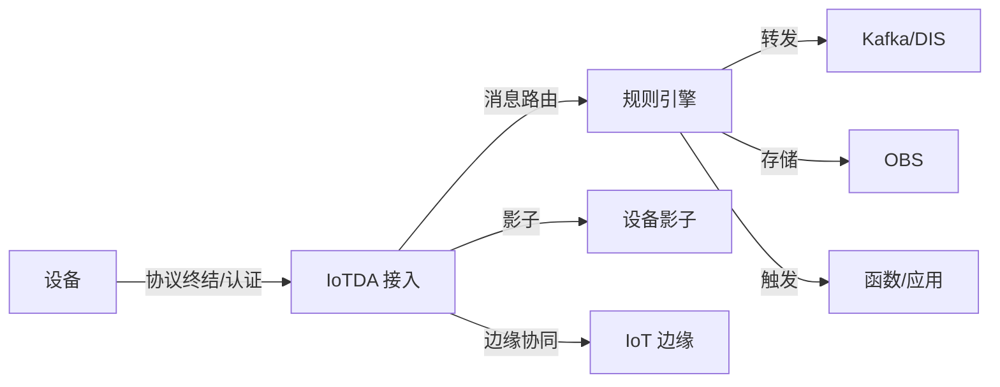

# 华为云 · 为什么需要物联网平台

## 0. 十万台设备，压垮一条收数管道

如果你只接几十台设备，写个 MQTT Broker + 一张设备表就能跑。但当设备数爬到十万、百万，跨地域、固件要批量升级、出了故障要追溯"这条消息是谁发的"，纯粹的"收数管道"就会迅速崩塌。

这一篇先不急着讲华为云的某个具体服务，而是把"为什么需要物联网平台"说清楚——再看华为云是怎么用一组产品把这套复杂度接住的。

可以先记住一句话：物联网平台不是"更会收数据的管道"，而是"把设备侧的混乱，收敛成业务侧秩序"的那层抽象。后面所有篇章，都在拆这层抽象。

## 1 问题背景：设备接入的真实痛点

抛开术语，设备接入要解决的现实问题无非这几条：

- **协议杂**：老设备只会 HTTP，新设备爱用 MQTT，水表/电表走 CoAP 或 LwM2M，工控现场还有 Modbus/OPC UA。你不能要求每台设备都改协议。
- **行业极杂**：车联网要低时延、工厂要本地自治、抄表要极低成本——不同行业的设备形态和约束天差地别。
- **身份认证乱**：一机一密还是一型一密？证书怎么发？设备被伪造了怎么踢？
- **连接不稳定**：基站切换、隧道丢包、设备休眠，连接会断，断了自己要不要重连、状态要不要补报，平台得兜住。
- **数据既要用又要存**：实时告警要秒级，历史分析要落库，机器学习要喂流——一条设备消息往往要同时流向多个地方。
- **设备要被"管理"**：固件升级、配置下发、批量注册、远程诊断，这些是"设备"作为资产必然产生的运维动作。

这些事单做一件都不难，**难的是把它们整成一个统一、可扩展、还得高可用的系统**。这恰恰是物联网平台存在的理由。

还有几个常被低估、但一上规模就爆的点：

- **时间乱序与重复上报**：设备时钟不准、网络重传，会让"先发生的事后到"。平台要做去重、补报、排序，否则上层统计全错。
- **固件碎片化**：同一型号设备可能分布在十个批次、跑了三种固件版本，升级时你根本不知道"哪台该升、升到哪"。
- **厂商绑定与黑盒**：自己写的适配散落在各业务里，换设备厂商就要改代码；没有统一模型，设备一旦多了就是一锅粥。
- **运维黑盒**：设备失联了，是断网、掉电还是被伪造？没有审计与可观测，问题只能靠猜。

## 2 设计理念：为什么用托管平台，而不是自己搭

自建一套"能跑"的物联网后端，初期成本看似低；但要做到"可靠、安全、可扩展"，隐性成本极高：

| 维度 | 自建（朴素版） | 托管平台（如华为云 IoT） |
|------|----------------|--------------------------|
| 连接规模 | 单机 Broker 几千~几万，再往上要自己分片 | IoTDA 托管的接入层，支持亿级设备 |
| 安全 | 自己实现认证/加密/轮换，易留坑 | X.509、TLS、设备证明开箱即用 |
| 高可用 | 得自己做主备、容灾 | 多 AZ 内建，跨 Region 可选 |
| 设备管理 | 自己写注册/OTA/监控 | 设备注册、OTA、批量任务内建 |
| 行业落地 | 每个行业重做一套 | 车联网/工厂/城市等使能能力可复用 |
| 运维追溯 | 自己接日志/指标/审计 | 监控、告警、审计内建，可开箱看板 |
| 成本结构 | 隐性的人力+救火成本 | 按实例/消息量计费，可预估 |

所以"平台化"的本质是：**把"设备又多又杂又时断时续"这个现实，收敛成平台一侧干净、业务一侧简单的结构**。你付出的代价是"学习它的模型"，换回的是"不用自己扛那一整套基础设施"。

换个角度说：自建和用平台，不是"贵不贵"的取舍，而是"把宝贵人力投在业务差异化，还是投在重复造基础设施"的取舍。对绝大多数团队，后者才是机会成本。

## 3 实际应用：华为云 IoT 的产品矩阵

华为云把 IoT 拆成"接入—边缘—使能—分析"四段，拼起来覆盖端到云：

- **设备接入 IoTDA**：设备接入与消息中枢，负责协议终结、身份认证、消息路由（规则引擎）和设备影子。演进自早期 OceanConnect。
- **IoT 边缘（Edge）**：边缘节点，把计算、协议转换、本地自治下沉到工厂/园区侧，断网也能本地处理。
- **数字孪生 / 建模服务**：把物理设备与场景建模成可查询、可仿真的数字实体。
- **全球 SIM / 连接管理**：面向蜂窝设备的一卡多网、流量与生命周期管理。
- **数据分析**：规则引擎把消息转给 DIS（数据接入）、Kafka、OBS（存储）、函数工作流等下游。

华为云强调的"行业使能"值得单独点一句：它不只是提供通用接入，还把**车联网 T-Box、智慧工厂 OEE、城市感知**这类行业模板沉淀成可复用能力，让你少从零搭建。

一条设备消息在华为云里的生命周期，大致是这样：

### 3.4 四段能力如何呼应本系列

上面这条链路，正好对应本系列后续各篇的拆解顺序：

- 接入（IoTDA 协议终结/认证）→ 连接（二）
- 消息路由（规则引擎）→ 消息（三）
- 设备语义（物模型/数字孪生）→ 物模型（四）
- 设备资产（注册/OTA/全球）→ 设备管理（五）
- 可观测与高可用 → 运维高可用（六）

也就是说，华为云"接入—边缘—使能—分析"四段，不是彼此孤立的产品，而是一条互相咬合的数据生命周期。读任何一篇，都要记得它只是这条链上的一环。

## 4 注意事项

- **别神话平台**：平台解决的是"基础设施复杂度"，不解决"你的业务模型怎么设计"。物模型、Topic 规划、数据流向仍要你自己想清楚。
- **实例与规格要选对**：IoTDA 有不同规格（标准版/企业版）和实例，设备数、消息 TPS、规则转发的配额直接影响架构，见（三）（五）。
- **多 Region 不是自动全球分发**：IoTDA 是区域级服务，全球部署需在多个 Region 各起实例并用连接管理/路由打通，留在（五）展开。
- **成本要算边际**：消息量、规则转发量、存储量都会按量计费，早期 prototype 和规模上线是两个账本，别用 demo 成本估生产。
- **团队要补平台技能**：用平台意味着团队要懂它的模型与边界，这部分学习成本也要算进"总拥有成本"。
- **数据归属要早定**：设备数据落在哪个 Region、是否跨境、谁能访问，关系到后续合规，别等上线了再补。

## 5 小结

物联网平台的价值，不在于"能收设备数据"，而在于把连接、认证、消息、设备管理、运维这些**横切关注点**统一接住，让你只关心业务数据本身。华为云用"接入 IoTDA + 边缘 + 数字孪生 + 连接管理 + 下游分析"把这条数据生命周期覆盖完整——这正是后面五篇要逐层拆解的主线。

一句话收尾：平台帮你扛住"设备的混乱"，把秩序留给你，把复杂度留给平台——你只要想清楚"业务要什么"。

## 参考链接

- 华为云 IoT 设备接入 IoTDA 文档：https://support.huaweicloud.com/iotda/
- 华为云 IoT 产品页：https://www.huaweicloud.com/product/iot.html
- 华为云 IoT 边缘文档：https://support.huaweicloud.com/iotedge/
