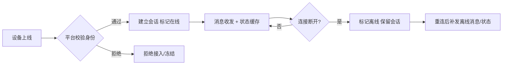
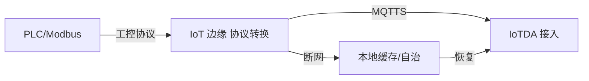

# 华为云 · 稳定连接

> 技术栈：华为云 IoTDA 设备接入 / IoT 边缘 + MQTTS / CoAP / LwM2M / HTTPS
> 适用场景：多协议接入、设备身份认证、连接保活与断线重连

连接是物联网平台的第一道关。设备不是浏览器——它可能在地下车库的弱网里、在跨省货车上、在水表里用电池撑五年。平台要做的，是让"连得上、认得清、扛得住抖"。

这一篇讲华为云 IoTDA 如何把"碎片化协议 + 不可信设备 + 不稳定网络"这三件事接住。

把连接层想成"门卫"：它既要放行合法设备，又要挡住冒名顶替；既要在网络抖动时维持会话，又不能在海量设备下被连接表压垮。

## 1.问题背景：连接层的三类挑战

- **协议碎片化**：MQTT、CoAP、LwM2M、HTTP 各有适用场景；更老的工控设备只有 Modbus/OPC UA，自己改不了协议。
- **设备身份不可信**：设备出厂就被克隆、密钥泄露、伪造设备冒充上报，是物联网最典型的安全威胁。
- **网络时断时续**：蜂窝网络切换、隧道丢包、设备休眠唤醒，连接会反复断；断线期间的状态补报、去重、保序都要平台兜底。

还有几个工程上特别磨人的点：

- **弱网下的功耗约束**：水表、气表靠电池撑几年，每次建连、每次重传都吃电。协议和保活间隔必须"能省则省"，否则电池寿命直接腰斩。
- **NAT/防火墙超时**：设备藏在运营商 NAT 后，长时间无心跳会被中间设备回收映射，连接"看起来在，其实已死"。保活节奏要踩在超时之前。
- **海量连接的连接表压力**：百万设备同时在线，接入层要维护的连接状态、会话表是实打实的内存与调度开销，不是"加机器"就能无视的。

## 2.设计理念：多协议终结 + 设备级强认证 + 会话保活

华为云的核心思路是：**接入层把协议差异吞掉，把"统一、可信、有状态"的连接交给上层**。

- **多协议接入**：原生支持 MQTTS、CoAP、LwM2M over DTLS、HTTPS；非标协议（Modbus/OPC UA 等）通过边缘节点做协议转换后上行。
- **设备认证**：支持 X.509 证书、密钥（一机一密/一型一密）、设备 CA 自注册；证书可吊销、密钥可轮换。
- **连接保活与离线**：长连接保活、断线重连、离线消息缓存与补发、会话状态由平台维护（设备"在线/离线"是平台侧事实，而非设备自报）。

再补两层常被忽略的设计：

- **握手即鉴权**：认证不是"连上之后再查"，而是在 TLS/DTLS 握手阶段就校验证书链或密钥，非法设备连会话都建不起来，从根上挡住伪造。
- **重连退避**：设备掉线后 avalanche 式同时重连会把接入层打爆。平台侧通常配合设备端做指数退避+抖动，让重连请求"错峰"，避免雪崩。

## 3.实际应用


### 3.1 协议与接入

设备按能力选协议：

```text
弱网/低功耗设备（水表、气表）  →  CoAP / LwM2M over DTLS
车机/实时上报                   →  MQTTS（MQTT over TLS）
浏览器/小程序/调试              →  HTTPS（REST）
工厂 PLC / Modbus               →  经 IoT 边缘做协议转换后上行
```

### 3.2 设备认证示例（X.509 + 设备 CA）

设备持有由平台设备 CA 签发的证书，握手时平台验证链条：

```json
{
  "deviceId": "water-meter-0001",
  "authType": "X.509",
  "certificateCn": "CN=water-meter-0001,O=tenant-a",
  "caId": "tenant-a-device-ca",
  "status": "enabled"
}
```

若证书被吊销或设备被标记异常，平台在握手阶段直接拒绝接入，且可一键"冻结"设备，无需改设备端。

### 3.3 连接状态与离线补报



### 3.4 边缘协议转换

工厂里的 PLC、Modbus 设备说不了 MQTT。华为云的做法是让 IoT 边缘节点"听懂"工控协议，在边缘侧完成采集与转换，再以标准 MQTT 上行。好处是：老旧设备零改造，且断网时边缘能本地自治，等网络恢复再补传。



### 3.5 保活间隔与重连退避建议

```text
保活心跳（Keep Alive）：取 NAT 超时阈值的 1/2~2/3，避免"假死连接"
重连退避： base=1s，指数增长，上限 60s，叠加随机抖动 ±30%
批量上线：错峰启动，避免开机即"万设备齐连"的瞬时洪峰
```

## 4.注意事项

- **证书生命周期要规划**：设备量极大时，证书签发、轮换、吊销的工程量是真实成本，建议用设备 CA 分级管理。
- **CoAP/LwM2M 基于 UDP（DTLS）**：与 MQTTS（TCP/TLS）的超时、重传参数不同，边缘网络质量差时要单独调优。
- **一型一密 vs 一机一密**：前者适合同型号海量低成本设备（烧录同密钥后平台分配），后者安全性更高但产线成本高，按风险选。
- **心跳不是越短越安全**：心跳太频繁，弱网设备电池扛不住；太长则"假死"难发现。要按设备供电与网络质量权衡。
- **冻结/吊销要可回滚**：误操作冻结大批量设备会直接"全网失联"，操作权限和审批流程要跟上。

## 5.小结

华为云连接层的设计，本质是"**协议终结在接入层 + 身份强认证 + 会话状态平台托管**"。它把"设备又杂又不可信又爱掉线"的现实，收敛成上层看到的一张干净、可信、有状态的连接网——这正是消息、物模型、设备管理能放心建立在之上的前提。

再加一句工程经验：连接层最贵的不是"连上"，而是"在百万级规模下，连得稳、认得准、断了能自愈"。这层做扎实，后面每一层都省力。

## 参考链接

- 华为云 IoTDA 设备接入协议：https://support.huaweicloud.com/iotda/
- 华为云 IoTDA 设备安全与认证：https://support.huaweicloud.com/usermanual-iotda/iotda_01_0401.html
