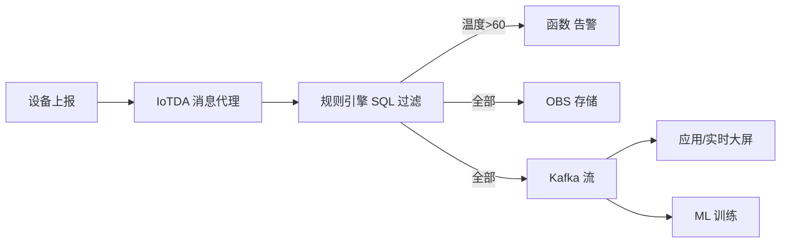

# 华为云 · 消息与规则引擎

> 技术栈：华为云 IoTDA 消息代理 / 规则引擎 + Kafka / DIS / OBS / 函数工作流
> 适用场景：设备消息的一对多分发、协议与存储解耦、声明式规则过滤与转发

设备连上来之后，真正的价值在于"数据流得动"。一条温度消息可能要同时喂给实时告警、历史库和机器学习——平台不能只把消息存下来，而要让它能**按需流向不同目的地**。

这一篇讲华为云 IoTDA 的消息通信与规则引擎如何做这件事。

把消息层想成"邮局 + 分拣机"：邮局负责把信可靠送达（不丢不重），分拣机按地址规则把信分到不同邮路。平台要同时当好这两者。

## 1.问题背景：消息层的典型诉求

- **一对多分发**：同一条消息，告警要秒级、存储要落库、分析要喂流。
- **协议与存储解耦**：业务系统不想直接连 MQTT，希望消息进 Kafka、进函数、进数据库。
- **过滤与加工**：不是所有消息都有用，想在平台侧按条件过滤、字段投影、简单计算后再转发。
- **规模与可达**：亿级设备、海量 Topic，要保证不丢、不重、低时延。

还有几个容易踩的点：

- **消息乱序**：设备重传、边缘补传会让消息顺序错乱，下游若依赖时序要先对齐。
- **峰值洪流**：抄表集中在整点、告警突发在故障瞬间，消息量会呈尖峰，平台要有削峰与背压能力。
- **重复消息**：网络重传、QoS1 重发都会产生重复，下游必须能幂等处理。

## 2.设计理念：消息代理 + 声明式规则引擎

华为云的思路是：**消息中枢只负责"可靠收发"，流向与加工交给"规则引擎"用类 SQL 声明式配置**，而不是让业务去写 consumer。

- **消息通信**：基于 Topic 的发布/订阅，设备与平台、设备与设备影子之间收发。
- **规则引擎**：用 SQL 式语法 `SELECT ... FROM ... WHERE ...` 对消息过滤、投影，再 ACTION 到多个目标（DIS/Kafka/OBS/函数/RocketMQ 等）。
- **解耦**：业务系统消费下游（Kafka/函数）即可，无需理解设备协议。

补充两点设计取向：

- **规则用"声明"而非"代码"**：业务同学配一条 SQL 就能完成"温度超阈值进告警"，不用写 consumer、不用管连接。这是平台降低使用门槛的关键。
- **转发目标可组合**：一条规则可以挂多个 ACTION，同一份消息同时进存储、进流、进函数，互不干扰。

## 3.实际应用


### 3.1 规则引擎示例（温度超阈值转发到函数告警）

```sql
SELECT
  deviceId,
  temperature,
  location
FROM
  /tenant-a/water-meter/+/report
WHERE
  temperature > 60
```

动作（ACTION）：转发至函数工作流触发告警，并落盘 OBS 留证。

规则引擎还内置一批函数，可在 SELECT 里做轻加工，例如：

```sql
SELECT
  deviceId,
  floor(temperature) AS temp_int,
  concat(location, '-', deviceId) AS tag
FROM
  /tenant-a/water-meter/+/report
WHERE
  temperature > 60 AND status = 'online'
```

### 3.2 一条消息的多目标流转



### 3.3 设备影子与消息

设备端状态通过消息更新影子，应用侧读影子即可拿到"设备最新已知状态"，即使设备离线也不影响业务查询——这与（二）的会话状态保活是一脉相承的。

### 3.4 Topic 规划与 QoS

Topic 是消息层的"地址"，规划好能省掉后面无数麻烦：

```text
建议分层： /租户/产品/设备/动作
示例：       /tenant-a/water-meter/device-001/report
通配：       /tenant-a/water-meter/+/report   （+ 单层）
            /tenant-a/#                       （# 多层）
QoS：       QoS0 最多一次（高频非关键）
            QoS1 至少一次（关键数据，需下游幂等）
```

## 4.注意事项

- **规则数量与配额**：规则引擎的条数、转发目标数、TPS 都受实例规格限制，海量规则要做分组/合并，别一条设备一条规则。
- **转发目标要幂等**：下游（函数/数据库）应自己处理重复消息，平台保证"至少一次"而非"恰好一次"。
- **Topic 规划早做**：Topic 结构决定规则匹配效率，建议按 `租户/产品/设备/动作` 分层，避免后期混乱。
- **函数/下游要限时**：转发到函数或应用时，下游处理慢会反压消息代理，建议异步消费、设超时与重试。
- **敏感数据别乱转发**：含位置、身份的消息进 Kafka 前要脱敏或控权，避免"为了方便"把全量明文到处发。

## 5.小结

华为云消息层的设计，是"**可靠消息代理 + 声明式规则引擎**"把"一对多分发、协议解耦、过滤加工"三件事一次性解决。业务侧只需消费下游，不必关心设备怎么连、消息怎么来——这正是让数据"流得动"的关键。

一句工程经验：消息层最怕"平台很能发，下游接不住"。把幂等、限流、脱敏想在前面，比事后救火便宜十倍。

## 参考链接

- 华为云 IoTDA 规则引擎：https://support.huaweicloud.com/iotda/
- 华为云 IoTDA 数据转发：https://support.huaweicloud.com/usermanual-iotda/iotda_01_0501.html
