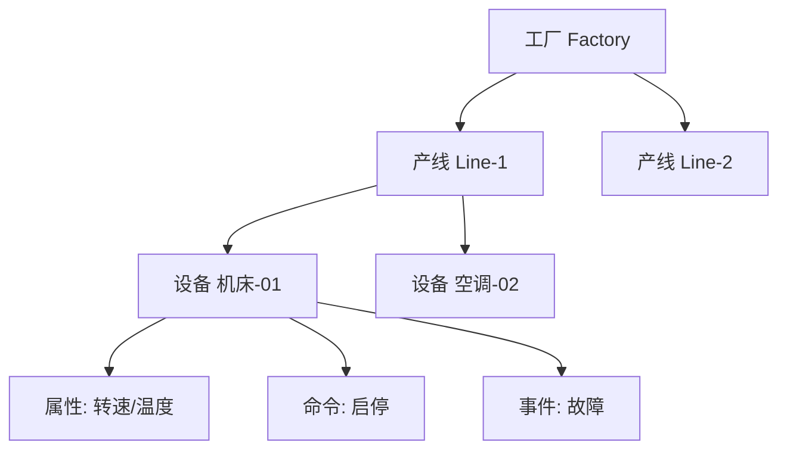
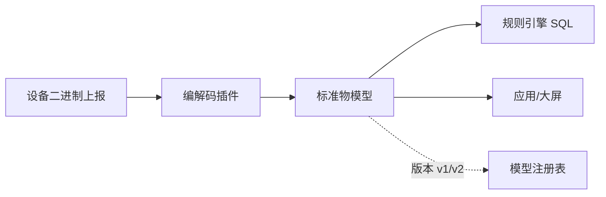

# 华为云 · 物模型与数字孪生：从属性描述到物理场景映射

> 技术栈：华为云 IoTDA 产品模型（属性/命令/事件）/ 数字孪生 / 编解码插件
> 适用场景：异构设备语义统一、物理场景建模、模型版本管理

设备连上来了、消息流起来了，但平台和应用看到的还是一串"key=value"。要让"软件能理解设备"，需要一个**统一的设备描述语言**——这就是物模型；再进一步，把设备和它所在的物理场景映射成可查询、可仿真的数字世界，就是数字孪生。

这一篇讲华为云的物模型（产品模型）与数字孪生。

把物模型想成"设备的简历模板"：所有同型号设备填同一张表，字段含义统一，HR（平台/应用）一眼就懂，不用每台重新面试。

## 1.问题背景：没有统一模型，每台设备都是一座孤岛

- **异构设备无统一语义**：同是"温度"，A 设备叫 `temp`、B 叫 `temperature`、C 用 `0x10` 寄存器——应用每接一个设备就要写一套适配。
- **命令/事件难标准化**：开灯、调速、告警、故障，各自有参数与格式。
- **场景要被建模**：一个智慧工厂不止"一台设备"，还有产线、车间、能源系统的关联。

再补两点：

- **厂商上报格式各异**：同一传感器换供应商，字段名、单位、精度全变，没有模型就只能改代码适配。
- **数据要可被规则引擎直接消费**：规则引擎（三）是按字段写 SQL 的，若字段语义不统一，一条规则只能绑一种设备，复用无从谈起。

## 2.设计理念：产品模型归一 + 数字孪生映射

华为云用两层解决：

- **产品模型（物模型）**：在"产品"层面定义**属性（Property）、命令（Command）、事件（Event）**，同一产品的设备共享模型；设备上报遵循模型，平台自动归一。
- **数字孪生**：把物理实体（设备/产线/车间/系统）建模成"实体—属性—关系"图，支持查询、仿真、联动。

更进一步，华为云的模型还包含：

- **服务（Service）**：把相关的属性、命令、事件打包成"能力单元"，例如"阀门服务"含开关属性+控制命令+泄漏事件，模型更内聚。
- **编解码插件（Codec）**：设备若用二进制/私有协议上报，通过插件在平台侧转成标准物模型，老设备也能"说标准话"。

## 3.实际应用


### 3.1 产品模型示例（智能水表）

```json
{
  "productId": "water-meter",
  "model": {
    "properties": [
      { "name": "temperature", "type": "float", "unit": "°C", "access": "r" },
      { "name": "flow", "type": "float", "unit": "L/min", "access": "r" }
    ],
    "commands": [
      { "name": "valveControl", "params": { "state": "open|close" } }
    ],
    "events": [
      { "name": "leakAlarm", "params": { "level": "warning|critical" } }
    ]
  }
}
```

设备 A/B/C 各自的上报格式不同，但平台按模型归一为统一语义，应用只认 `temperature/flow`，不用关心底层差异。

### 3.2 数字孪生建模



孪生体把"设备—产线—工厂"的层级与关系固化，支持层级查询、影响分析和联动控制。

### 3.3 模型版本与编解码联动



模型有版本，升级模型时旧设备可暂留旧版、新设备用新版，平滑过渡，避免"改模型即断网"。

## 4.注意事项

- **模型要早定义、慎改**：模型是上下游的契约，改字段会牵动设备端、规则引擎、应用；建议版本化管理。
- **属性 vs 命令 vs 事件**：属性是当前状态（可读/可写），命令是主动动作，事件是异步通知，三者语义不要混用。
- **孪生不是越大越好**：只建模你真正要查询/联动的对象，过度建模会变成维护负担。
- **编解码插件要测边界**：二进制解析最易出 bug，字段越界、长度错都会让整批消息解析失败，上线前充分测。
- **模型与业务解耦**：模型描述"设备是什么"，业务规则写在规则引擎/应用层，别把业务逻辑塞进模型。

## 5.小结

华为云用"**产品模型归一设备语义 + 数字孪生映射物理场景**"把"异构设备"变成"软件可理解的对象"。这让上层应用、规则引擎、数据分析都能建立在统一语义之上——这也是它"行业使能"能复用模板的底层原因。

一句经验：物模型定得好，后面五层都轻松；物模型定得烂，每层都在补坑。它是整个平台语义的"地基"。

## 参考链接

- 华为云 IoTDA 产品模型：https://support.huaweicloud.com/iotda/
- 华为云 数字孪生相关文档：https://support.huaweicloud.com/
