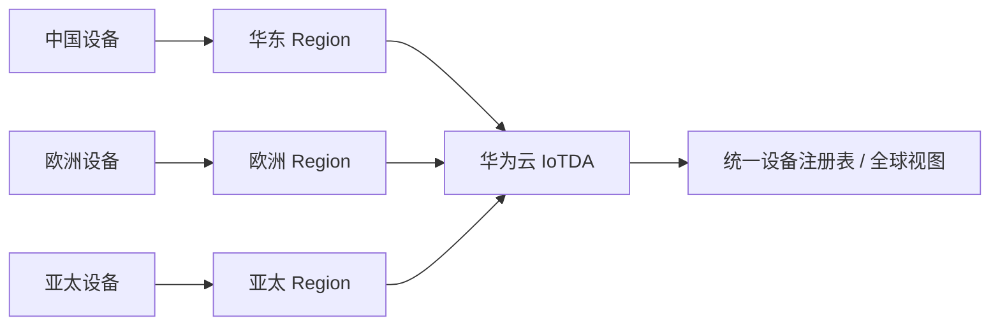
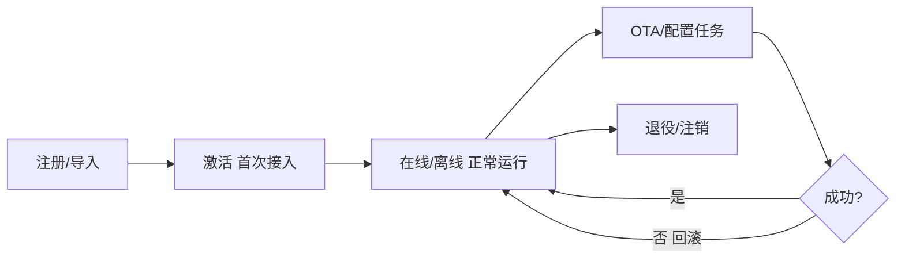

# 华为云 · 海量设备管理

> 技术栈：华为云 IoTDA 设备注册 / 批量任务（OTA/配置）/ 多 Region 全球接入 / 设备影子
> 适用场景：海量设备的批量注册、OTA 灰度升级、全球就近接入、设备生命周期管理

当设备从几台变成几万台，"管理"就从"顺手配一下"变成"必须有工程化的手段"：怎么高效注册？怎么批量升级固件？怎么在全球不同 Region 就近接入？

这一篇讲华为云 IoTDA 的设备管理、OTA 与全球接入。

把设备管理想成"资产台账 + 工单系统"：台账记录每台设备是谁、在哪、什么状态；工单把"升级/配置"变成可编排、可追踪的任务。

## 1.问题背景：设备管理的规模难题

- **注册与鉴权海量**：几万设备逐个配密钥不现实，要批量、可审计。
- **固件要可控升级**：OTA 要能分组、灰度、回滚，不能"一升级全变砖"。
- **跨地域接入**：全球部署的设备，应该就近接入、低时延，而不是全连到一个 Region。
- **设备状态要可查**：谁在线、谁失联、谁在升级中，运维要一眼看清。

再加几点：

- **设备标识要唯一稳定**：设备换网、换卡后身份不能变，否则台账乱套、历史数据对不上。
- **休眠设备按需唤醒**：抄表类设备大部分时间睡着，管理指令要能"攒着"，等设备上线再下发，不能因为暂时离线就判定失联。
- **设备要能退役**：坏了、丢了、过保的设备要从台账移除或标记，否则"幽灵设备"会污染统计与计费。

## 2.设计理念：注册表 + 批量任务 + 就近接入

华为云的思路是：**把"设备"当作可批量运维的资产**，用注册表统一管理身份，用"任务"统一编排升级/配置，用多实例实现就近接入。

- **设备注册**：支持单个/批量注册、设备 CA 自动签发、一型一密分配。
- **批量任务（OTA/配置）**：固件升级、配置下发以"任务"为单位，可分组、灰度、暂停、回滚。
- **全球接入**：通过多个 Region 实例 + 连接管理，实现设备就近接入。

补充两点：

- **设备分组与标签**：按地域、型号、批次打标签，让"精准运维"成为可能——你能只给"华东+水表+2024批次"发指令，而非全网广播。
- **设备影子承载期望态**：平台把"希望设备变成什么样"写进影子，设备上线自取并执行，离线也不丢指令。

## 3.实际应用


### 3.1 OTA 灰度升级示例

```json
{
  "jobName": "fw-upgrade-v2",
  "targets": { "productId": "water-meter", "group": "region-east" },
  "firmwareVersion": "2.0.1",
  "strategy": { "grayScale": 10, "rollbackOnFail": true },
  "schedule": "immediate"
}
```

先对 10% 设备灰度，失败自动回滚，确认稳定后逐步放量——避免"全网一次升级"的灾难。

### 3.2 全球就近接入（多 Region）



### 3.3 设备影子与状态

设备影子保存"期望状态"与"上报状态"，升级/配置任务通过影子下发，即使设备离线，上线后也能拉取并执行。

### 3.4 设备生命周期



把生命周期管清楚，资产台账才可信，计费、统计、追溯才有据可依。

## 4.注意事项

- **OTA 必须可回滚**：固件升级失败是常态，灰度+回滚是底线，别省。
- **分组维度早设计**：按地域、型号、批次分组，决定你能否"精准运维"而非"全网操作"。
- **全球接入的合规**：跨 Region 数据流动要关注数据驻留与合规要求，不是只把延迟降下来就行。
- **固件要签名校验**：设备端必须验签，否则中间人替换固件就是远程"植木马"，OTA 反而成攻击面。
- **影子别当数据库用**：影子存"当前/期望状态"够用即可，历史全量应进时序库，别把影子撑成无限增长的大对象。

## 5.小结

华为云设备管理的设计，是"**注册表统一身份 + 任务制批量运维 + 多 Region 就近接入**"，把"几万台设备怎么管"变成可编排、可灰度、可回滚的工程问题。这让"海量设备"从负担变成可运营的资产。

一句经验：设备管理拼的不是"能注册"，而是"能精准、能追溯、能安全退役"。台账干净，心里才不慌。

## 参考链接

- 华为云 IoTDA 设备管理：https://support.huaweicloud.com/iotda/
- 华为云 IoTDA OTA 升级：https://support.huaweicloud.com/usermanual-iotda/iotda_01_0601.html
