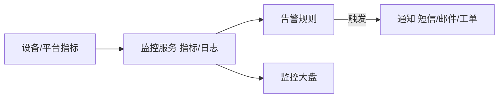

# 华为云 · 智能运维与高可用

> 技术栈：华为云 IoT 监控告警 / 安全审计 / 多 AZ 高可用 / 混沌演练
> 适用场景：物联网平台的可观测、安全审计、高可用架构、典型案例收尾

平台"能跑"和"稳得住"是两回事。设备亿级、7×24 不停机、出事要能追溯——这是物联网平台的"运维与高可用"主题，也是华为云强调行业落地的底层保障。

这一篇讲监控告警、安全审计、高可用架构，并用两个典型案例收尾整个系列。

把运维想成"给平台装仪表盘和黑匣子"：仪表盘让你随时知道健康状况，黑匣子让你出事后能复盘"到底发生了什么"。

## 1.问题背景：运维与高可用的真实压力

- **看不见**：海量设备里谁在异常、消息是否堆积，靠人盯不可能。
- **追不到**：一条异常告警，要能回溯"哪台设备、什么时间、发了什么"。
- **扛不住**：单点故障、Region 级中断，不能让全量设备失联。
- **被攻击**：伪造设备、DDoS、异常消息突增，要能识别与隔离。

再补两点：

- **告警风暴**：故障瞬间成千上万设备同时告警，若不加收敛，运维会被"告警海"淹没，反而看不见真问题。
- **容量拐点**：连接数、消息 TPS 临近规格上限时性能会陡降，要能提前预警、提前扩容，而不是等宕机。

## 2.设计理念：可观测 + 安全审计 + 多 AZ 高可用

华为云把"稳"建立在三层：

- **可观测**：指标（连接数/消息 TPS/离线率）、日志、告警统一看板。
- **安全审计**：设备行为审计、异常检测（消息突增、未授权接入）、证书/密钥合规。
- **高可用**：接入层多 AZ 部署，关键路径无单点；跨 Region 可选容灾。

补充一层常被忽视的：

- **混沌与演练**：高可用不是"配了多 AZ"就完事，要定期做故障注入演练（杀节点、断 AZ），验证真的能切换、真的能恢复。

## 3.实际应用

### 3.1 监控与告警数据流

### 3.2 高可用架构要点

- **接入层多 AZ**：IoTDA 接入与消息代理跨可用区部署，单 AZ 故障自动切换。
- **无状态接入**：会话状态托管、可迁移，避免单点状态丢失。
- **跨 Region 容灾**：关键行业（车联网/工厂）可在多 Region 部署并路由，见（五）的全球接入。

### 3.3 安全审计与异常检测

- **设备行为基线**：为每类设备建立消息频率、时段、来源基线，偏离即告警（如半夜突发海量上报）。
- **接入审计**：谁在什么时候用什么身份接入、是否来自异常 IP/证书，全程留痕。
- **证书/密钥合规**：到期、吊销、弱密钥要能扫描出来，避免"过期证书悄悄失效"。

### 3.4 典型案例收尾

**案例一 · 智慧工厂**：工厂设备经 IoT 边缘做协议转换与本地自治，数据上云做 OEE 分析；断网时边缘本地处理不中断，恢复后补齐——连接稳定性 + 边缘自治 + 设备管理的综合体现。

**案例二 · 车联网**：车机通过 MQTTS 低时延上报，规则引擎实时转发到实时大屏与告警；海量车机靠多 Region 就近接入与任务制 OTA 远程升级——连接 + 消息 + 设备管理 + 高可用的综合体现。

**案例三 · 城市抄表**：海量水/电表低功耗广覆盖，靠 LwM2M 省电接入、规则引擎把异常读数（负值/突变）实时告警、影子攒指令待设备上线下发——连接 + 消息 + 设备管理 + 运维的综合体现。

### 3.5 容量规划与故障演练

稳定性不是"配好就完事"，要有前瞻和验证：

- **水位线预警**：连接数、消息 TPS 设 70%/90% 两道线，到线即扩容，别等打满才动手。
- **容量压测**：上线前按峰值 1.5~2 倍压测接入层与规则引擎，提前摸清性能拐点在哪里。
- **混沌演练**：定期杀节点、断 AZ、掐网络，验证多 AZ 切换与边缘自治真的生效，而不是"配了没测过"。

这三个案例正好对应本系列主线：连接（二）→ 消息（三）→ 物模型（四）→ 设备管理（五）→ 运维高可用（六），串起来就是一条完整的物联网数据生命周期。

## 4.注意事项

- **告警要分级**：别所有异常都叫"紧急"，否则告警疲劳；建议 Critical/Warning/Notice 分级。
- **审计日志要留存**：合规与追溯都依赖它，配置合理的保留期。
- **高可用是设计出来的**：多 AZ 只解决"机房级"故障，Region 级要单独规划，且要真做故障演练。
- **告警要收敛抑制**：同类告警聚合、依赖抑制（下游挂了别让上游每台设备都叫），否则告警海会掩盖真问题。
- **容量要设水位线**：连接数/TPS 设 70%/90% 预警，给扩容留反应时间，别等打满才动手。
- **演练要常态化**：高可用配置会随架构漂移，半年不演练就约等于没有，建议把故障演练纳入定期运维动作。

## 5.小结

华为云物联网平台的"稳"，来自**可观测的监控、可审计的安全、可切换的高可用**三者叠加，再配合前几篇的连接、消息、物模型、设备管理，构成一条从设备到业务的完整、可靠数据生命周期。这也是为什么读任何一家云（阿里云/AWS/Azure/华为云/火山引擎），骨架都高度趋同——你现在已握有三套同构视角。

一句收尾：平台的价值，最终落在"平时看得见、出事追得到、故障扛得住"。把这三句做到，物联网才真正可运营。

到这里，六篇全部讲完。连接、消息、物模型、设备管理、运维高可用，五件事串成一条链；你握着它，再去读任何一家云的同主题文档，都能一眼对上号。

## 参考链接

- 华为云 IoTDA 监控运维：https://support.huaweicloud.com/iotda/
- 华为云 IoT 产品页：https://www.huaweicloud.com/product/iot.html
