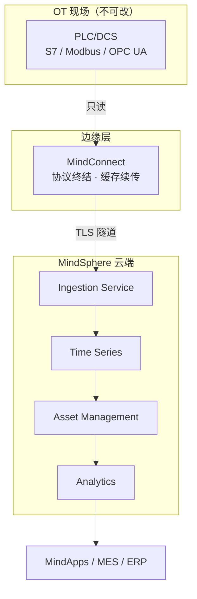

# 西门子 · 为什么工业需要专门的IoT架构：OT的现实与IT的诉求之间

> 技术栈：MindSphere（工业 IoT 即服务 PaaS）+ MindConnect + Asset Management + Time Series + Analytics
> 适用场景：理解工业 IoT 为什么不能照搬消费/通用 IoT 方案

消费级物联网把"连接 + 上云"当作终点。但工厂车间里的设备从第一天起就不是为了"上网"而存在的。一台注塑机、一条十年前投产的产线，首要目标是稳定产出——联网只是手段，不是目的。

工业 IoT 真正要解决的不是"怎么联网"，而是"怎么在不打扰生产的前提下，把车间的真实状态可信地搬到 IT 侧"。西门子 MindSphere 的定位正是如此：把 Siemens 百年自动化经验收敛成一套面向 OT 的"云操作系统"。

这里澄清一个误解：工业 IoT 不等于"给机器装个传感器 + 网关"。真正的价值在线缆之上的"语义"——设备数据要能被 MES、ERP 读懂，能被十年后的人追溯。工业现场同时存在绿地设备（出厂即带联网）和棕地设备（S7-300 连网口都没有），MindSphere 设计了多种接入形态正是为了同时接住两类。


## 1.问题背景：OT/IT 融合不是把 PLC 接上网线

工业现场的现实，决定了通用 IoT 方案搬进工厂会处处别扭。以 MindSphere 面对的典型场景为例：

| 场景 | 现实 | MindSphere 的应对 |
|------|------|------------------|
| OT/IT 融合 | PLC 毫秒级 / SCADA 秒级 / MES 班次级 / ERP 天级，节奏完全不同 | MindConnect 只读不写，保持"融合不替换"的硬边界 |
| 协议碎片化 | Modbus RTU 无安全 / OPC UA 带证书 / S7 私有 / Profinet 实时帧 | 边缘统一翻译为 Asset + Aspect 变量流 |
| 强实时 | 焊装线节拍秒级，200ms 抖动即可导致误动作 | 安全相关闭环永远留在 OT 侧 |
| 长生命周期 | S7-300 从 2010 服役到 2025+，数据格式必须跨代兼容 | Asset Type / Aspect 与硬件解耦 |
| 合规 | IEC 62443 要求分区隔离，GDPR 要求数据可追溯 | 租户隔离 + 设备证书 + RBAC + 数据驻留 |

## 2.设计理念：专门架构不是"通用 IoT 套一层网关"

### 2.1 五维差异

| 维度 | 通用 IoT | MindSphere |
|------|---------|-----------|
| 协议 | 假设 MQTT / HTTP | MindConnect 边缘终结 S7 / Modbus / OPC UA |
| 实时性 | 尽力而为 | 边缘自治 + OT 内闭环 |
| 生命周期 | 几年一换 | 10~20 年，Asset Type / Aspect 长期可演进 |
| 安全 | 设备认证为主 | 等保 + IEC 62443 + GDPR 全栈合规 |
| 数据 | 事件为主 | 高频时序为主，Time Series 专精 |

### 2.2 五层架构



- **采集层**：设备侧 100 米内终结协议、预处理、缓存续传
- **接入层**：统一鉴权、校验、限流
- **存储层**：时序数据专项优化，按 Asset / Aspect 读写聚合
- **模型层**：用 Asset Type / Aspect 把"字节"变成"设备"
- **智能层**：在可信数据之上建模

专门架构的代价是前期建模成本更高。MindSphere 通过 Asset Type 模板、MindConnect 即插即用、Fleet Manager 批量纳管来摊薄——把"一次性接入的复杂度"换成"长期可演进、可审计的便宜"。

## 3.实际应用：三产线异构接入与语义归一

某汽车零部件厂三条产线（S7-1500 + 老 S7-300 + 日系数控），经 Nano 和 Software Agent 接入。所有数据在 MindConnect 归一为 Asset 变量流：

```yaml
mindconnect:
  agent: mindconnect-nano
  protocols:
    - type: S7
      endpoint: tcp://plc-s7-1500:102   # 只读
  mappings:
    - source: "DB4.DBW10"
      aspect: "spindle"
      variable: "bearing_temp"
      unit: "°C"
```

Asset Management 用统一 Aspect 模板描述"主轴温度/振动/电流"，让三套异构设备语义可比。Visualizer 并排展示三线 OEE。

关键三点：**归一发生在边缘**（云端永远只看到干净数据）、**语义模型是跨产线可比的前提**、**安全合规横贯始终**。

| 指标 | 接入前 | 接入后 |
|------|--------|--------|
| 跨产线数据对接 | 每台机数人天 | 套用 Aspect 模板数小时 |
| OEE 横向对比 | 不可做 | 分钟级出数 |
| 合规整改 | 项目后期救火 | 上线即自带 |

## 4.注意事项

- **别把工业 IoT 等同"给设备装网卡"**：先盘点"哪些设备能改、哪些不能停"，再决定接入形态，切忌一刀切上云。
- **合规不是上线前补一张表**：等保、IEC 62443、GDPR 贯穿全过程。数据驻留要写进架构决策。
- **不要为"智能"而智能**：先把连接、采集、可视化做扎实。很多项目失败不是模型不行，而是上游特征管道没统一。

## 5.小结

工业 IoT 架构的本质，是在 OT 的现实（老、慢、稳、险）和 IT 的诉求（新、快、活、智）之间架一座分层可演进的桥梁。MindSphere 一侧用 MindConnect 收敛复杂度，另一侧用 Asset Management 把设备变成可计算的数字孪生。

后面五篇顺着 MindSphere 的架构逐层拆解：连接 → 消息 → 物模型 → 设备管理 → 智能运维。

## 参考链接

- [MindSphere 官方文档](https://documentation.mindsphere.io/)
- [MindConnect Nano 技术规格](https://documentation.mindsphere.io/MindConnect/MindConnectNano/MindConnectNano.html)
