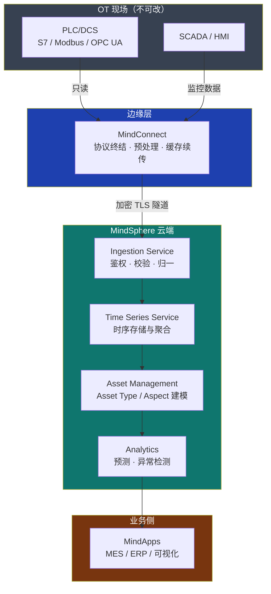

# 西门子 · 为什么工业需要专门的IoT架构

> 技术栈：OPC UA / S7 / Modbus / MQTT + MindConnect 边缘接入（以西门子 MindSphere 为具体案例）
> 适用场景：从 0 理解工业为什么需要专门的 IoT 架构

消费级物联网把"连接 + 上云"当作终点。但工厂车间里的设备从第一天起就不是为了"上网"而存在的。一台注塑机、一条十年前投产的产线，首要目标是稳定产出——联网只是手段，不是目的。

工业 IoT 真正要解决的不是"怎么联网"，而是"怎么在不打扰生产的前提下，把车间的真实状态可信地搬到 IT 侧"。西门子 MindSphere 的定位正是如此：把 Siemens 百年自动化经验收敛成一套面向 OT 的"云操作系统"，边缘用 MindConnect 接住老设备，云端用 Asset Management 把数据变成资产与洞察。

这里要先澄清一个常见误解：工业 IoT 不等于"给机器装个传感器 + 网关"。真正的价值在线缆之上的"语义"——设备数据要能被 MES、ERP 读懂，能被十年后的人追溯，能在安全事故时解释清楚"到底发生了什么"。

补充一点现实约束：工业现场同时存在绿地设备（出厂即带联网能力）和棕地设备（S7-300 连网口都没有）。MindSphere 设计了 Nano / IoT2040 / Software Agent 多种形态，正是因为现场必须同时接住两类。

## 1.问题背景：工业与通用 / 消费 IoT 的本质差异

抛开概念，工业场景相对通用 IoT 有五条绕不开的现实约束。

### 1.1 五条绕不开的现场约束

- **OT 与 IT 的融合（而非替换）**：工厂里运行着以 PLC、SCADA、DCS 为核心的运营技术（OT）体系，它讲究确定性、低延迟、永不停机。IT 侧（云、数据中心、业务系统）讲究弹性、迭代、数据驱动。MindSphere 要做的正是"桥接"这两套语言不同的世界——它不要求把老 S7-300 PLC 推倒重来，而是用 MindConnect 把它接进来。

- **协议碎片化**：现场既有三十多年前的 Modbus RTU，也有 OPC UA、S7、Profinet，还有各家数控系统的私有协议。MindConnect 家族（Nano / IoT2040 / Lib / Software Agent）的价值，正是把这些异构协议在边缘侧归一。

- **强实时与高可靠**：一条产线的停机按分钟计算就是真金白银的损失；某些安全相关回路要求毫秒级响应，且不能依赖公网。

- **设备长生命周期（10~20 年）**：MindSphere 要陪一台设备走完整个服役期，期间还要兼容协议与标准演进，今天的资产模型十年后依然要成立。

- **安全合规**：既有等保（网络安全等级保护），也有工业网络安全 IEC 62443、数据保护 GDPR 这类硬性标准——出问题不是赔钱，是伤人。MindSphere 的端到端加密、设备证书、RBAC 与租户隔离正是为此而生。

这些约束叠加在一起，意味着工业 IoT 不能只是"把设备数据收上来"。它必须同时满足确定性、长周期、可审计和安全。

### 1.2 五个场景看约束为何"绕不开"

| 场景 | 现实 | MindSphere 的应对 |
|------|------|------------------|
| OT/IT 融合 | PLC 毫秒级 / SCADA 秒级 / MES 班次级 / ERP 天级，节奏完全不同 | MindConnect 只读不写，保持"融合不替换"的硬边界 |
| 协议碎片化 | Modbus RTU 无安全 / OPC UA 带证书 / S7 私有 / Profinet 实时帧 | 边缘统一翻译为 Asset + Aspect 变量流，云端只面对一种"标准语言" |
| 强实时 | 焊装线节拍秒级，200ms 抖动即可导致误动作 | 安全相关闭环永远留在 OT 侧，云只做监控与分析 |
| 长生命周期 | S7-300 从 2010 服役到 2025+，数据格式必须跨代兼容 | Asset Type / Aspect 与硬件解耦，十年后依然成立 |
| 合规 | IEC 62443 要求分区隔离，GDPR 要求数据可追溯 | 租户隔离 + 设备证书 + RBAC + 数据驻留策略 |

## 2.设计理念：专门架构不是"通用 IoT 套一层网关"

通用 IoT 平台假设设备能联网、能改协议、能频繁升级。搬进工厂会处处别扭：老设备连不上、实时性保不住、合规过不了。

### 2.1 五维差异：通用 vs 工业

| 维度 | 通用 IoT | MindSphere 为代表的工业 IoT |
|------|---------|--------------------------|
| 协议 | 假设 MQTT / HTTP | MindConnect 边缘终结 S7 / Modbus / OPC UA |
| 实时性 | 尽力而为 | 边缘自治 + OT 内闭环，云端只做监控与分析 |
| 生命周期 | 几年一换 | 10~20 年，Asset Type / Aspect 长期可演进 |
| 安全 | 设备认证为主 | 等保 + IEC 62443 + GDPR 全栈合规 |
| 数据 | 事件为主 | 高频时序为主，Time Series Service 专精 |

### 2.2 五层架构：从采集到智能



- **采集层（MindConnect）**：设备侧 100 米内终结协议、预处理、缓存续传。通用 IoT 通常没有这一层。
- **接入层（Ingestion Service）**：统一鉴权、校验、限流，把变量流归一为标准负载。
- **存储层（Time Series Service）**：为时序测点数据做专项优化，支持按 Asset / Aspect 读写聚合。
- **模型层（Asset Management）**：用 Asset Type / Aspect 把"字节"变成"设备"。通用 IoT 只有扁平 deviceId + tag。
- **智能层（Analytics）**：在可信数据之上建模，而非只看板。

专门架构的代价是前期建模成本更高。MindSphere 通过 Asset Type 模板、MindConnect 即插即用、Fleet Manager 批量纳管来摊薄——把"一次性接入的复杂度"换成"长期可演进、可审计的便宜"。

### 2.3 为什么不是"套一层网关"

很多团队用通用 MQTT 网关接 PLC 再转发到公有云，POC 很快。但遇到证书过期、断网续传、跨厂区批量升级、资产命名混乱就会处处返工。MindSphere 把 Agent Management、Device Configuration、RBAC 内建为平台能力，让 OT 工程师用资产语言而非 JSON 文档工作。

## 3.实际应用：MindSphere 总体架构

### 3.1 总体架构：OT → 边缘 → 云端 → 业务

下面这张图给出以 MindSphere 为主线的参考骨架：左侧是 OT 现场（传感器、PLC/DCS、SCADA、老旧专机），中间是 MindConnect 边缘接入层与 MindSphere 云端核心服务（Ingestion、Time Series、Asset Management、Analytics），右侧是 MindApps 行业应用（如 Analyze MyMachine、Visualizer）与 IT 业务（MES/ERP、预测性维护）；底部横贯的是安全合规这条底线。


它呈现的核心关系是：OT 的"协议碎片化、长生命周期"被 MindConnect 在边缘侧归一；MindSphere 云端用 Ingestion Service 安全接入、用 Time Series Service 存时序、用 Asset Management 建数字孪生、用 Analytics 做智能；MindApps 再把洞察交还给业务。后面五篇会沿这条链路逐段展开。

### 3.2 落地样例：三产线异构接入与语义归一

核心动作：裸 PLC 地址 → 带语义的 Aspect 变量：

```yaml
mindconnect:
  agent: mindconnect-nano
  protocols:
    - type: S7
      endpoint: tcp://plc-s7-1500:102   # 只读，不反向写控制位
  mappings:
    - source: "DB4.DBW10"              # 裸地址
      aspect: "spindle"                # 归入"主轴"Aspect
      variable: "bearing_temp"         # 变量名标准化
      unit: "C"                       # 跨设备可比
```

某汽车零部件厂三条产线（S7-1500 + 老 S7-300 + 日系数控），做法：S7-1500 经 Nano 接入，老 S7-300 经 Software Agent 从 SCADA 历史库取数。所有数据在 MindConnect 归一为 Asset 变量流，加密送 Ingestion Service，Time Series 按"产线—设备—部件"层级落库。

Asset Management 用统一 Aspect 模板描述"主轴温度/振动/电流"，让三套异构设备语义可比。Visualizer 并排展示三线 OEE，质量部门据此定位波动。

关键三点：**归一发生在边缘**（云端永远只看到干净数据）、**语义模型是跨产线可比的前提**、**安全合规横贯始终**（设备证书加密 + RBAC 控制权限）。

### 3.3 边界与收益：融合不替换

MindSphere 不替代 SCADA（实时控制仍由 PLC 负责），不替代 MES/ERP，而是把"设备健康度"回写 MES 让排产避开亚健康设备。三者是**补位而非替换**。

| 指标 | 接入前 | 接入后 |
|------|--------|--------|
| 跨产线数据对接 | 每台机数人天 | 套用 Aspect 模板数小时 |
| OEE 横向对比 | 不可做 | 分钟级出数 |
| 合规整改 | 项目后期救火 | 上线即自带 |

## 4.注意事项


- **别把工业 IoT 等同"给设备装网卡"**：真正的难点在 OT/IT 语义对齐和长周期可维护性。先盘点"哪些设备能改、哪些不能停"，再决定用 Nano、IoT2040、Lib 还是 Software Agent，切忌一刀切上云。
- **合规不是上线前补一张表**：等保、IEC 62443、GDPR 应贯穿全过程。数据驻留要写进架构决策——跨国集团不能等到上线才发现数据存错了区域。
- **不要为"智能"而智能**：先把连接、采集、可视化做扎实，再上模型。很多项目失败不是模型不行，而是上游特征管道（采样频率、单位、命名）没统一。


## 5.小结

工业需要专门的 IoT 架构，根子在于它的约束和消费 / 通用 IoT 完全不同：OT/IT 融合、协议碎片化、强实时高可靠、设备长生命周期、严苛的安全合规。以 MindSphere 为例，专门的架构用"MindConnect 边缘归一 + 云端核心承接 + 合规贯穿"的分层桥梁，把这套现实收敛成业务侧可用的资产与数据。

这套分层具体落到采集（MindConnect）、接入（Ingestion）、存储（Time Series）、模型（Asset Management）、智能（Analytics）五层，每一层都为工业约束做过专门设计。它不替换 SCADA/MES/ERP，而是与它们补位协作，把"设备健康度"等新信号交还给业务。这正是（二）~（六）要逐层拆解的主线。

| 维度 | 通用 / 消费 IoT 思路 | 工业 IoT（MindSphere）思路 |
|------|--------------|--------------|
| 协议接入 | 假设 MQTT / HTTP 直连 | MindConnect 边缘终结 S7 / Modbus / OPC UA |
| 实时性 | 尽力而为 | OT 内闭环，云端只做监控与分析 |
| 生命周期 | 几年一换 | 10~20 年长周期，Asset Type / Aspect 长期演进 |
| 安全合规 | 设备认证为主 | 等保 + IEC 62443 + GDPR 全栈合规，端到端加密与证书 |
| 数据形态 | 事件为主 | 高频时序为主，Time Series Service 专精 |

一句话收尾：工业 IoT 不是"通用 IoT 换个壳"，而是把 OT 的老、慢、稳、险作为一等约束，用分层桥梁接住——这正是后面五篇逐一拆解的出发点。

## 参考链接

- Siemens MindSphere 概览（基于云的开放式 IoT 操作系统）：https://siemens.mindsphere.io/en/about
- MindSphere 开发者文档（连接、资产、分析、API）：https://developer.mindsphere.io/
- MindConnect Nano / IoT2040 等产品说明书：https://www.siemens.com/zh-cn/products/insights-hub/resources/product-sheets
