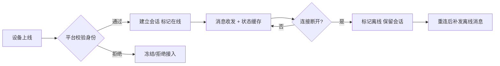
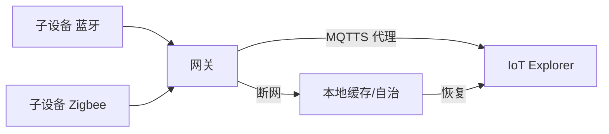

# 腾讯云 · 稳定连接

> 技术栈：腾讯云 IoT Explorer 设备接入 + MQTT / CoAP / WebSocket / HTTPS + 网关代理子设备
> 适用场景：多协议接入、设备身份认证、连接保活与断线重连、网关子设备代理

连接是物联网平台的第一道关。设备不是浏览器——它可能在弱网里、在跨省货车上、在智能家电里。平台要做的，是让"连得上、认得清、扛得住抖"。

这一篇讲腾讯云 IoT Explorer 如何把"碎片化协议 + 不可信设备 + 不稳定网络"这三件事接住。

把连接层想成"门卫"：它既要放行合法设备，又要挡住冒名顶替；既要在网络抖动时维持会话，又不能在海量设备下被连接表压垮。

## 1.问题背景：消费级弱网 + 行业专线的双线难题

- **协议碎片化**：MQTT（主流）、CoAP（受限设备）、WebSocket（浏览器/小程序）、HTTP（调试），各有场景。
- **设备身份不可信**：设备被克隆、密钥泄露、伪造设备冒充上报，是物联网最典型的安全威胁。
- **网络时断时续**：蜂窝/宽带切换、隧道丢包、设备休眠唤醒，连接会反复断；断线期间的状态补报、去重、保序都要平台兜底。

还有几个工程上特别磨人的点：

- **弱网下的功耗约束**：抄表、定位类设备靠电池撑几年，每次建连、每次重传都吃电。协议和保活间隔必须"能省则省"，否则电池寿命直接腰斩。
- **NAT/防火墙超时**：设备藏在运营商 NAT 后，长时间无心跳会被回收映射，连接"看起来在，其实已死"。保活节奏要踩在超时之前。
- **海量连接的连接表压力**：百万设备同时在线，接入层要维护的连接状态、会话表是实打实的内存与调度开销，不是"加机器"就能无视的。
- **网关与子设备的代理**：智能家居里一个网关带几十个子设备（蓝牙/Zigbee/私有协议），子设备自己不会说 MQTT，需要网关代它接入。

## 2.设计理念：多协议终结 + 设备级认证 + 会话保活

腾讯云的核心思路是：**接入层把协议差异吞掉，把"统一、可信、有状态"的连接交给上层**。

- **多协议接入**：原生支持 MQTT、CoAP、WebSocket、HTTPS；小程序经 WebSocket 直连，体验顺畅。
- **设备认证**：支持证书（X.509）、密钥（一机一密/一型一密）；密钥可轮换、设备可冻结。
- **连接保活与离线**：长连接保活、断线重连、离线消息缓存与补发、会话状态由平台维护（设备在线/离线是平台侧事实）。
- **网关与子设备**：网关设备代理其下的子设备接入，平台按"网关-子设备"两级管理身份与状态，子设备无需各自建连。

再补两层常被忽略的设计：

- **握手即鉴权**：认证在 MQTT/TLS 连接建立阶段就校验密钥或证书链，非法设备连会话都建不起来，从根上挡住伪造。
- **重连退避**：设备掉线后同时重连会把接入层打爆。配合设备端做指数退避+抖动，让重连请求"错峰"，避免雪崩。

## 3.实际应用


### 3.1 协议与接入

设备按能力选协议：

```text
智能硬件/家电（常态）   →  MQTT over TLS
受限设备/抄表           →  CoAP
微信小程序 / 浏览器调试  →  WebSocket
一次性上报 / 调试        →  HTTPS（REST）
蓝牙/Zigbee 子设备       →  经网关代理接入
```

### 3.2 设备认证示例（密钥 + 一机一密）

```json
{
  "deviceName": "light-0001",
  "productId": "iot-light",
  "authType": "PSK",
  "secret": "****",
  "status": "enabled"
}
```

若密钥泄露或设备被标记异常，平台可一键冻结，拒绝其接入，无需改设备端。

### 3.3 连接状态与离线补报



### 3.4 网关与子设备接入



网关作为"会说话的代表"，把子设备的消息翻译后上行；子设备本身零改造，且断网时网关能本地自治。

### 3.5 保活间隔与重连退避建议

```text
保活心跳（Keep Alive）：取 NAT 超时阈值的 1/2~2/3，避免"假死连接"
重连退避： base=1s，指数增长，上限 60s，叠加随机抖动 ±30%
批量上线：错峰启动，避免开机即"万设备齐连"的瞬时洪峰
```

## 4.注意事项

- **小程序走 WebSocket**：腾讯连连的小程序直连依赖 WebSocket 通道，调试时留意浏览器/微信的网络策略。
- **一型一密 vs 一机一密**：前者适合同型号海量低成本设备，后者更安全但产线成本高，按风险选。
- **证书生命周期要规划**：设备量极大时，证书签发/轮换/吊销有工程量，建议分级管理。
- **心跳不是越短越安全**：心跳太频繁，弱网设备电池扛不住；太长则"假死"难发现。要按设备供电与网络质量权衡。
- **冻结/吊销要可回滚**：误操作冻结大批量设备会直接"全网失联"，操作权限和审批流程要跟上。

## 5.小结

腾讯云连接层的设计，本质是"**协议终结在接入层 + 身份强认证 + 会话状态平台托管**"，再叠加"网关代理子设备"把异构末梢也纳入连接网。它把"设备又杂又不可信又爱掉线"的现实，收敛成上层看到的一张干净、可信、有状态的连接网——这正是消息、数据模板、设备管理能放心建立在之上的前提。

再加一句工程经验：连接层最贵的不是"连上"，而是"在百万级规模下，连得稳、认得准、断了能自愈"。这层做扎实，后面每一层都省力。

## 参考链接

- 腾讯云 IoT Explorer 设备接入：https://cloud.tencent.com/document/product/634
- 腾讯云 IoT 设备认证与安全：https://cloud.tencent.com/document/product/634/32546
