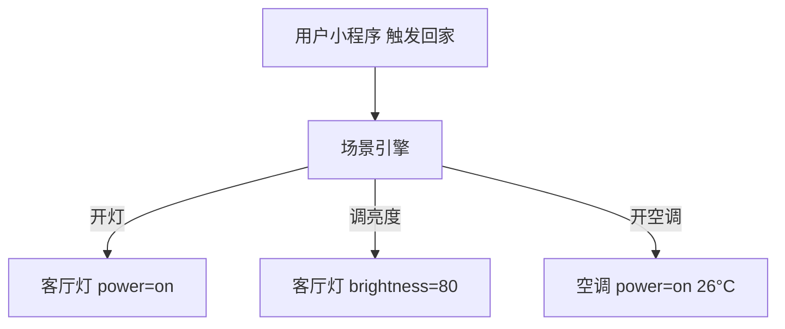
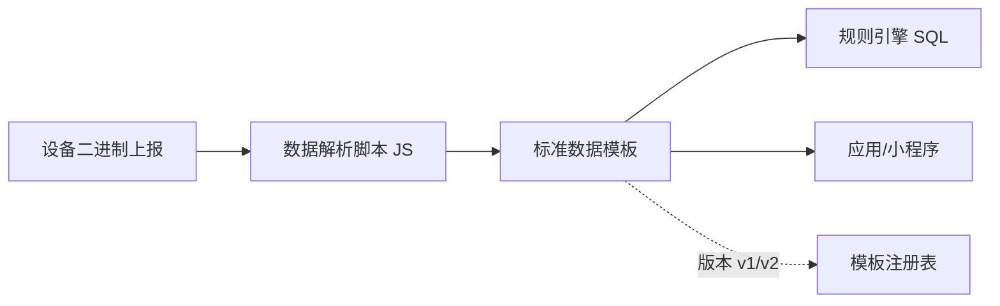

# 腾讯云 · 物模型与数字孪生

> 技术栈：腾讯云 IoT Explorer 数据模板（属性/事件/行为）/ 场景联动 / 数据解析脚本
> 适用场景：异构设备语义统一、场景联动建模、二进制协议转标准模板

设备连上来了、消息流起来了，但平台和应用看到的还是一串"key=value"。要让"软件能理解设备"，需要一个**统一的设备描述语言**——在腾讯云里，这叫**数据模板**；再进一步把设备与场景联动起来，就是基于数据模板的场景联动与孪生。

这一篇讲腾讯云的数据模板与数字孪生。

把数据模板想成"设备的简历模板"：所有同型号设备填同一张表，字段含义统一，应用（和小程序）一眼就懂，不用每台重新面试。

## 1.问题背景：为什么需要"设备描述语言"

- **异构设备无统一语义**：同是"温度"，A 设备叫 `temp`、B 叫 `temperature`——应用每接一个设备就要写一套适配。
- **命令/事件难标准化**：开灯、调速、告警，各自有参数与格式。
- **场景要被联动**：一个智能家居不止"一盏灯"，还有房间、场景模式（回家/离家）的关联触发。

再补两点：

- **厂商上报格式各异**：同一传感器换供应商，字段名、单位、精度全变，没有模板就只能改代码适配。
- **数据要可被规则引擎直接消费**：规则引擎（三）是按字段写 SQL 的，若字段语义不统一，一条规则只能绑一种设备，复用无从谈起。

## 2.设计理念：数据模板归一 + 场景联动

腾讯云用两层解决：

- **数据模板（物模型）**：在"产品"层面定义**属性（Property）、事件（Event）、行为（Action）**，同一产品的设备共享模板；设备上报遵循模板，平台自动归一。
- **场景联动 / 孪生**：基于模板把设备与场景（房间/模式/规则）建模，支持联动触发与状态可视化。

更进一步，腾讯云还有：

- **数据解析（自定义脚本）**：设备若用二进制/私有协议上报，通过 JS 解析脚本在平台侧转成标准数据模板，老设备也能"说标准话"，类似其他家的编解码插件。
- **行为（Action）即可控能力**：腾讯云把"命令"称为"行为"，如 `flash` 闪一闪，强调它是可被小程序/场景引擎主动调用的能力。

## 3.实际应用


### 3.1 数据模板示例（智能灯）

```json
{
  "productId": "iot-light",
  "template": {
    "properties": [
      { "id": "power", "type": "bool", "mode": "r/w" },
      { "id": "brightness", "type": "int", "unit": "%", "mode": "r/w" },
      { "id": "colorTemp", "type": "int", "unit": "K", "mode": "r/w" }
    ],
    "events": [
      { "id": "lowPower", "params": { "level": "warning" } }
    ],
    "actions": [
      { "id": "flash", "params": { "times": "int" } }
    ]
  }
}
```

设备 A/B/C 各自的上报格式不同，但平台按模板归一为统一语义，应用只认 `power/brightness`，不用关心底层差异。

### 3.2 场景联动示例（回家模式）



场景引擎基于数据模板把"一个动作"映射到"一组设备状态变更"，实现消费级体验的顺滑联动。

### 3.3 数据解析脚本与模板联动



数据模板有版本，升级模板时旧设备可暂留旧版、新设备用新版，平滑过渡，避免"改模板即断网"。

## 4.注意事项

- **模板要早定义、慎改**：模板是上下游的契约，改字段会牵动设备端、规则引擎、应用；建议版本化管理。
- **属性 vs 事件 vs 行为**：属性是当前状态（可读/可写），事件异步通知，行为是主动动作，三者语义不要混用。
- **联动别形成环**：场景 A 触发 B、B 又触发 A，要设计防抖/优先级，避免无限循环。
- **解析脚本要测边界**：二进制/私有协议解析最易出 bug，字段越界、长度错都会让整批消息解析失败，上线前充分测。
- **模板与业务解耦**：模板描述"设备是什么"，业务逻辑写在规则引擎/应用层，别把业务逻辑塞进模板。

## 5.小结

腾讯云用"**数据模板归一设备语义 + 场景联动映射物理空间**"把"异构设备"变成"软件可理解的对象"，再借腾讯连连小程序把"设备状态"直接呈现给用户。这让上层应用、规则引擎、数据分析都建立在统一语义之上——这也是它消费/轻行业体验顺畅的底层原因。

一句经验：数据模板定得好，后面五层都轻松；数据模板定得烂，每层都在补坑。它是整个平台语义的"地基"。

## 参考链接

- 腾讯云 IoT Explorer 数据模板：https://cloud.tencent.com/document/product/634/19494
- 腾讯云 场景联动：https://cloud.tencent.com/document/product/634
