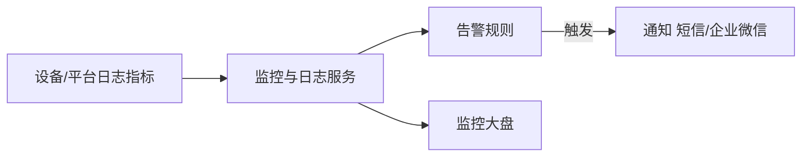
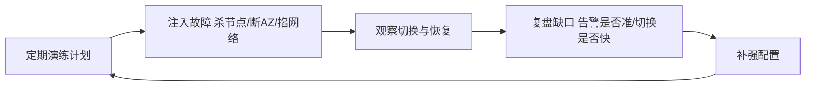

# 腾讯云 · 智能运维与高可用

> 技术栈：腾讯云 IoT 监控告警 / 安全审计 / 多 AZ 高可用 / 混沌演练
> 适用场景：物联网平台的可观测、安全审计、高可用架构、典型案例收尾

平台"能跑"和"稳得住"是两回事。设备亿级、7×24 不停机、出事要能追溯——这是物联网平台的"运维与高可用"主题，也是腾讯云大规模消费/行业设备落地的底层保障。

这一篇讲监控日志、安全、高可用架构，并用两个典型案例收尾整个系列。

把运维想成"给平台装仪表盘和黑匣子"：仪表盘让你随时知道健康状况，黑匣子让你出事后能复盘"到底发生了什么"。

## 1.问题背景：运维与高可用的真实压力

- **看不见**：海量设备里谁在异常、消息是否堆积，靠人盯不可能。
- **追不到**：一条异常告警，要能回溯"哪台设备、什么时间、发了什么"。
- **扛不住**：单点故障、Region 级中断，不能让全量设备失联。
- **被攻击**：伪造设备、DDoS、异常消息突增，要能识别与隔离。

再补两点：

- **告警风暴**：故障瞬间成千上万设备同时告警，若不加收敛，运维会被"告警海"淹没，反而看不见真问题。
- **容量拐点**：连接数、消息 TPS 临近规格上限时性能会陡降，要能提前预警、提前扩容，而不是等宕机。

## 2.设计理念：可观测 + 安全 + 多 AZ 高可用

腾讯云把"稳"建立在三层：

- **可观测**：设备日志、消息日志、监控指标统一，对接告警通知（短信/邮件/企业微信）。
- **安全**：设备认证、权限（产品/设备级）、异常登录与消息突增检测、密钥/证书合规。
- **高可用**：接入层多 AZ 部署，关键路径无单点；跨 Region 可选容灾。

补充一层常被忽视的：

- **混沌与演练**：高可用不是"配了多 AZ"就完事，要定期做故障注入演练（杀节点、断 AZ），验证真的能切换、真的能恢复。

## 3.实际应用

### 3.1 监控与告警数据流

### 3.2 高可用架构要点

- **接入层多 AZ**：IoT Explorer 接入与消息代理跨可用区部署，单 AZ 故障自动切换。
- **无状态接入**：会话状态托管、可迁移，避免单点状态丢失。
- **跨 Region 容灾**：关键行业可在多 Region 部署并路由，见（五）的全球接入。

### 3.3 安全审计与异常检测

- **设备行为基线**：为每类设备建立消息频率、时段、来源基线，偏离即告警（如半夜突发海量上报）。
- **权限最小化**：产品级、设备级权限分开，避免一个密钥泄露波及全量设备。
- **密钥/证书合规**：到期、吊销、弱密钥要能扫描出来，避免"过期密钥悄悄失效"。

### 3.4 典型案例收尾

**案例一 · 智能家电/智能家居**：家电经 MQTT 接入，数据模板归一，腾讯连连小程序直连控制，规则引擎做能耗告警——连接（二）+ 消息（三）+ 数据模板（四）+ 小程序生态综合体现。

**案例二 · 共享设备（充电宝/单车）**：海量设备分批注册、任务制 OTA 远程升级，监控大盘看在线率与异常，异常自动告警——设备管理（五）+ 运维（六）综合体现。

**案例三 · 智慧园区/工业**：边缘网关汇聚产线设备，数据模板归一后规则引擎做实时质检告警，多 AZ 接入保证 7×24 在线——连接 + 消息 + 物模型 + 设备管理 + 运维综合体现。

这三个案例正好对应本系列主线：连接（二）→ 消息（三）→ 物模型（四）→ 设备管理（五）→ 运维高可用（六），串起来就是一条完整的物联网数据生命周期。

### 3.5 演练常态化：从"配了"到"验证过"

多 AZ、跨 Region、告警收敛，这些在控制台里点几下就能"配好"。但配置不等于能力——真正决定出事时扛不扛得住的，是**有没有真的演练过**。

落地时建议把握三条节奏：

- **频率固定**：演练别靠"想起才做"。把故障注入排进月度/季度运维日历，和版本发布一样成为固定动作。
- **范围递进**：先从单节点、单 AZ 杀起，确认自动切换无误；再逐步加码到网络分区、依赖服务中断，逼出真实最坏情况。
- **复盘留痕**：每次演练都要有"是否按预期恢复、告警是否及时、恢复耗时多少"的结论，缺口直接转成下个迭代的整改项。

一个常被忽略的细节：演练最好选在**真实流量低谷**做，并在通知里明确告知相关方"这是演练"。否则一次"验证高可用"的注入，反而可能演成真故障的误判，得不偿失。

## 4.注意事项

- **告警要分级**：别所有异常都叫"紧急"，否则告警疲劳；建议按严重程度分级。
- **日志要留存**：合规与追溯都依赖它，配置合理的保留期。
- **高可用是设计出来的**：多 AZ 只解决"机房级"故障，Region 级要单独规划，且要真做故障演练。
- **告警要收敛抑制**：同类告警聚合、依赖抑制（下游挂了别让上游每台设备都叫），否则告警海会掩盖真问题。
- **容量要设水位线**：连接数/TPS 设 70%/90% 预警，给扩容留反应时间，别等打满才动手。
- **演练要常态化**：高可用配置会随架构漂移，半年不演练就约等于没有，建议纳入定期运维动作。

## 5.小结

腾讯云物联网平台的"稳"，来自**可观测的监控、可审计的安全、可切换的高可用**三者叠加，再配合前几篇的连接、消息、数据模板、设备管理，构成一条从设备到业务的完整、可靠数据生命周期。至此，你已握有阿里云、AWS、华为云、Azure、腾讯云、火山引擎共六套同构视角——读任何一家，骨架都高度趋同，差异只在命名与侧重。

一句收尾：平台的价值，最终落在"平时看得见、出事追得到、故障扛得住"。把这三句做到，物联网才真正可运营。

到这里，六篇全部讲完。连接、消息、物模型、设备管理、运维高可用，五件事串成一条链；你握着它，再去读任何一家云的同主题文档，都能一眼对上号。

## 参考链接

- 腾讯云 IoT Explorer 监控运维：https://cloud.tencent.com/document/product/634
- 腾讯云 IoT 产品页：https://cloud.tencent.com/product/iottc
