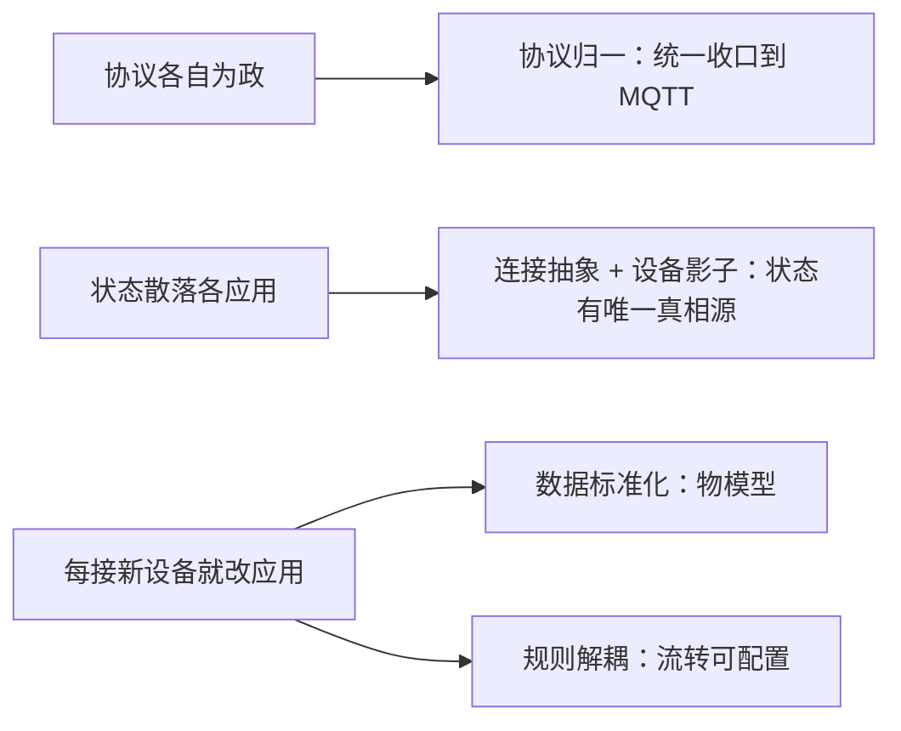

# 火山引擎 · 为什么要平台化

> 技术栈：MQTT + 物模型 + 规则引擎（以火山引擎物联网平台，由世纪互联 Vnet 运营，作为具体案例）
> 适用场景：从 0 理解物联网平台这套结构到底在解决什么问题


如果你是第一次接触物联网平台，最自然的第一反应通常是：我有一堆设备，设备能上网，我写个服务把数据收下来存库，不就完了？

确实，几台设备的时候，直接 TCP / HTTP 收数据完全够用。但只要你设备数量往上走、设备种类变多、前端和后端都要用这些数据，事情就开始不对了。

这篇不急着讲产品、设备、物模型这些名词，而是先把没有平台的痛说清楚，再回过头看平台为什么要设计成它现在的样子。你会发现，后面所有看似啰嗦的概念，本质上都是在填直连架构挖下的坑。


## 1.问题背景：直连设备的三个坑

### 1.1 协议各自为政

设备不是都讲同一门语言。温湿度传感器可能走 MQTT，摄像头走 RTSP，老式电表走 Modbus，车间机床走 OPC-UA。你如果让每个应用直接去对接设备：

- 前端要显示数据，得自己实现一套 MQTT 订阅；
- 后端要做告警，又得自己连一遍 Modbus；
- 数据分析团队想拉历史数据，发现数据格式每家都不一样。

结果就是：**每个应用都要懂每种设备的协议**，连接数随应用数 × 设备数爆炸式增长。

### 1.2 状态散落在每个应用里

设备当前在线吗？最新温度是多少？空调现在开到 26 度还是关着？这些状态如果由各应用各自维护，就会出现：

- 应用 A 认为设备在线，应用 B 认为离线；
- 设备改了一次温度，A 知道、B 不知道；
- 设备掉线半小时，谁都不确定它最后的状态是什么。

状态没有唯一真相源，业务代码里到处是 `if (deviceLastSeen > xxx)` 这种补丁。

### 1.3 每接一个新设备，应用都要改

这是最致命的。直连架构里，应用和具体设备是写死绑定的。今天接一台新品牌的传感器，明天接一个带摄像头的网关——每来一种新设备，前端、后端、告警逻辑全得改一遍。设备越多，系统的表面积越大，改动成本越高。

## 2.平台化解法：四条设计主线

平台化不是把代码换个地方跑，而是把上面三个坑，用四个设计决策一次性填掉。


### 2.1 连接抽象：设备只认平台，应用也只认平台

平台在中间做翻译总线。设备无论用什么协议，先连到平台；应用无论要什么数据，都从平台取。于是：

- 连接关系从 N 应用 × M 设备收敛成应用→平台和平台→设备两类；
- 应用不再需要懂设备协议，设备也不再需要懂业务。

这就是图里右边那张星型收敛——所有复杂度被关进了平台内部。在火山引擎物联网平台里，这套连接关系落到两个最基础的资源上：设备通过设备证书（ProductKey、DeviceName、DeviceSecret）向平台完成认证后建立长连接；应用侧则通过云端 API 和云端 SDK 跟平台打交道，从不直接碰设备。设备侧和应用侧从此都只面向平台编程。

### 2.2 协议归一：用 MQTT 做统一南向入口

平台通常把设备侧统一收口到 MQTT（或其变体）。哪怕设备原本是 Modbus / 串口，也由平台的边缘 / 网关层把数据翻译成 MQTT 消息再上报。

火山引擎在这一层提供了两样东西值得留意：一是设备接入协议以 MQTT 为主，配套的 C 语言设备端 SDK 让不同设备能快速接入上云；二是针对老旧的、不直接讲 MQTT 的设备，平台用网关与子设备机制来兜底——网关本身能直连平台，并代理子设备接入，把 Modbus、串口这类协议差异隔离在网关这一层。

好处是：对上层来说，所有设备都变成发布 / 订阅消息的主题（Topic），一套模型通吃。协议差异被隔离在平台最底层。

### 2.3 数据标准化：物模型

光统一传输还不够。一台设备报 `{"temp":26.5}`，另一台报 `{"temperature":265,"unit":0}`（后者用 0.1℃ 整数），应用还是得为每家写解析。

平台引入物模型（TSL，即 Thing Specification Language）：把这台设备能测什么、能干什么定义成一份标准描述，拆成属性、服务、事件三类。在火山引擎里，物模型就是云端对设备功能的标准化描述，采用 JSON 格式；属性描述设备运行状态（如当前环境温度，支持读和设置），服务是可被外部调用的能力或方法，事件则是设备运行时需要被外部感知的通知（比如故障告警）。设备上报的数据先被平台按物模型归一，应用拿到的永远是统一结构。这块后面第（三）篇专门展开。

用一个具体对比感受一下归一前有多劝退：

```text
归一前：同一含义，各家写法天差地别
  设备A（温湿度传感器）: {"temp":26.5}
  设备B（同功能另一厂商）: {"temperature":265,"unit":0}   # 整数 ×0.1℃，单位用枚举
  设备C（网关下子设备）:  "26.5C"                          # 字符串，还顺带把单位写进值里

归一后：都按物模型，统一成一份结构
  {"temperature": 26.5, "unit": "°C"}
```

应用的解析代码，从「每家的 if 分支」收敛成「一份物模型映射」——这就是标准化最直接的红利。

### 2.4 规则解耦：让数据自己流起来

直连架构里，设备数据到了之后怎么处理是硬编码在应用里的。平台把这一步抽出来，变成规则引擎：你配置当温度 > 30 时，转发到告警服务 / 调用空调关机服务，数据流转不再需要改业务代码。

火山引擎的规则引擎提供了三种现成能力来承载这个思路：订阅转发，把设备消息转发到第三方 HTTP 地址；场景联动，配置简单规则就能让设备数据流转到其他设备、实现设备联动；数据转发，把数据送往其他设备 Topic 或自定义 Kafka。这就是南向采集、北向开放——设备数据进来后，往哪走由规则决定，而不是由某个应用写死。

把四条主线收一下，它们各自填掉了开头说的哪个坑：



## 3.四条主线怎么串起来

把上面四点拼起来，一个物联网平台的逻辑分层就清楚了：

```
           业务应用（看板 / 告警 / 分析）
                │  只认平台
                ▼
        ┌──────────────────┐
        │   物联网平台       │
        │  · 连接管理        │
        │  · 物模型归一      │◄── 规则引擎：数据往哪走由规则决定
        │  · 设备影子/状态   │
        └──────────────────┘
                │  只认平台，协议被网关归一
                ▼
        设备 / 网关（MQTT / Modbus / 串口…）
```

注意这个结构的对称性：**应用侧和设备侧都只跟平台打交道**。平台替它们承受了所有不对称——协议不对称、数据格式不对称、在线状态不对称。

设备影子正是用来消化状态不对称的那块拼图：它是云端为每个设备保存的一份 JSON 状态文档，无论设备是否在线，应用都能通过 MQTT 或 HTTP 读取、设置它的状态；设备离线时设置的期望属性值还会缓存在云端，等设备上线再同步。这正好对应 1.2 里那个状态散落的坑。

## 4.对你意味着什么

如果你正打算做设备接入，或者要选型 / 设计一个平台，这套思想给你三把尺子：

（1）先看连接收敛度。一个方案如果让你给每个应用单独对接设备，本质还是直连架构，迟早踩 1.3 的坑。合格的平台应该让应用和设备都只面向平台编程——这点也可以直接去对照：它是否提供了产品管理、设备管理的控制台和云端 API。

（2）再看数据是否归一。别满足于能收到数据。要问：收到的数据是不是已经按统一物模型整理好？不同厂商同类型设备，应用侧要不要写分支？没归一，分析层迟早崩。

（3）最后看流转是否可配置。数据从设备到业务系统的路径，能不能用规则配置而不是改代码？能配置，你的系统才跟得上业务变化。在火山引擎里，这三类规则（订阅转发、场景联动、数据转发）都可以在控制台直接配，不用动业务代码。

顺带一提，平台本身是有容量边界的——火山引擎按实例规格提供连接与吞吐能力，选型时要把预期的设备和消息量级跟实例规格对上，别等上线了才发现连接数顶不住。

## 5.小结

物联网平台不是多了个中间件那么简单。它用连接抽象收敛链路、协议归一隔离差异、数据标准化统一语义、规则解耦释放流转——四件事合起来，把每个应用都懂每种设备这个不可能任务，变成平台懂设备、大家都懂平台。

后面的篇章，我们就沿着这四条主线，一个概念一个概念拆开讲：第（二）篇先说最基础也最容易混的——产品与设备，为什么非得分两层。

## 参考链接

- [什么是物联网平台](https://console.cloud.vnet.com/docs/83825/1161799)
- [产品架构](https://console.cloud.vnet.com/docs/83825/1261918)
- [功能特性](https://console.cloud.vnet.com/docs/83825/1261919)
