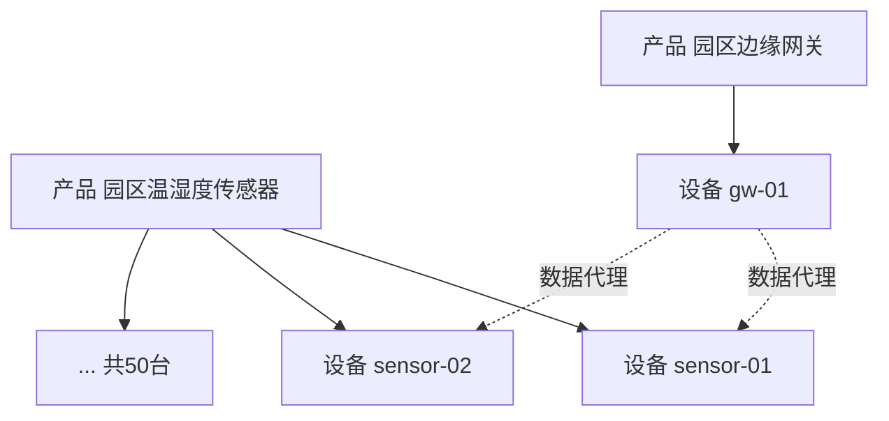

# 火山引擎 · 产品与设备

> 技术栈：产品 / 设备模型（以火山引擎物联网平台，由世纪互联 Vnet 运营，作为具体案例）
> 适用场景：搞清楚为什么建设备前要先建产品，以及怎么规划自己的设备体系

> 第一次用物联网平台的人，十有八九会卡在同一个地方：我想接一台设备，平台却让我先建一个产品。很多人心里会嘀咕：我就是要个设备，搞这么麻烦干嘛？直接给我个设备 ID 不行吗？这其实是个特别好的问题——它正好戳中了物联网平台最底层的一个设计决定：**用产品（模板）+ 设备（实例）两层模型，去对付设备又多又杂这个现实。**

在火山引擎物联网平台里，你可以在控制台的「设备中心」下找到「产品管理」和「设备管理」两个入口，两者正好对应这层模板与实例的划分。先建产品、再在产品下挂设备，是接入流程里绕不开的第一步。


## 1.问题背景：没有产品这层会怎样

假设你有 1000 台同型号的温湿度传感器，要接进系统。如果不分产品，直接每台建一个独立设备，麻烦立刻来了：

- **能力要重复定义 1000 次。** 每台都得告诉系统我能测温度和湿度、单位是什么、量程多大。型号一样，配置却得填 1000 遍。
- **改型号要改 1000 处。** 厂商升级了固件，湿度精度从 0.1 变成 0.01，你得逐台去改，漏一台数据就错位。
- **无法批量操作。** 给所有温湿度传感器下发一条新指令、统计某一型号在线率——因为没有型号这个归口，这些操作都做不了。

本质问题就一句话：**你把型号的公共定义和个体的私有状态混在一起了。**

## 2.设计理念：产品是模板，设备是实例

平台的解法很朴素，就是软件工程里那套类与对象：

> 产品 = 类（模板），定义这一类设备能干什么；
> 设备 = 对象（实例），是某一台具体东西，带着自己的身份和状态。

在火山引擎物联网平台创建产品时，你会先选「所属品类」——可以理解为产品模板。标准品类里已经预定义了常用功能（比如路灯照明品类下预置了工作状态、调光等级、用电量等必选功能），自定义品类则让你从零定义物模型。这其实就是把这一类设备的能力先固化成一个模板，后面所有同型号设备直接继承。

### 2.1 产品解决重复定义问题

产品持有物模型（后面第（三）篇细讲）：一份描述这类设备有哪些属性、服务、事件的标准说明。你买 1000 台同款传感器，它们共享同一个产品的物模型——定义一次，1000 台自动获得相同能力。

要升级型号能力？改产品的物模型一处即可，所有设备生效。这就是模板的价值：把变的部分和不变的部分拆开。

### 2.2 设备是带身份的个体

设备归属于某个产品，平台给它一个产品内唯一的名字（DeviceName），再配合产品的全局标识（ProductKey），组成这台设备在世界上的唯一地址。在火山引擎物联网平台里，创建设备后你能拿到一份设备证书，它由 ProductKey、DeviceName 和 DeviceSecret 三部分组成，是设备接入时做连接认证和加密的凭证——这套三件套就是一机一密的典型实现。

设备只关心自己的事：当前在线吗、最新温度多少、证书是什么、连的是哪个网关。这些个体状态，跟它属于哪个产品、产品怎么定义能力，是两套独立的数据。设备详情页里的「运行状态」展示的就是这部分个体数据，而「物模型记录」则记录它与平台交互的属性上报和服务调用。

一句话区分开：**产品管是什么，设备管是谁。**

设备接入时，平台会发给它一份证书（一机一密），它就是设备身份的实体化：

```text
设备证书（一机一密）
  ProductKey   = PK_abc123            # 平台分配，全局唯一，标识「属于哪个产品」
  DeviceName   = park-a1-sensor-01    # 你定，产品内唯一，标识「具体是哪台设备」
  DeviceSecret = 8f3a2b...            # 平台分配，用于连接认证与加密
设备的世界唯一地址 = ProductKey + DeviceName
```

拿着这三件套，设备才能和平台建起一条认证过的长连接；后面第（五）篇讲的 MQTT 通信，就是跑在这条连接上的。

## 3.实际应用：你怎么规划产品树

理解了模板+实例，落地时最大的坑是——产品到底按什么维度建。下面几条是踩过之后的经验。

### 3.1 一个物理型号 = 一个产品，别按项目建

错误做法：给 A 小区项目建一个产品，给 B 工厂项目建一个产品，哪怕两边用的是同一款传感器。

后果是物模型重复、无法跨项目复用、设备量一大就乱。正确做法：**产品对齐硬件型号 / 固件版本**，项目只是设备的标签或分组，不是产品维度。

在火山引擎物联网平台里，项目维度可以交给两个能力来承载：一个是「标签」，产品、设备、分组都支持打标签，列表页还能按标签筛选（多个标签之间是「与」的关系）；另一个是「设备分组」，它支持跨产品管理设备，并且分组支持最多 5 层的层级结构，方便你按地域、按楼宇去组织。项目归属用标签和分组表达，比塞进产品定义里灵活得多。

> 经验：当两台设备能力定义完全一样时，它们就该是同一个产品下的两个设备，而不是两个产品。

以一个智慧园区为例，产品树长这样（注意传感器归传感器产品、网关归网关产品，数据才经网关代理）：



### 3.2 命名与标识要可运维

- ProductKey：平台分配，全局唯一，别自己造；
- DeviceName：你定，建议带含义且稳定，例如 greenhouse-01-sensor、gw-field-a。后期查日志、写规则都靠它定位。火山引擎的设备详情页里「云端日志」会记录设备上下线、消息收发，DeviceName 就是你检索时最常用的锚点。
- 避免用纯随机串当 DeviceName——半年后你看到 dev_8f3a 根本想不起它是谁。

举个命名示例，一个智慧园区的设备可以这样落：

| 设备 | 所属产品 | DeviceName | 说明 |
|------|----------|------------|------|
| 温湿度传感器 ×50 | 园区温湿度传感器 | park-a1-sensor-01 … 50 | 楼栋+编号，查日志一眼定位 |
| 智慧路灯 ×30 | 园区智慧路灯 | park-a1-lamp-01 … 30 | 品类+序号 |
| 汇聚网关 ×3 | 园区边缘网关 | park-a1-gw-01 … 03 | 网关单独命名，便于排障 |

经验：DeviceName 一旦定下尽量少改，它是规则、日志、看板里定位设备的锚点。

### 3.3 网关与子设备：身份归各自产品，数据经网关

这是最容易混的地方（见图右侧）。在火山引擎物联网平台创建产品时，你可以选择「节点类型」：网关设备、网关子设备、直连设备。网关自己是一种直连设备，归属网关型产品；子设备（比如只支持 LoRa 的传感器）也是设备，归属传感器产品，只是联网靠网关转发。它们分属不同产品，但数据流是子设备 → 网关 → 平台。

平台还给了你管理网关拓扑的工具：在网关设备的详情页能看到「子设备管理」和「动态发现」列表，可以关联、删除、启用或禁用子设备的拓扑关系；网关 SDK 上报新发现的子设备后，动态发现列表里会出现待确认项（有效期 24 小时）。这些能力背后，仍然是每个设备都有自己独立身份这个原则。

规划时要记住两点：

- **子设备不是挂在网关名下的设备。** 它的身份仍归自己的产品管，网关只负责帮它转发；
- **网关有容量上限。** 单台网关能带的子设备数量有限（主流平台常见上限在几百到两千之间），规划拓扑时先算总数，别等上线才发现一台网关带不动。

## 4.常见误区

（1）网关不是设备，是独立一层。 —— 错。网关就是设备，只是多了代理子设备的能力。它一样有 ProductKey、有物模型、要认证。

（2）子设备不属于任何产品。 —— 错。子设备本质也是设备，照样归属于某个产品，只是联网靠网关。

（3）一个网关下的子设备必须和网关同产品。 —— 错。子设备可以是别的产品，网关只负责转发，不要求同型号。

（4）产品和网关是平级管理对象。 —— 错。产品是模板层（定义能力），设备 / 网关 / 子设备是实例层（具体个体）。两层不是并列，是定义与被定义的关系。

## 5.小结

产品 + 设备这层模型，本质是把软件里类与对象的思想搬到了物理设备上：**产品承载公共能力定义，设备承载个体状态与身份**。它解决的不是能不能连，而是设备多了之后还能不能管。

记住三个判断：

- 能力相同的设备 → 同一个产品下的不同设备；
- 网关和子设备都是设备，区别只在接入方式；
- 产品对齐型号，项目用标签/分组表达，别用产品维度。

在火山引擎物联网平台里，这套两层模型还延伸到更上层的运营能力：你可以对分组或带特定标签的设备发起「任务」，批量下发属性设置、服务调用、设备影子设置或配置下发；设备详情页的「运行状态」「物模型记录」「设备影子」「云端日志」则把每个个体的状态与交互摊开给你看。理解了模板与实例，后面这些功能就好懂了。

下一篇（三）我们顺着这层往下钻，讲产品里那个最关键的「能力定义」——物模型：它是怎么把千奇百怪的设备，变成平台里可计算的数据的。

## 参考链接
- [创建产品](https://console.cloud.vnet.com/docs/83825/1261929)
- [创建设备](https://console.cloud.vnet.com/docs/83825/1261941)
- [设备分组](https://console.cloud.vnet.com/docs/83825/1161809)
- [标签](https://console.cloud.vnet.com/docs/83825/1161810)
- [任务](https://console.cloud.vnet.com/docs/83825/1161811)
