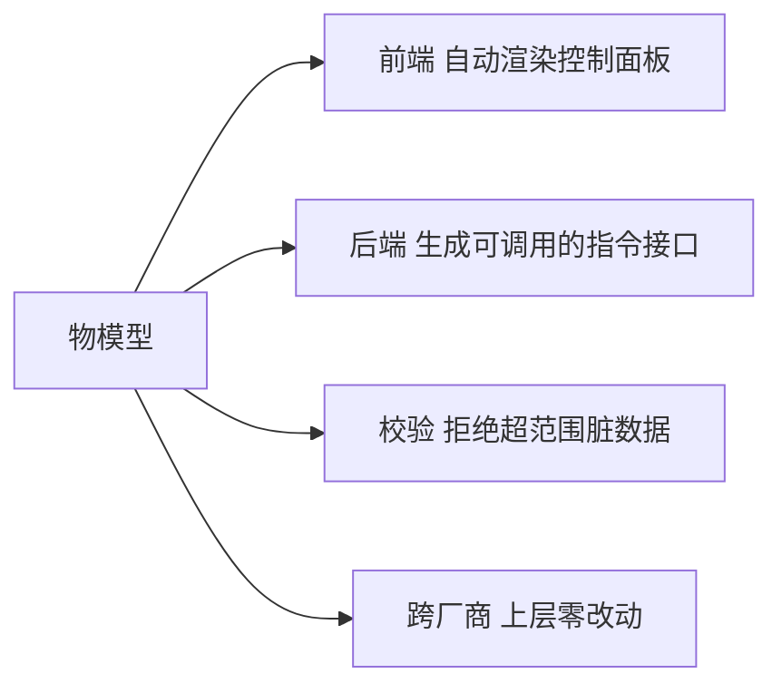

# 火山引擎 · 物模型

> 技术栈：物模型 / TSL（以火山引擎物联网平台，由世纪互联 Vnet 运营，作为具体案例）
> 适用场景：搞懂为什么要有物模型，以及怎么定义一份能前后端共用的设备描述

> 你有没有遇到过这种事：两台温湿度传感器，一台上报 `{"temp":26.5}`，另一台上报 `{"temperature":265,"unit":0}`（后者用 0.1℃ 的整数）。后端接到数据，光是温度到底是多少就得写一堆分支判断。设备一多，这种同义不同形会把数据分析、可视化、告警逻辑全部拖垮。物联网平台给出的答案，就是**物模型（TSL，Thing Specification Language）**：在设备和业务之间插一层标准翻译。


## 1.问题背景：没有物模型，数据是乱的

直连架构里，应用直接收设备原始报文。问题不在收不到，而在收不齐、对不上：

- **字段名不统一**：`temp` / `temperature` / `t`；
- **单位/精度不统一**：26.5℃ 还是 265（0.1℃）还是 2650（0.01℃）；
- **类型不统一**：字符串 `"on"` 还是布尔 `true`；
- **能力不透明**：某台设备到底能不能远程重启？应用侧只能试，试错才知道。

每接一个新厂商，分析层就得多写一套适配。设备十家百家，适配代码就成了无人敢动的地雷阵。

## 2.设计理念：用物模型把能力标准化

物模型的核心思想一句话：**把这台设备能测什么、能干什么、会发生什么定义成一份机器可读的标准说明**，设备上报的数据先按这份说明归一，业务侧拿到的永远是统一结构。

在火山引擎物联网平台里，物模型就是 TSL，本质是一份描述产品功能的数据模型，用来反映现实物理设备的特性。它在平台里是具体能力，不是抽象概念。

### 2.1 三要素：属性 / 服务 / 事件

平台把设备能力拆成三类，正好对应状态 / 动作 / 发生：

| 要素 | 它是什么 | 方向 | 例子 |
|------|----------|------|------|
| **属性 Property** | 设备可测、可设的状态 | 设备上报 / 平台读取（双向） | 温度、湿度、开关、亮度 |
| **服务 Service** | 设备可执行的动作 | 平台调用设备（单向） | 重启、设定目标温度、OTA |
| **事件 Event** | 设备主动上报的发生 | 设备上报平台（单向） | 报警、故障、上线、按键 |

这个三分法很关键——它逼着你在设计时就想清楚：某件事到底是状态（用属性）、命令（用服务）、还是通知（用事件）。很多早期系统的混乱，就是因为这三者没分清楚，什么都往消息里塞。

落到火山引擎的具体能力上，三要素各自还有更细的约束：

- **属性**分读写和只读两种类型。只读的只上报，读写的平台可以下发设置，对应我们下面 TSL 里的 `access: "r"` 和 `"rw"`。
- **服务**支持异步和同步两种调用方式，而且可以带输入参数和输出参数，适合用一条指令跑完一段较复杂的业务逻辑。
- **事件**可以被订阅和推送，一般承载需要被外部感知的告警、故障等信息，里面可以带多个输出参数。

另外，平台用物模型模块来组织这些功能。默认就有一个模块，复杂产品还能再建自定义模块（总数不超过 20 个），不同设备只实现自己关心的模块即可，互不干扰。

### 2.2 为什么能屏蔽硬件差异

物模型是设备与业务之间的**契约**。设备那端千差万别（不同固件、不同寄存器），但只要它按物模型说出标准结构，平台就把它翻译成统一语义；业务那端只认物模型，不认具体硬件。

于是加一家新厂商从改业务代码降级成加一份物模型 + 写个设备侧适配。差异被关进了最底层。

举个具体的归一例子。两台传感器，物理上测的是同一个温度，但固件报文不同：

```json
// 厂商 A 上报
{ "temp": 26.5 }
// 厂商 B 上报（0.1℃ 整数）
{ "temperature": 265, "unit": 0 }
```

平台按物模型归一后，业务侧拿到的都是统一结构：

```json
{
  "temperature": 26.5,
  "unit": "°C"
}
```

厂商 B 的 265 和 unit=0 由设备侧适配（或平台解析）翻译成 26.5℃，差异被关在了物模型这一层，上层完全无感。

## 3.实际应用：定义一份物模型

在火山引擎的实际流程里，产品创建完成后就可以为它定义物模型，产品下的设备会自动继承这份定义。你在默认模块下添加自定义功能，定义完要发布版本才正式生效——没发布的只是草稿。

### 3.1 一份可参考的 TSL（精简版）

下面是一份智能温控器的物模型描述，去掉了各平台特有的字段名，保留设计骨架，你可以直接照这个思路写：

```json
{
  "schema": "thing-model/v1",
  "productKey": "PK_THERMOSTAT_01",
  "properties": [
    {
      "identifier": "temperature",
      "name": "当前温度",
      "dataType": { "type": "float", "unit": "°C", "min": -20, "max": 60, "step": 0.1 },
      "access": "r"          // 可读（设备上报）
    },
    {
      "identifier": "targetTemp",
      "name": "目标温度",
      "dataType": { "type": "float", "unit": "°C", "min": 16, "max": 30, "step": 0.5 },
      "access": "rw"         // 可读可写（平台可下发）
    },
    {
      "identifier": "power",
      "name": "开关",
      "dataType": { "type": "bool" },
      "access": "rw"
    }
  ],
  "services": [
    {
      "identifier": "restart",
      "name": "重启设备",
      "input": [],
      "output": { "type": "int", "desc": "0=成功" }
    }
  ],
  "events": [
    {
      "identifier": "overheat",
      "name": "过热告警",
      "output": { "type": "struct", "specs": { "temp": "float", "ts": "int" } }
    }
  ]
}
```

在火山引擎控制台里，这份描述正是以 TSL（Thing Specification Language）表达的，采用 JSON 格式，你可以在产品详情页导出查看。平台还区分两种导出口径：完整物模型用于云端应用开发，精简物模型配合设备端 SDK 做设备开发。实际对照官方文档里温湿度传感器的例子，温度属性是 `Temperature`（float，-50~50，步长 0.01，单位 ℃）、湿度是 `Humidity`（int，0~100，步长 1，单位 %）——和我们上面的写法思路完全一致。

**怎么读这份描述**：业务侧一看就知道——温度只读、目标温度和开关可读可写、能远程重启、过热会主动报。不需要翻设备手册。

### 3.2 前后端怎么用这份描述

这才是物模型真正的价值——**它是一份活文档，可以驱动代码**：

- **前端**：根据 `properties` 自动渲染控制面板（只读的显示、可读写的出开关/滑块），新增属性不用改页面；
- **后端**：根据 `services` 生成可调用的指令接口，根据 `events` 配置监听；
- **校验**：设备上报 `temperature=999` 超出 `max`，平台直接拒绝，脏数据进不来；
- **跨厂商**：换一家温控器，只要物模型兼容，上层零改动。

把"活文档驱动代码"这件事画出来：



### 3.3 定义时的几个经验

**（1）属性尽量原子化。** 别把 `{"temp":26.5,"hum":60}` 塞成一个大字段，拆成两个独立属性，下游才好筛选、告警、做时序。

**（2）状态和命令结果分开。** 目标温度是属性（`targetTemp`），设到 26 度这个动作是服务（`setTarget`）。很多 bug 来自把两者混成一个字段来回改。

**（3）事件带结构化负载。** `overheat` 事件里带上 `temp` 和 `ts`，告警系统才能直接出图表，而不是再去查属性。

**（4）给标识符起稳定的英文名。** `temperature` 别写成 `temp1`，后期写规则、做看板都靠 `identifier` 定位，改名是跨系统的痛。

## 4.注意事项

**（1）物模型有规模上限。** 单个产品的功能点（属性+服务+事件）通常有限制（主流平台多在数百级），别把一颗传感器数组展开成上千个属性——用 `array` / `struct` 类型聚合。火山引擎 TSL 本身也支持 `struct` / `enum` / `array` 等复合类型约束，正是用来做这种聚合而不是暴力展开的。另外 TSL 文件本身也有体积约束（JSON 上限 512 KB、字符数 256×1024），设计时别无脑堆字段。

**（2）改物模型要向后兼容。** 新增属性安全；改已有属性的类型/单位会让历史数据错位，务必谨慎。

**（3）设备侧适配不可省。** 物模型是契约，但设备固件未必天然产出标准结构。设备端仍要写原始读数 → 物模型结构的映射，这部分成本转移但没消失。

## 5.小结

物模型干的事，是在乱七八糟的硬件和干干净净的业务之间立了一份**标准契约**：属性描述状态、服务描述动作、事件描述发生。它让设备数据从能收到变成能计算——可视化、告警、分析都能基于统一语义自动展开。

回到本系列主线，这是第（一）篇说的数据标准化那一条的具体落地。下一篇（四）我们讲另一种差异屏蔽：当设备自己根本连不上网时，平台用**网关与子设备**把这群哑设备也接进来。

## 参考链接

- [物模型概述](https://console.cloud.vnet.com/docs/83825/1261935)
- [为产品定义物模型](https://console.cloud.vnet.com/docs/83825/1261926)
