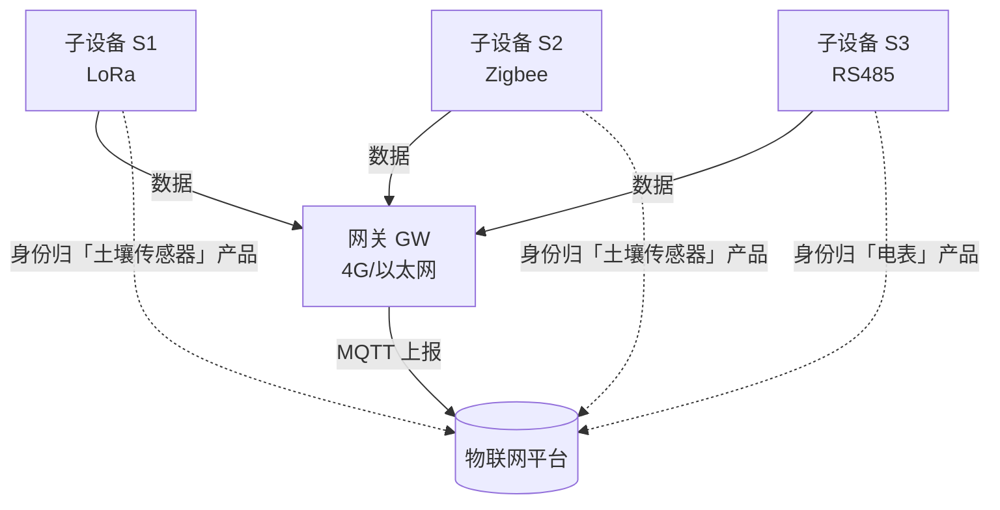

# 火山引擎 · 网关与子设备：哑设备怎么通过网关间接上云

> 技术栈：网关 / 子设备模型（以火山引擎物联网平台，由世纪互联 Vnet 运营，作为具体案例）
> 适用场景：当你的设备根本不会上网时，怎么把它们接进平台

> 第（二）篇我们说设备直连平台。但现实里大量设备是哑的：一颗土壤传感器只会 LoRa，一个电表只有 RS485 串口，一个老式温感只懂 Zigbee。它们**没有 IP、不会 MQTT、连不上公网**。难道这些设备就接不进物联网平台了？当然不是。平台的答案是**网关（Gateway）**：一台会上网的设备，替底下这群哑设备把数据背到云上。


## 1.问题背景：不是所有设备都能直连

直连架构隐含一个前提——**设备自己能发起网络连接**。但下面这些场景里这个前提不成立：

- 工厂车间里的仪表只有 Modbus / RS485 串口，物理上就不连网；
- 农田里的传感器用 LoRa / NB-IoT 低功耗通信，没有 IP 栈；
- 智能家居里的 Zigbee / 蓝牙子设备，靠的是网关做协议桥接。

如果平台只允许设备直连，这批设备就被挡在门外了。可它们偏偏又是很多物联网场景里的主力（量大、便宜、靠电池）。

在火山引擎物联网平台里，设备被分成直连设备、网关和网关子设备三种类型——这第三种就是专门留给哑设备的。平台对直连设备和网关子设备走的是两套接入通道，网关子设备自己不需要有联网能力，只要网关能够得着它就行。

## 2.设计理念：网关做边缘代理，拓扑解耦

平台的解法，是把联网能力和感知能力拆开：

> 网关 = 一个**自己能直连平台**、并且**能代理其他设备通信**的特殊设备。
> 子设备 = 自己不能上网，数据经由网关转发到平台的设备。

用一张图看清这套关系：子设备经网关上云（实线是数据流），而子设备的**身份**仍归各自的产品（虚线是归属，并不挂在网关名下）。



### 2.1 为什么是代理，而不是子设备挂在网关名下

这是第（二）篇强调过的关键点，这里再落地一次：**网关和子设备是代理 / 接入关系，不是归属关系。**

子设备身份仍归它自己的产品管（比如它是一颗土壤传感器产品下的设备），网关只是帮它把消息送到平台。平台视角里，子设备和直连设备几乎一样——都有 `DeviceName`、都归属某产品、都能定义物模型——只不过网络路径多经过了一跳网关。

这个设计的好处是**拓扑解耦**：你换一台网关，底下子设备的身份、历史数据、业务配置都不受影响；你加一批新子设备，也不需要重新注册到网关名下那种强绑定。

在火山引擎里，这套关系就叫**拓扑关系**。你在平台上创建的是网关类型的产品，在网关产品下创建设备，然后到该网关设备的详情页里做拓扑关系管理：关联子设备、删除子设备、启用 / 禁用某条拓扑关系。子设备可以来自多个不同的产品——这也印证了子设备不归网关的产品管这点，关联时你是先选产品再从设备列表勾选的。

### 2.2 解耦带来什么

- **子设备可跨网关迁移**：坏了或信号差，换台网关挂载即可；
- **协议差异被关在网关内**：LoRa / Zigbee / 串口怎么收，是网关的事；平台上子设备看到的仍是标准物模型；
- **成本下降**：哑设备便宜、网关分摊联网成本，整体比每台都带 4G 模块省得多。

## 3.实际应用

### 3.1 什么时候该上网关

一句话判断：**设备自己发不出 IP 报文时，就上网关。**

| 设备情况 | 接法 |
|----------|------|
| 自带 Wi-Fi / 以太网 / 4G / NB-IoT | 直连设备 |
| 只有 LoRa / Zigbee / BLE / 串口 | 子设备，经网关接入 |
| 量大、分散、靠电池、低功耗 | 多半是子设备，网关汇聚 |

别为了统一强行让每台设备都直连——给哑设备塞 4G 模块，成本和功耗都扛不住。

### 3.2 容量规划：盯住两个上限

网关不是无限的。规划拓扑前，先确认平台对网关的两个典型限制（具体数值以官方文档为准，下面是常见量级）：

- **单网关可挂载子设备上限**：常见在几百到两千之间；
- **单批次挂载子设备上限**：一次性挂很多子设备时，单次操作也有上限（常见几十级）。

在火山引擎里，这两个上限会以具体数值写在网关相关文档里（含单网关子设备数量上限），规划时务必以官方文档为准，别凭经验拍脑袋。

所以拓扑设计要倒推：你一片区域有多少子设备？除以单网关上限，得出要布几台网关。别忘了**冗余**——一台网关故障时，它下面的子设备集体失联，关键场景要留备份网关或重叠覆盖。

算一笔账更直观。一片田有 500 颗 LoRa 土壤传感器，单网关子设备上限按 2000 算，理论上 1 台网关就够。但按上限 ×0.7 留余量，单台实际承载约 1400 台——500 台用 1 台即可；若后期扩到 3000 台，就要布 3 台（3000 ÷ 1400 ≈ 2.1，向上取整），而不是等上线了才发现 1 台带不动。

把这套算法画成一条决策流，规划时照着走就行：

```mermaid
flowchart LR
  A[子设备总数 N] --> B[单台实际承载 = 上限 × 0.7]
  B --> C{网关数 = ceil(N / 单台承载)}
  C --> D["例: 500 / 1400 ≈ 0.36 → 1 台"]
  C --> E["例: 3000 / 1400 ≈ 2.14 → 3 台"]
```

### 3.3 数据怎么走：子设备 → 网关 → 平台

数据流是单向向上汇聚的：

```
子设备 S1 (LoRa) ─┐
子设备 S2 (Zigbee) ─┼─→ 网关 GW (4G/以太网) ──MQTT──→ 物联网平台
子设备 S3 (串口)  ─┘
```

网关侧要做的事很明确：把不同协议的子设备数据，**归一成平台能识别的物模型报文**再上报。这部分通常体现为网关上的子设备绑定配置，示意如下：

```text
网关 GW 绑定子设备：
  S1  ← 协议: LoRa，地址: 0x0A，映射到产品「土壤传感器」/ DeviceName: soil-01
  S2  ← 协议: Zigbee，地址: 0x1B，映射到产品「土壤传感器」/ DeviceName: soil-02
  S3  ← 协议: RS485，从机号: 3，映射到产品「电表」/ DeviceName: meter-03
```

注意关键一点：**子设备的产品归属是在绑定配置里指定的**，不是默认跟网关同产品。这也是 01 篇说的网关和子设备分属不同产品。

另外，火山引擎还提供了一种更省事的接入路径：**动态发现子设备**。网关 SDK 配好之后，网关可以向平台上报自己新发现的子设备，平台在网关详情页的动态发现列表里展示出来，你确认添加即可。这套机制适合子设备经常增减的场景——网关自己报上来，你点头就行，不用手工一条条关联。注意动态发现列表有效期是 24 小时，超时需要重新上报。

## 4.注意事项

**（1）网关是单点，要有冗余预案。** 它一断，下面全盲。关键区域用重叠覆盖或主备网关。

**（2）别让网关既当网关又当重计算节点。** 网关职责是转发 + 协议适配，复杂边缘计算另说，但别把业务全压在一台网关上，否则故障半径太大。

**（3）子设备上线依赖网关在线。** 调试子设备连不上时，先确认网关本身在线且已绑定，再查子设备侧协议参数（地址、波特率、信道）。在火山引擎控制台里，可以到网关设备的拓扑关系 / 动态发现列表确认子设备是否真的关联上、状态是否启用。

**（4）容量要留余量。** 按上限 × 0.7 左右规划，给后期扩展和峰值留空间，别贴着上限布网。

## 5.小结

网关与子设备这套设计，本质是把联网从每个设备身上抽出来，**集中到有能力的网关上**，从而让海量廉价哑设备也能进平台。它和第（三）篇的物模型是同一思路的两面：物模型屏蔽能力差异，网关屏蔽接入差异。

回到主线，这是连接抽象在设备侧的具体体现——不管底下是 LoRa 还是串口，平台上看到的子设备都长一个样。

下一篇（五）我们讲平台侧另一个解耦设计：**设备影子**与**消息通信（Topic）**——它们解决的是应用怎么和设备打交道，又不被设备的在线状态绑架。这里可以先剧透一句：在火山引擎里，设备影子就是一个 JSON 文档，专门缓存设备上报的状态和应用的期望值，弱网下也能帮设备和应用把状态对上。

## 参考链接

- [网关](https://console.cloud.vnet.com/docs/83825/1161808)
- [设备影子](https://console.cloud.vnet.com/docs/83825/1261945)
