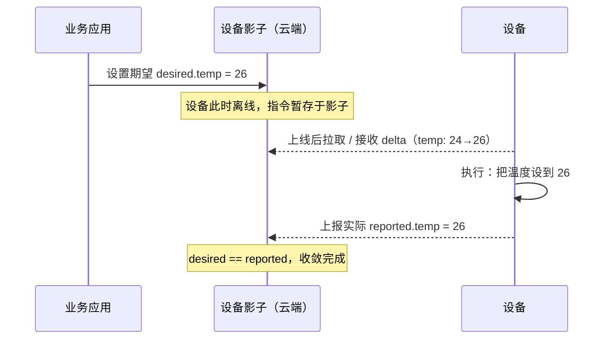
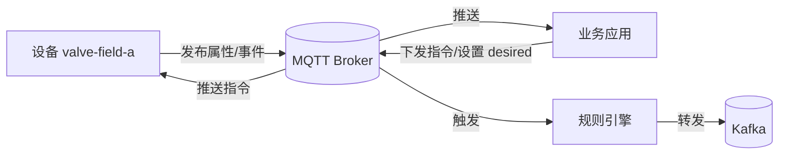

# 火山引擎 · 设备影子与通信：离线指令缓存与异步状态同步

> 技术栈：设备影子（Device Shadow）+ MQTT Topic（以火山引擎物联网平台，由世纪互联 Vnet 运营，作为具体案例）
> 适用场景：解决设备离线时还想下发指令、应用不想被设备在线状态卡住的问题

> 你下发一条"把空调设到 26 度"的指令，结果设备刚好离线了。指令石沉大海，等它上线，早忘了这回事。或者，你的看板想读取设备最新状态，可设备三分钟前就掉线了——你拿到的到底是它最后的真实状态，还是根本没值？这两个问题，靠"直接发消息给设备"是解决不了的。平台用两个设计来接：设备影子管状态与指令的解耦，Topic 发布订阅管消息的解耦。


## 1.问题背景：应用被设备在线状态绑架

直连架构里，应用和设备是点对点对话。一旦设备不在，对话就断：

- 指令丢失：设备离线时下发，消息直接丢弃，没有任何地方替它记着；
- 状态不确定：设备掉线后，应用不知道它最后状态，只能猜；
- 强耦合：应用必须知道哪台设备连没连，才能决定能不能通信。

物联网设备偏偏大量处于弱网、间歇在线、电池供电的状态。点对点模型在这里根本不成立。

## 2.设计理念一：设备影子——状态的"云端缓存"

影子（Shadow）是平台为每台设备维护的一份 JSON 文档，记录它的状态。在火山引擎物联网平台里，设备影子就是平台为每一台设备维护的 JSON 状态文档，每台设备有且只有一个。它把"设备实际怎样"和"应用希望它怎样"分开存，于是通信不再要求双方同时在线。

### 2.1 期望 / 实际 双值

影子文档里最关键的是两半：

- `desired`（期望）：应用希望设备变成的状态，比如 `{"temp": 26}`；
- `reported`（实际）：设备上报的真实状态，比如 `{"temp": 24}`。

只要 `desired ≠ reported`，就说明还没收敛到目标，设备和平台会协作把它拉平。

在火山引擎中，设备与影子通过平台预定义的影子 Topic 同步，例如 `sys/{ProductKey}/{DeviceName}/shadow/desired/set`（云端下发期望）、`sys/{ProductKey}/{DeviceName}/shadow/report`（设备上报实际）、`sys/{ProductKey}/{DeviceName}/shadow/desired/get`（设备拉取期望）。设备在线时直接获取指令，离线后再次上线可主动拉取，影子相当于一层设备缓存，专门解决弱网环境下的消息同步。

以灌溉阀 valve-field-a 为例，它的影子文档长这样：

```json
{
  "productKey": "PK_VALVE_01",
  "deviceName": "valve-field-a",
  "state": {
    "desired":  { "valve": "open", "ts": 1718000000 },
    "reported": { "valve": "closed" }
  },
  "metadata": { "desired": { "valve": { "timestamp": 1718000000 } } }
}
```

`desired.valve=open` 而 `reported.valve=closed`，平台据此知道还没收敛，会把 delta（open）推给设备；设备执行后上报 closed→open，影子就收敛了。

### 2.2 影子同步时序

设备离线时，指令先落到影子；设备上线后自动拉取并执行。整个过程的时序是这样的：



注意这段时序的精髓：应用只跟影子对话，不跟设备对话。设备在不在线，对应用透明。

### 2.3 为什么解耦有用

- 指令不丢：离线下发，上线补执行；
- 状态可读：设备掉线，应用仍能从影子读到它最后已知状态；
- 应用简化：不用维护"设备在线表"和重试队列，影子替你存着。

## 3.设计理念二：Topic 发布订阅——消息的"解耦总线"

影子解决了状态，但日常设备数据（属性上报、指令调用、事件）走的是另一套机制：Topic（主题）。它是 MQTT 的发布/订阅中介，把"谁发"和"谁收"彻底解开。

### 3.1 主题是带通配的地址

火山引擎把 Topic 分成产品 Topic 类和设备 Topic 两层。产品 Topic 类是同一 ProductKey 下所有设备通用的模板，设备 Topic 则是把模板里的 `${DeviceName}` 替换成具体设备名后得到的真实地址。两者都用正斜杠分层，通常用 `${ProductKey}` 和 `${DeviceName}` 通配一个唯一的设备，例如：

```text
# 设备上报属性
${productKey}/${deviceName}/property/post

# 平台下发服务调用
${productKey}/${deviceName}/service/invoke
```

订阅时可以用 `+` / `#` 通配：`${productKey}/+/property/post` 表示一个产品下所有设备的属性上报。这让"监听整类产品"变得一句话的事。

### 3.2 发布 / 订阅有权限

不是谁都能往任意主题发。火山引擎对指定的 Topic 可以按产品下的设备定义不同权限：

- 发布：设备可以通过该 Topic 将消息发送到物联网平台；
- 订阅：设备订阅该 Topic 后，服务端发消息到该 Topic 时，平台会把消息送到设备；
- 发布和订阅：同时具备收发两个功能。

设备侧一般只能发布自己的属性/事件、订阅自己的指令主题；应用侧可订阅数据、发布指令，但受产品/设备范围约束。这套权限避免了"一台设备误发别家数据"的越权问题。

### 3.3 系统 Topic 与自定义 Topic

火山引擎预定义的 Topic 分三类：基础通信 Topic、物模型通信 Topic、自定义 Topic。

- 系统 Topic：平台预定义、以 `sys/` 为前缀的固定主题，覆盖属性、事件、服务、影子同步、OTA、任务、时钟同步等开箱即用的能力；
- 自定义 Topic：你的业务如果需要私有消息通道（比如设备间点对点、固件分包），可自行定义，格式为 `sys/{ProductKey}/{DeviceName}/custom/{TopicSuffix}`，前 5 个类目已固定，走同一套发布订阅。

两者共用同一个 Broker，区别只在是否被平台"翻译"成物模型语义。

把发布订阅的关系画出来更直观：



## 4.实际应用

### 4.1 用影子下发一条"不丢的指令"

弱网 / 离线场景的标准做法：

```text
1. 应用调用"设置设备属性"接口，写入 desired.temp = 26
2. 影子保存期望，立即返回"已记录"
3. 设备在线：平台实时把 delta 推给设备
   设备离线：平台暂存，设备上线后自动同步
4. 设备执行后上报 reported.temp = 26
5. 影子收敛，应用可查询"已达成"
```

应用侧不需要写离线重试队列——这是影子带来的最大简化。

### 4.2 Topic 规划示例

一个温控场景的 Topic 分工：

| 用途 | 主题（示例） | 发布者 | 订阅者 |
|------|--------------|--------|--------|
| 属性上报 | `${pk}/${dn}/property/post` | 设备 | 应用、规则引擎 |
| 指令下发 | `${pk}/${dn}/service/invoke` | 应用 | 设备 |
| 事件上报 | `${pk}/${dn}/event/post` | 设备 | 应用、告警 |
| 影子同步 | `${pk}/${dn}/shadow/*` | 平台/应用/设备 | 三方 |

原则：一类消息一个主题，别把所有东西塞进一个主题，否则订阅端只能收到一团乱麻自己拆。

## 5.注意事项

**（1）影子不是实时通道。** 它适合状态 / 指令，不适合高频流式数据（那是规则引擎和时序存储的活）。

**（2）desired 要及时清理。** 指令执行完、目标达成后，考虑清空或更新 `desired`，否则设备每次上线都会误以为还有未决指令。

**（3）Topic 权限按最小够用配置。** 别给设备开可发布任意主题，避免越权。

**（4）高频属性别走影子。** 温度每秒报一次，用属性 Topic 直接上报即可，没必要每次更新影子文档。影子留给需要持久化、需要离线补偿的那类状态。

## 6.小结

设备影子和 Topic，是平台在"通信层"做的两层解耦：

- 影子解耦"状态/指令"与"设备在线"——应用只跟影子对话，指令不丢、状态可读；
- Topic 解耦"发送方"与"接收方"——发布者不关心谁在收，订阅者不关心谁在发。

它们共同把应用从"设备的在线状态"里解放出来。回到主线，这是比第（一）篇讲的规则解耦更底层的通信解耦。

下一篇（六）我们顺着"数据进来之后往哪走"，讲平台的规则引擎与数据流转：订阅转发、场景联动、数据转发，三种模式到底怎么选。

## 参考链接

- [设备影子](https://console.cloud.vnet.com/docs/83825/1261945)
- [通信Topic概述](https://console.cloud.vnet.com/docs/83825/1261931)
