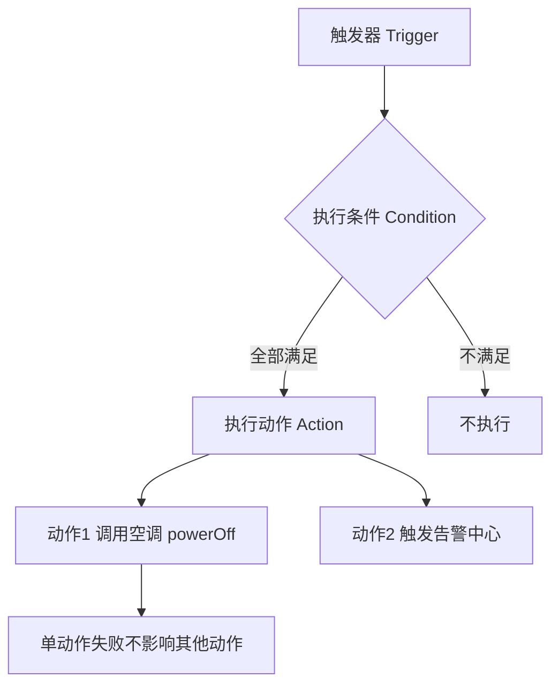

# 火山引擎 · 规则引擎

> 技术栈：规则引擎（以火山引擎物联网平台，由世纪互联 Vnet 运营，作为具体案例）
> 适用场景：设备数据进了平台之后该流向哪里，这部分怎么设计才不会写死

> 设备数据好不容易进了平台，接下来问题才真正开始：温度超标了要通知谁？要不要自动关空调？历史数据要不要送进 Kafka 给分析系统？新手最容易的做法，是在接收数据的应用里写一堆 `if (temp > 30) { http.post(...) }`。短期能跑，但业务一旦变（超标改推钉钉、再加一条联动），你就得改代码、发版、重启。平台给出的解法是**规则引擎**：把数据往哪走从代码里抽出来，变成可配置的规则。

在火山引擎物联网平台里，这三类能力就挂在控制台的「规则引擎」菜单下，分别是订阅转发、场景联动、数据转发——下文我会用它们的真实配置方式来讲设计。


## 1.问题背景：数据流转被写死

把流转逻辑硬编码在业务应用里，会带来几个老问题：

- **业务一变就要改代码**：加一个转发目标 = 改一处 `if` + 重新部署；
- **逻辑散落多处**：告警在 A 服务、联动在 B 服务、存储在 C 服务，同一个温度超标被重复判断三次；
- **难复用、难观测**：谁配了什么规则，没有统一视图，出问题只能翻代码。

本质上，这是把**平台该管的流转**误放进**应用该管的业务**里了。

## 2.设计理念：规则引擎做 if-this-then-that 解耦

规则引擎的核心，是把数据流转表达成「当满足条件，就执行动作」的配置，而不是代码。它立在设备数据和业务系统之间，承担**南向采集、北向开放**的枢纽角色。

> **南向采集**：设备 / 网关的数据汇聚进平台；
> **北向开放**：平台把数据按规则分发到外部系统或其他设备。

### 2.1 为什么叫解耦

没有规则引擎时，数据流向是应用写死的私有权。有了之后，流向变成平台托管的配置：

- 业务变化 → 改一条规则配置，秒级生效，不用发版；
- 同一个数据源 → 可被多条规则同时消费，互不干扰；
- 规则集中管理 → 谁配了什么、何时触发，有统一视图。

这就是第（一）篇说的**规则解耦**——它把系统的可变部分从代码里挪到了配置里。

### 2.2 三种流转模式

平台通常提供三类规则动作，覆盖绝大多数场景。火山引擎物联网平台把它们明确拆成了三块独立能力，名字就直接叫「订阅转发」「场景联动」「数据转发」：

| 模式 | 它解决什么 | 数据去哪（火山引擎里的真实去向） |
|------|------------|----------|
| **订阅转发** | 把设备消息实时推给外部系统 | 指定 HTTP 地址（POST，body 携带消息），可配多个目的端 |
| **场景联动** | 用一条规则让设备间自动协作 | 平台内其他设备的属性 / 服务调用，或触发告警中心 |
| **数据转发** | 把数据送入分析 / 存储管道 | 另一个 Topic，或自定义 Kafka |

## 3.实际应用：三种模式怎么选

各家平台都提供这三类能力，只是配置入口与字段略有差异。下面用火山引擎物联网平台的真实配置项来讲，这样你既能学到通用思想，也能直接照着控制台点一遍。

### 3.1 订阅转发：给外部系统递消息

适合平台之外的系统要实时知道设备发生了什么。例如把告警事件推给你们的工单系统、把属性推给自有的分析服务。

在控制台左侧导航栏选「规则引擎 > 订阅转发」，点创建订阅转发，核心就三件事：

- **所属产品**：选消息源设备所属的产品；
- **推送消息类型**：服务端能订阅的设备消息类型很多——设备创建、设备删除、设备上下线状态、拓扑关系变换、设备属性上报、设备事件上报、服务调用结果上报、自定义消息；
- **数据流向**：目前只支持 Http 类型，以 POST 方法请求你配置的 url，body 里会带上消息内容。需要的话可以「添加数据流向」配多个目的端。

```text
规则：设备事件 overheat 上报
动作：HTTP POST https://your-system/api/alert
       body: { device, temp, ts }
```

创建后状态是未启动，启动后变成运行中，平台才会真正推送；出问题点「日志」就能看到每次推送的结果。要点：目标系统是**被动接收方**，它不反向控制设备，只是被告知。

### 3.2 场景联动：让设备自己协作

适合一个设备的状态变化要触发另一个设备的动作，而且希望**低延迟、平台内闭环**。例如温度 > 30 就调用空调关机服务。

火山引擎把场景联动抽象成一套 TCA 模型：**触发器（Trigger）、执行条件（Condition）、执行动作（Action）**。当触发器指定的事件或属性变化发生时，系统判断执行条件是否满足，再决定是否执行动作。两个关系要记住：

- 触发器之间是与（or / ||）的关系——多个触发器任意一个命中即可；
- 执行条件与执行动作内部是与（and / &&）的关系——必须全部满足才执行。

执行动作可以选设备调用（设备自身调用，或重新指定设备，再配属性参数或服务调用参数），也可以触发报警（关联到告警中心，满足条件就产生告警）。而且某一动作执行失败时，不影响其他动作——这点对可靠性很友好。

```text
规则：IF 属性 temperature > 30
动作：调用 设备 air-conditioner 的 service: powerOff()
```

要点：联动的两端都在平台内，不需要你自己的应用去中转一次，延迟和可靠性都更好。配置完别忘了点「启用」，还能用「调试」按具体条件跑一遍规则判断。

把 TCA 模型画成图更清楚：



一条真实的场景联动配置长这样（示意）：

```text
触发器: 属性 temperature 上报且 > 30
执行条件: 设备位于分组「车间A」(and)
执行动作:
  - 调用 设备 air-conditioner 的 service: powerOff()
  - 触发告警中心: 生成「高温告警」
```

### 3.3 数据转发：把数据送进管道

适合设备数据要进大数据 / 分析 / 长期存储。例如把所有属性转发到 Kafka，供 Flink 实时计算、送时序库做看板。

火山引擎的数据转发最像写 SQL：配置数据源时你其实在写一条 `SELECT 字段 FROM Topic WHERE 条件` 的流转语句——字段就是 SELECT 后处理的内容，Topic 是 FROM 的数据源（设备创建、删除、属性上报、事件上报、服务调用结果、设备上下线、拓扑变化、自定义 Topic 任选），条件就是 WHERE 的触发门槛。

数据目的（行为类型）支持两种：

- **转发到另一个 Topic**：把一个设备的 Topic 消息转发到另一个设备 Topic，类型可选属性设置、服务调用、自定义 Topic；
- **转发到自定义 Kafka**：填集群类型、安全协议（如 SASL_SSL 或 SASL_PLAINTEXT）、Kafka Topic、认证机制（如 SCRAM-SHA-256 或 PLAIN）、用户名、密码。

规则引擎还内置了一批函数方便你取字段，比如 `deviceName()` 取设备名、`ThingModelData(default:CurrentTemperature)` 取物模型里某个属性的值，写 SELECT 时直接用。

```text
规则：产品「温度传感器」全部属性上报
动作：转发到 Kafka topic: iot-raw-thermostat
```

要点：这是流式而非事件式，量级大、偏下游消费。运行中状态不可删除，要先用「停用」停掉数据流转再删。

### 3.4 一张表帮你选

| 你的需求 | 选哪个 | 理由 |
|----------|--------|------|
| 推消息给外部业务系统 | 订阅转发 | 外部系统被动接收，目前走 Http |
| 设备 A 触发设备 B 动作 | 场景联动 | 平台内闭环、低延迟，TCA 模型编排 |
| 数据进 Kafka / 时序库做分析 | 数据转发 | 流式管道，支持 SQL 与 Kafka |
| 既要告警又要存储 | 配两条规则 | 同一数据源可被多规则消费 |

**关键认知**：三种模式不是互斥的。一条设备数据，完全可以同时被订阅转发给告警系统、被场景联动关空调、被数据转发进 Kafka——规则引擎天然支持一对多。

## 4.注意事项

**（1）规则里别写重业务逻辑。** 规则适合条件→动作的简单映射；复杂计算、聚合、跨系统事务，留给下游业务系统，规则只负责把数据送到那。写数据转发时尤其别在 SELECT 里硬塞太重的处理。

**（2）注意触发频率。** 温度 > 30 就转发可能在抖动时每秒触发几十次。订阅转发的消息类型、数据转发的 WHERE 条件里，必要时加变化阈值或静默期约束，别让下游被刷爆。

**（3）环路要小心。** 场景联动 A→B、B→A 容易形成死循环。设计规则时画一下数据流向，避免自激。

**（4）可观测性优先。** 三类规则平台都提供了日志/监控（订阅转发、数据转发有运行日志，场景联动有调试与运行结果）。上线前确认你能看到这些，否则出问题只能盲猜。

## 5.小结

规则引擎是平台**北向开放**的出口，也是**规则解耦**的落点。它用订阅转发 / 场景联动 / 数据转发三种模式，把设备数据往哪走从写死的代码变成可配置的规则——业务变，只改规则；系统变，加条规则。对照火山引擎物联网平台你会发现，这三类能力的真实配置（Http 订阅、TCA 联动、SQL 式 Kafka 转发）正是对这套思想的落地。

到这篇，第（一）篇说的四条主线（连接抽象、协议归一、数据标准化、规则解耦）已经全部落地了一遍。下一篇（七）我们不做新概念，而是把前面所有东西**串成一个端到端的实战**：用智慧农业监测这个场景，走一遍从建模到看板的完整设计。

## 参考链接

- [订阅转发](https://console.cloud.vnet.com/docs/83825/1261950)
- [场景联动](https://console.cloud.vnet.com/docs/83825/1261951)
- [数据转发](https://console.cloud.vnet.com/docs/83825/1261952)
