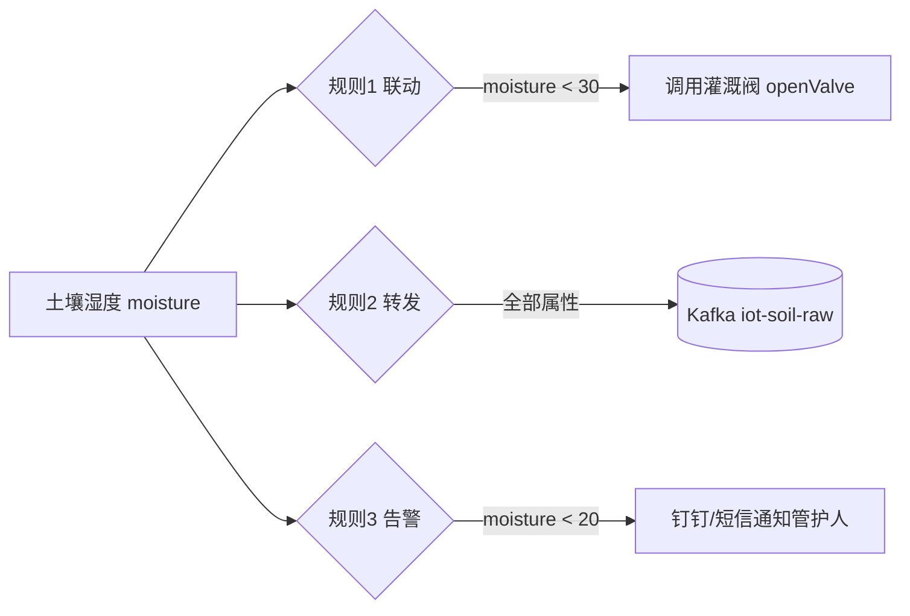

# 火山引擎 · 实战：智慧农业闭环——从设备到看板，一条数据跑通全链路

> 技术栈：产品 / 物模型 / 网关 / 影子 / 规则引擎（以火山引擎物联网平台，由世纪互联 Vnet 运营，作为具体案例）
> 适用场景：把第（一）~（六）篇的所有设计理念，落到一个能跑通的真实场景里


前面六篇，我们分别拆了平台化、产品与设备、物模型、网关与子设备、影子与通信、规则引擎。每篇单独看都好懂，但你可能还是想问：**这些东西放一起到底怎么用？**

这篇不新讲概念，而是用一个智慧农业墒情监测的场景，把前面所有理念串成一条完整的链路。你看完应该能回答：给我一批设备，我第一步建什么、第二步配什么、数据最后去哪。


## 1.场景设定

一片大棚 / 农田，要做的就三件事：

1. **采集**：实时知道每块地的土壤湿度、环境温度；
2. **告警**：湿度过低自动通知管护人；
3. **联动**：湿度低于阈值，自动触发灌溉，并在看板上看见实时墒情。

设备现状：几十颗土壤传感器只支持 LoRa（不上网），一两台气象站。田里没拉网线，靠 4G。

## 2.设计落地：一步步对应前面的理念

### 2.1 先建模：产品 + 物模型（对应（二）、（三））

别急着接设备。**先定义这类设备是什么**。

- 建一个产品「土壤传感器」，物模型里定义两个属性：`moisture`（湿度 %）、`temperature`（温度 ℃）；
- 建一个产品「农田网关」，物模型声明它具有代理子设备能力；
- 建一个产品「气象站」（如果直连），定义 `airTemp` / `airHumidity`。

```json
// 土壤传感器 物模型（精简）
{
  "productKey": "PK_SOIL_01",
  "properties": [
    { "identifier": "moisture",   "name": "土壤湿度", "dataType": { "type": "float", "unit": "%",  "min": 0, "max": 100 } },
    { "identifier": "temperature", "name": "土壤温度", "dataType": { "type": "float", "unit": "°C", "min": -20, "max": 60 } }
  ]
}
```

> 这一步是数据标准化的落地：所有同款传感器，无论固件细微差异，上报都归一成 `moisture` / `temperature`。

在火山引擎物联网平台里，这对应到设备中心>产品管理里创建产品，再为产品定义物模型——从属性的维度定义产品功能。比如创建产品时，节点类型选直连设备（网关则选网关类型），数据格式选标准数据格式，这样同一产品下的设备就天然共享一套物模型。

在真正接传感器前，你完全可以用设备模拟器先把链路跑通：在设备中心>设备管理里，对刚创建的产品下的设备点操作里的模拟器，启动设备模拟器，用上行命令调试的属性上报把温度、湿度数值发上来，再用下行命令调试的属性设置把云端指令下发回去——不用一颗真传感器，就能验证物模型和后面的规则是否配对。

### 2.2 再接入：网关 + 子设备（对应（四））

传感器不会上网，所以：

- 田里布一台 **网关 GW**（4G 直连平台），归属「农田网关」产品；
- 每颗传感器作为**子设备**注册到「土壤传感器」产品，再绑定到 GW，走 LoRa；
- 数据路径：**传感器(LoRa) → 网关(4G) → 平台**，网关负责把 LoRa 报文翻译成标准物模型上报。

在平台上，网关和子设备都通过设备中心>设备管理来创建与绑定：网关作为直连设备注册，传感器作为子设备注册到土壤传感器产品后再绑定到网关。只要绑定关系对，子设备上报的数据就会归到对应产品的物模型下。

> 这一步是连接抽象的落地：平台上子设备看到的，和直连设备一模一样——都有身份、有物模型、能定义影子。

### 2.3 要控制：用影子下发灌溉（对应（五））

湿度低就灌溉听起来是平台发条指令。但灌溉阀可能间歇在线、或 4G 抖动。用**影子**保证指令不丢：

```text
管护平台调用"设置设备属性" → 灌溉阀影子 desired.valve = "open"
  - 阀在线：实时收到，执行开阀
  - 阀离线：指令暂存影子，上线自动开阀
阀执行后上报 reported.valve = "open" → 影子收敛，看板显示"已开启"
```

在火山引擎里，设备影子就是 desired/reported 双状态文档：应用通过调用设置设备属性，由云端把指令写入影子，阀上线后自动拉取 desired 并执行，再上报 reported 收敛状态。你不用自己写一套设备是否在线 的判断逻辑。

> 这一步是通信解耦的落地：应用只跟影子对话，不关心阀在不在线。

### 2.4 让数据流起来：规则引擎（对应（六））

最后把数据进来之后去哪用规则配置出来，而不是写代码：

```text
规则1（联动）：IF 土壤湿度 moisture < 30
        THEN 调用 灌溉阀 的 service: openValve()

规则2（转发）：产品「土壤传感器」全部属性上报
        THEN 转发到 Kafka topic: iot-soil-raw（供分析/时序库）

规则3（告警）：IF 土壤湿度 moisture < 20
        THEN 订阅转发 → 管护人钉钉/短信
```

火山引擎的规则引擎可以把物模型数据流转到不同目的地：转发到 Kafka topic 供下游分析，或触发联动调用设备服务，或转发到消息通知（钉钉/短信）。规则都在控制台里配，不碰业务代码。

把三条规则画成一张图：



> 这一步是规则解耦的落地：业务变化只改规则——想加湿度<20 再发短信，加一条规则3即可，零代码改动。

## 3.完整链路回顾

把上面四步拼起来，就是图里那三层：

```
现场（南向）       平台（中枢）                  北向（业务）
传感器(LoRa)  ─┐
气象站        ─┼─→ 网关(4G) ─→ 产品/物模型 ─┐
              ─┘             设备影子      ├─→ 可视化看板
                               规则引擎 ────┼─→ 告警通知
                                           └─→ 联动控制(灌溉)
```

注意这条链路的对称性：**左边所有异构设备，都被网关和物模型收敛成一个标准模型；右边所有业务消费，都被规则引擎分发到不同目标。** 中间的平台，替你承受了所有不对称。

## 4.你能直接抄的实战清单

按这个顺序落地，不会乱：

1. **建产品 + 定义物模型**（先做，再接设备）；
2. **建网关产品 + 注册网关**（直连）；
3. **把传感器作为子设备注册并绑定网关**（核对 LoRa 地址）；
4. **配影子**：需要远程控制的设备（灌溉阀）启用影子；
5. **配规则**：联动 / 转发 / 告警三条，按业务需要增删；
6. **北向消费**：看板订阅数据、告警接通知、分析接 Kafka。

每一步出问题时，定位也很清晰：设备没数据 → 查网关绑定；控制不生效 → 查影子 `desired`；数据没到看板 → 查规则转发目标。

## 5.注意事项

**（1）建模先于接入。** 先想清楚物模型，再买设备接设备。模型定了，后面加设备只是注册，不是重写。

**（2）网关容量要算总账。** 一片田几十颗传感器，确认单网关子设备上限够；不够就布多台，别贴上限。

**（3）规则别写成业务系统。** 联动只做条件→动作，复杂分析交给 Kafka 下游，规则保持轻。

**（4）影子只管该持久化的状态。** 高频墒情上报走属性 Topic，别每次更新影子文档。

## 6.小结

回到第（一）篇开头那个问题——为什么物联网平台要这么设计。六篇走下来，答案是一组相互支撑的决策：

| 设计理念 | 它解决的根本问题 | 落地的概念 |
|----------|------------------|------------|
| 连接抽象 | 应用×设备 网状私有连接 | 产品/设备、网关代理 |
| 协议归一 | 设备协议各自为政 | 网关把 LoRa/串口翻译成 MQTT |
| 数据标准化 | 同义不同形，分析崩 | 物模型（属性/服务/事件） |
| 通信解耦 | 应用被在线状态绑架 | 设备影子、Topic 发布订阅 |
| 规则解耦 | 流转写死在应用里 | 规则引擎（转发/联动/告警） |

它们不是五个孤立功能，而是**同一个目标的不同切面**：把设备又多又杂又时断时续这个现实，收敛成平台一侧干净、业务一侧简单的结构。

希望这个系列帮你建立的，不只是某个平台怎么用，而是面对任何物联网平台，都能看出它为什么这么设计的判断力。读文档时，你大概会自然地问：这一层在做连接抽象，还是数据标准化，还是规则解耦？——能问出这句话，这个系列就值了。

到这里，从建模到闭环都已经跑通，但还差最后一环：数据进了平台、也流转起来了，怎么让它真正被看见、被查询、被告警、被分析？下一篇（八）我们收个尾，把视线从接入侧转向消费侧，讲清数据北向开放的最后一块拼图。

## 参考链接
- [什么是物联网平台](https://console.cloud.vnet.com/docs/83825/1161799)
- [快速入门概述](https://console.cloud.vnet.com/docs/83825/1261924)
- [创建产品和设备](https://console.cloud.vnet.com/docs/83825/1261925)
- [模拟上报设备数据](https://console.cloud.vnet.com/docs/83825/1261927)
