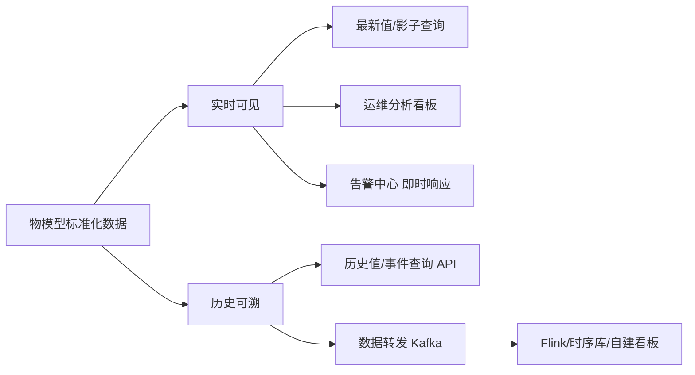
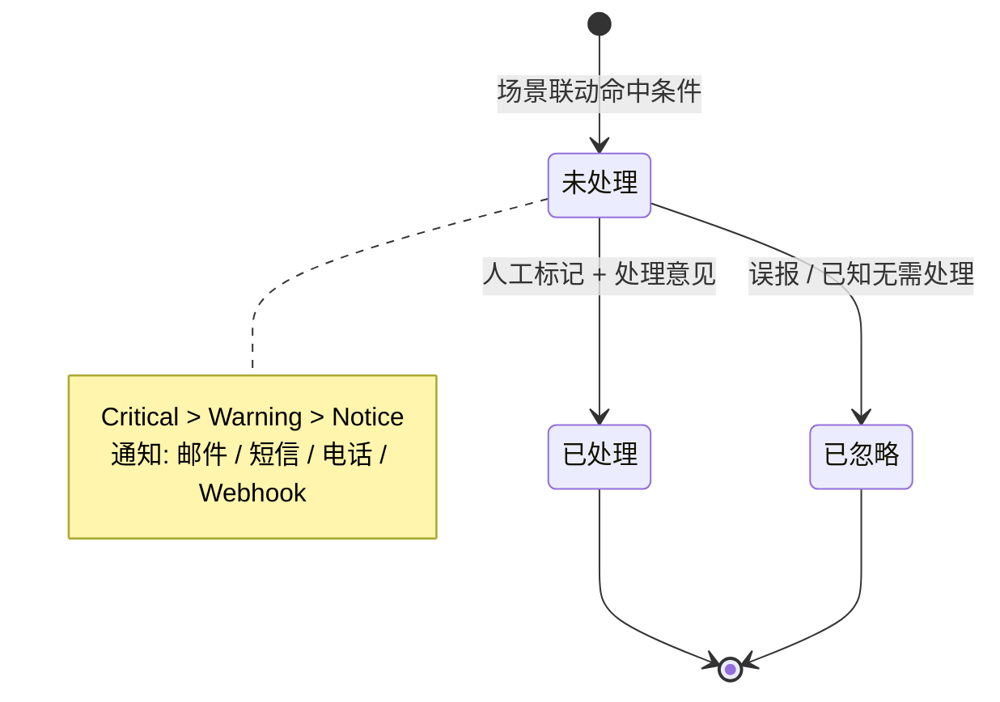

# 火山引擎 · 数据分析与可视化：把设备数据变成可落地的业务图表

> 技术栈：运维分析 / 告警中心 / 数据查询 API（以火山引擎物联网平台，由世纪互联 Vnet 运营，作为具体案例）
> 适用场景：把前面建模、路由好的数据，变成能看、能查、能告警、能分析的结果


前面六篇，我们把数据从设备接进来（第（二）篇 产品与设备）、归一成统一结构（第（三）篇 物模型）、收进平台（第（四）篇 网关与子设备）、解耦通信（第（五）篇 设备影子与通信）、再让它在规则引擎里流起来（第（六）篇 规则引擎），最后串成一个实战闭环（第（七）篇 实战：智慧农业闭环）。

但到这里有个容易被忽略的问题：**数据躺在平台里，不等于它被看见了。**

你接了一千台传感器的湿度上报，可如果只能去翻原始 MQTT 消息，那跟没接差不多——人看不过来，业务也用不上。数据的价值，最终要靠分析、可视化、告警这些北向能力释放出来。

本篇不新讲接入概念，而是把视线转向平台的另一侧：那些已被标准化、已流转起来的数据，是怎么变成图表、告警和趋势的。在火山引擎物联网平台里，这部分能力主要分布在「监控运维」（运维分析、告警中心）和「物模型使用」的数据查询 API 上，再配合第（六）篇讲过的数据转发与订阅转发，把数据送到你自己的分析系统。


## 1.问题背景：数据进了平台却看不见

没有分析可视化能力时，平台里只有一串串消息流，会带来几个典型困境：

- **人看不过来**：一千台设备每秒上报，靠控制台翻日志根本不可行；
- **异常发现靠运气**：温度悄悄超标三天，没人盯就没人知道；
- **历史查不动**：想看上周某台设备的湿度曲线，只能自己写脚本回放消息；
- **系统各自为政**：看板一套、告警一套、分析一套，数据被重复拉取。

本质上，这是把**平台该提供的数据消费面**留给了业务系统去从头造——而很多团队造得不轻巧，反而把复杂度又搬了回去。

## 2.设计理念：数据消费的两个方向

平台对数据消费的设计，可以归成两个方向，它们解决不同层面的问题。

### 2.1 实时可见：让人和系统立刻知道发生了什么

一部分数据价值在于即时性——设备现在在线吗、当前湿度多少、有没有触发异常。这类需求靠平台内置的即时查询与看板满足：

- **最新值查询**：随时取某设备某属性的当前值（物模型使用类 API）；
- **设备影子 / Topic**（第（五）篇）：实时读 desired/reported，双向同步；
- **运维分析看板**：设备分布、在线活跃等统计直接出图。

### 2.2 历史可溯：让趋势和复盘成为可能

另一部分价值在于时间维度——过去七天湿度怎么变、上个月故障频率、哪台设备最不稳定。这类靠历史检索与下游分析管道：

- **历史值查询**：按时间区间取属性历史（物模型使用类 API）；
- **事件 / 服务记录**：查设备上报过的事件、被调用过的服务；
- **数据转发到 Kafka**（第（六）篇）：送进 Flink / 时序库做长期分析与看板。

把两个方向画出来就清楚了：



注意这两个方向不是替代关系，而是互补：**实时方向负责此刻发生了什么，历史方向负责这件事是怎么演变的。** 一个完整的监控，两者都要有。

## 3.实际应用：三类能力怎么用

下面用火山引擎物联网平台的真实能力来讲，这样你既能学到通用思想，也能直接照着控制台和 API 点一遍。

### 3.1 运维分析：设备全局一目了然

当设备数量上来后，你最需要的往往不是单台数据，而是整体态势。火山引擎在「监控运维 > 运维分析」提供了一个开箱即用的看板：

- **设备分布图**：展示在线设备所在区域，精确到具体城市；
- **累计创建设备 / 累计激活设备**：看规模与激活率；
- **每日在线设备 / 每日活跃设备 / 每日新增设备 / 每日激活设备**：看日常活跃与增长。

页面默认展示全部产品一周内的数据，可在上方切换产品和时间范围。

> 一个提醒：运维分析是按天统计的——统计信息每日凌晨执行，因此最近能拿到的是昨天一天的历史。要做实时态势，得走最新值查询或影子，别指望它反映当下这一秒。

举个智慧农业的例子：你在运维分析里看设备分布图，能立刻发现某片大棚的传感器在线数明显少于注册数，定位是不是田里那台网关下的子设备掉线了——这比逐台查设备状态快得多。

### 3.2 告警中心：把异常变成可处理的工单

告警中心管理平台监控告警功能，专门管理**规则引擎中场景联动规则触发的告警信息**。它和前面的联动是配套的：你在第（六）篇配的场景联动，如果动作是触发告警中心，告警就会在这里汇总。

它的几个设计点值得留意：

- **告警分级**：支持 Notice / Warning / Critical 三级，严重程度 Critical > Warning > Notice，方便你按紧急度排序处理；
- **通知渠道**：邮件、短信、电话，以及自定义 Webhook（飞书 / 钉钉 / 企业微信群机器人）；
- **处理闭环**：告警默认未处理，可标记已处理并填处理意见，或忽略，状态全程可追溯。

```text
场景联动规则：IF 土壤湿度 moisture < 20
动作：触发告警中心，等级 Critical
通知：钉钉群机器人 Webhook → 管护人立即收到
```

要点：告警中心管的是「场景联动产生的告警」，不是所有消息。它的价值在于把一次条件命中，变成一条有等级、有通知、有处理记录的闭环，而不是转瞬即逝的一条日志。

告警从产生到闭环是一个有状态的生命周期，用状态机看最清楚：



### 3.3 数据查询 API：把数据接进你自己的系统

如果你要在自己的业务系统里展示或计算，火山引擎在「物模型使用」下提供了一组查询 API，按用途分得很清楚：

| API | 它解决什么 |
|-----|------------|
| GetLastDevicePropertyValue | 取单台设备某属性的最新值 |
| GetAllLastDevicePropertyValue | 取一批设备某属性的最新值（批量看板） |
| GetPropertyValuesByTime | 按时间区间取属性历史值（画趋势曲线） |
| GetDeviceEventRecordList | 查设备上报过的事件记录 |
| GetDeviceServiceCallRecordList | 查设备被调用过的服务记录 |
| GetDeviceOverview | 取设备概览信息 |

把第（七）篇的智慧农业接着说：管护平台想给每块地画一张墒情趋势曲线，就调用 `GetPropertyValuesByTime`，按时间区间把某几台土壤传感器的 `moisture` 取出来，前端直接渲染成折线图——不用自己维护一个消息回放服务。

```text
请求意图（示意）：GetPropertyValuesByTime
  设备: 土壤传感器 PK_SOIL_01 / 地块A-01
  属性: moisture
  时间: 过去 7 天
返回: 带时间戳的湿度序列 → 前端画趋势曲线
```

> 这部分和第（六）篇的数据转发是两条互补路径：API 是**按需拉取**（你要时来取），数据转发是**持续推送**（数据来了就走 Kafka）。实时看板用 API 拉，长期分析用转发推，别混用。

### 3.4 一张表帮你选

| 你的需求 | 用哪个能力 | 理由 |
|----------|------------|------|
| 看设备整体态势、分布 | 运维分析 | 开箱看板，不需开发 |
| 异常要立刻通知人 | 告警中心 + 场景联动 | 分级 + 多渠道通知 + 处理闭环 |
| 自己系统要展示当前值 | 最新值查询 API | 按需拉取单台/批量 |
| 自己系统要画历史曲线 | GetPropertyValuesByTime | 按时间区间取历史 |
| 长期分析 / 大数据管道 | 数据转发 → Kafka | 流式持续推送，解耦下游 |

## 4.注意事项

**（1）别把实时和统计混为一谈。** 运维分析是 T+1 天级统计，看不到此刻；要看当下在线数和当前值，走最新值查询或影子。两者职责不同，别用错。

**（2）告警中心只收场景联动产生的告警。** 它不处理订阅转发、数据转发的消息。如果你想让某个条件触发告警，得在场景联动的动作里选触发告警中心，而不是另写一条转发规则。

**（3）查询 API 适合按需，不适合当消息总线。** 高频轮询最新值来"监听"变化，既费配额又慢。真要实时感知，用影子 / Topic 订阅，或第（六）篇的转发。

**（4）历史分析留给下游，别在平台内硬算。** 复杂的聚合、跨设备关联计算，用数据转发把数据送进 Kafka / 时序库，交给 Flink 或你的分析服务。平台内的查询 API 定位是取数，不是算数。

## 5.小结

数据进了平台只是开始，被看见、被查询、被告警、被分析，才算真正释放价值。本篇把视线从接入侧（第（二）篇至第（七）篇）转向消费侧，对应到两条设计主线：

- **实时可见**：最新值查询、影子、运维分析看板、告警中心，负责此刻发生了什么；
- **历史可溯**：历史值 / 事件查询 API、数据转发到 Kafka，负责这件事怎么演变。

它们合起来，正是第（一）篇「北向开放」思想的最终落点——设备数据进来后，往哪看、往哪算、往哪推，都有现成能力，而不是要你从零再造一套。

到这里，整个系列的逻辑就闭环了：第（一）篇讲为什么平台化，第（二）篇至第（五）篇讲连接与数据的基石（产品设备、物模型、网关、影子），第（六）篇讲流转解耦，本篇讲数据怎么被消费。八篇文章，串起的是同一句话——**把设备又多又杂又时断时续这个现实，收敛成平台一侧干净、业务一侧简单的结构。**

## 参考链接

- [运维分析](https://console.cloud.vnet.com/docs/83825/1261953)
- [告警中心](https://console.cloud.vnet.com/docs/83825/1261955)
- [数据转发](https://console.cloud.vnet.com/docs/83825/1261952)
- [场景联动](https://console.cloud.vnet.com/docs/83825/1261951)
